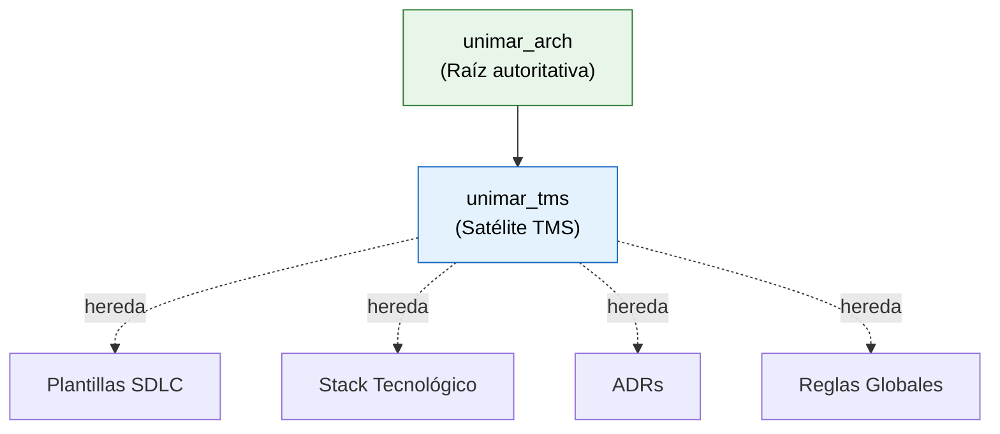

# Reglas de Repositorio Satélite — unimar_tms

> **Herencia:** Adopt desde [`unimar_arch/.harness/rules/satellite-repo-rules.md`](https://github.com/mhernandez-unimar/unimar_arch/blob/main/.harness/rules/satellite-repo-rules.md)
> **Alcance:** unimar_tms como satélite TMS

## Modelo de Herencia



## Reglas de Herencia (S-01 a S-15)

| ID | Regla | Operación |
| :-- | :---- | :-------- |
| **S-01** | Plantillas Base SDLC desde `unimar_arch` | Adopt |
| **S-02** | Formato Canónico de Historias | Adopt |
| **S-03** | Diagramas Mermaid Obligatorios | Adopt |
| **S-04** | Requisitos Técnicos Aislados (sección 3) | Adopt |
| **S-05** | Actores y Stakeholders (sección 2) | Extend — actores TMS: Conductor, Operador Logístico, Cliente Carga |
| **S-06** | Trazabilidad a ADRs de `unimar_arch` | Adopt |
| **S-07** | Stack Tecnológico Autorizado | Extend — stack TMS local en `reference/architecture/stack-tecnologico-autorizado-tms.es.md` |
| **S-08** | Versión SemVer en Plantillas | Adopt |
| **S-09** | Idioma Único | Adopt |
| **S-10** | Referencias Relativas | Adopt |
| **S-11** | Badges Uniformados | Adopt |
| **S-12** | Validación Pre-Commit | Adopt |
| **S-13** | Historial de Cambios | Adopt |
| **S-14** | Guía de Estilo | Adopt |
| **S-15** | Decisiones Locales en `DECISIONS.md` | Adopt |

## Validador de Cumplimiento

```bash
node .harness/scripts/validate-docs.mjs
```

## Excepciones

Las excepciones deben ser aprobadas por el Architecture Board y documentadas en `DECISIONS.md` con operación `Override`.
