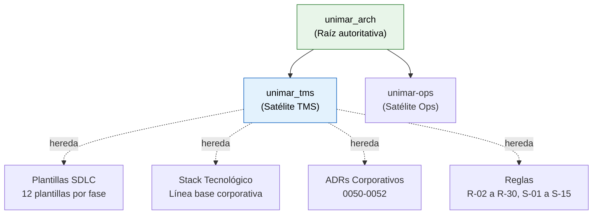

# Sistema de Gestión de Transportes — UNIMAR TMS

> **Repositorio satélite del Sistema de Gestión de Transportes de Unimar S.A.**

 

**unimar_tms es el repositorio satélite de Unimar para el Sistema de Gestión de Transportes (TMS).** 
Hereda taxonomía, reglas, plantillas SDLC, skills BMAD y stack tecnológico del repositorio 
autoritativo [`unimar_arch`](https://github.com/mhernandez-unimar/unimar_arch) y los especializa para el dominio TMS.

> *Separar conceptualmente antes de separar físicamente.*

 

  <!-- TODO: Agregar diagrama conceptual del TMS (herencia + flujo de planificación) -->
  
   
  <strong>Figura 1:</strong> Modelo conceptual del TMS — herencia desde unimar_arch, dominio de transporte y flujo de planificación MVP.

 
 

---

## 1. Orientación

<strong>Puntos de entrada primarios</strong>

> **Meta:** Acelerar la localización de los artefactos más consultados del repositorio satélite.
> **Objetivos:** Reducir el tiempo de onboarding, unificar el lenguaje del dominio TMS, dar visibilidad a las decisiones activas.

| Enlace (URL) | Descripción | Meta / Objetivo | Tipificación |
|---|---|---|---|
| [Índice de Navegación](./reference/navigation/MASTER_INDEX.md) | Navegación completa del repositorio TMS | Localizar cualquier artefacto | Índice de navegación |
| [AGENTS.md](./AGENTS.md) | Reglas y convenciones para agentes de IA | Gobernar la interacción con asistentes BMAD | Reglas para agentes |
| [DECISIONS.md](./DECISIONS.md) | Triaje Adopt/Extend/Override/N/A de patrones unimar_arch | Registrar decisiones arquitectónicas locales | Registro de decisiones |
| [Glosario TMS](./reference/governance/glosario-tms.es.md) | Terminología controlada del dominio de transporte | Unificar lenguaje TMS | Referencia |
| [Stack Tecnológico Autorizado](./reference/architecture/stack/stack-tecnologico-autorizado-tms.es.md) | Lista aprobada de tecnologías para el TMS | Estandarizar elecciones técnicas | Estándar |
| [Estrategia de Ramificación](./reference/governance/sdlc/estrategia-ramificacion.es.md) | GitFlow extendido para el TMS | Definir flujo de branching | Guía |
| [PRD del Sistema TMS](./_bmad-output/planning-artifacts/prd-sistema-gestion-transportes.es.md) | Documento de Requerimientos de Producto del TMS | Definir alcance y visión del producto | PRD |

<strong>Primeros pasos por rol</strong>

> **Propósito:** Onboarding autoguiado — cada perfil encuentra su primera lectura según su responsabilidad.

| Rol | ¿Qué busca? | Comenzar por | Luego revisar |
|---|---|---|---|
| **Product Manager / Product Owner** | PRD, alcance MVP, roadmap | [PRD del Sistema TMS](./_bmad-output/planning-artifacts/prd-sistema-gestion-transportes.es.md) — visión, actores, flujos MVP | [DECISIONS.md](./DECISIONS.md) — decisiones arquitectónicas activas |
| **Arquitecto** | ADRs, stack, estándares | [Stack Tecnológico Autorizado](./reference/architecture/stack/stack-tecnologico-autorizado-tms.es.md) — tecnologías aprobadas TMS | [ADRs locales](./reference/architecture/adrs/) — decisiones registradas |
| **Desarrollador** | Stack, estándares, SDLC | [Estrategia de Ramificación](./reference/governance/sdlc/estrategia-ramificacion.es.md) — GitFlow TMS | [Stack Tecnológico Autorizado](./reference/architecture/stack/stack-tecnologico-autorizado-tms.es.md) — tools y frameworks |
| **Agente IA (BMAD)** | Reglas, skills, flujo asistido | [AGENTS.md](./AGENTS.md) — reglas y convenciones para agentes | Skills BMAD en `.claude/skills/` — 46 skills especializados |
| **Cualquier rol** | Navegación general | — | [Índice de Navegación](./reference/navigation/MASTER_INDEX.md) — ruteo exhaustivo |

<strong>Repositorio Autoritativo y Herencia</strong>

> **Meta:** Establecer la relación de herencia desde unimar_arch y las reglas de especialización del satélite TMS.

| Enlace | ¿Qué contiene? | Meta |
| :----- | :------------- | :--- |
| [unimar_arch](https://github.com/mhernandez-unimar/unimar_arch) | Repositorio corporativo de arquitectura de software | Fuente autoritativa de estándares, reglas y plantillas |
| [Reglas Globales (R-02 a R-30)](.harness/rules/global-rules.md) | Reglas corporativas aplicables a todos los repositorios | Gobernar calidad, formato y procesos |
| [Reglas Satélite (S-01 a S-15)](.harness/rules/satellite-repo-rules.md) | Reglas específicas para repositorios satélite | Estandarizar la operación de satélites |

## 2. Producto

<strong>PRD — Sistema de Gestión de Transportes</strong>

> **Meta:** Definir la visión, alcance y requisitos del Sistema de Gestión de Transportes de Unimar.
> **Objetivos:** Establecer el contexto de dominio, actores, sistemas externos, flujos de alto nivel y alcance del MVP de planificación de transportes.

**Estado:** Borrador para revisión (v0.1.0-draft)

| Enlace (URL) | Meta / Objetivo |
|---|---|
| [PRD — Sistema de Gestión de Transportes](./_bmad-output/planning-artifacts/prd-sistema-gestion-transportes.es.md) | Visión completa del producto: contexto, actores, alcance MVP, funcionalidades, historias de usuario, pantallas, reglas de negocio, NFRs |
| [Diagramas Conceptuales (Drawio)](./docs/tms-figma.drawio) | Vistas conceptuales, C4 de contexto, flujos de proceso, prototipos de pantalla (8 páginas) |
| [Flujo de Planificación (PDF)](./docs/tms-planificacionservicio.pdf) | Prototipos de negocio del flujo de planificación de transportes |
| [Plan de Implementación](./reference/architecture/stack/stack-tecnologico-autorizado-tms.es.md) | Stack tecnológico definido para la implementación del TMS |

**Alcance MVP:**
| Área | Estado |
| :--- | :----- |
| Gestión de Relaciones Detalladas | ✅ Incluido |
| Creación de Solicitudes de Transporte | ✅ Incluido |
| Asignación de Viajes (Transportista → Chofer → Unidad) | ✅ Incluido |
| Consulta de Viajes Planificados | ✅ Incluido |
| Dashboard de Planificación | ✅ Incluido |
| Emisión de GRE | ❌ Fase 2 |
| Track & Trace | ❌ Fase 2 |
| Citas Portuarias | ❌ Fase 2 |
| App Móvil TMS | ❌ Post-MVP |

## 3. Arquitectura

<strong>Decisiones y Estándares Arquitectónicos</strong>

> **Meta:** Registrar las decisiones arquitectónicas y estándares técnicos del TMS.
> **Objetivos:** Proveer trazabilidad de decisiones, stack autorizado y ADRs locales que especializan la línea base corporativa.

| Enlace (URL) | Meta / Objetivo | Tipificación |
|---|---|---|
| [ADR-0001 — Stack Tecnológico TMS](./reference/architecture/adrs/0001-stack-tecnologico-tms.es.md) | Definir stack: NestJS, PostgreSQL, Redis, RabbitMQ, React, Flutter (post-MVP) | Decisión arquitectónica |
| [ADR-0002 — Actores del Dominio TMS](./reference/architecture/adrs/0002-actores-dominio-tms.es.md) | Definir actores: Gestor de Transportes, Transportista, Operador de Transmisiones, Gestor Comercial | Decisión arquitectónica |
| [ADR-0003 — GitFlow TMS Extendido](./reference/architecture/adrs/0003-gitflow-tms-extendido.es.md) | Extender ADR-0050 con ramas TMS-*, merge squash a develop, --no-ff a main | Decisión arquitectónica |
| [Stack Tecnológico Autorizado TMS](./reference/architecture/stack/stack-tecnologico-autorizado-tms.es.md) | Lista aprobada de lenguajes, frameworks, herramientas y servicios | Estándar técnico |

## 4. Ciclo de Desarrollo

<strong>SDLC, GitFlow y Calidad</strong>

> **Meta:** Estandarizar el ciclo de desarrollo del TMS usando GitFlow extendido, Conventional Commits y validación automática.
> **Objetivos:** Garantizar trazabilidad, calidad de commits y documentación validada.

| Enlace (URL) | Meta / Objetivo | Tipificación |
|---|---|---|
| [Estrategia de Ramificación](./reference/governance/sdlc/estrategia-ramificacion.es.md) | GitFlow extendido con ramas `main`, `develop`, `qa`, `uat`, `feature/TMS-*`, `release/v*`, `hotfix/TMS-*` | Guía de branching |
| [CONTRIBUTING.md](./CONTRIBUTING.md) | Guía de contribución: commits, PRs, merging | Guía de colaboración |
| [DOCUMENTATION_VERSIONS.md](./DOCUMENTATION_VERSIONS.md) | Log de versiones y cambios de documentación | Historial |
| [Validador de Documentación](.harness/scripts/validate-docs.mjs) | Script de validación de enlaces, anclas y Mermaid | Herramienta de calidad |

**Gates de Calidad:**
| Gate | Descripción | Herramienta |
| :--- | :---------- | :---------- |
| ✅ Commit Message | Validación Conventional Commits v1.0.0 | commitlint + husky (`commit-msg`) |
| ✅ Documentación | Enlaces relativos válidos, anclas existentes, Mermaid sin errores | `validate-docs.mjs` (husky `pre-commit`) |
| ✅ Estructura Satélite | Validación de directorios/archivos requeridos vs unimar_arch | `validate-satellite-base.mjs` |

---

  <strong>© Unimar S.A.</strong> · RUC 20100412447 · Operador Logístico Aduanero desde 1978 · Última revisión: 2026-06-23

