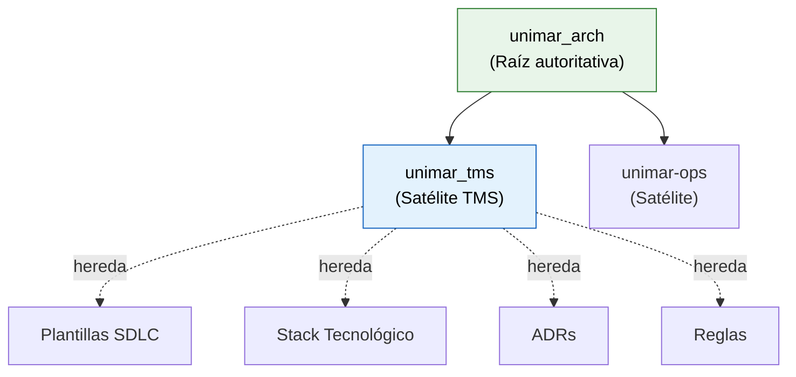

# unimar_tms

[](https://www.unimar.com.pe/)
[]()
[](https://docs.bmad-method.org/)
[]()

Repositorio satélite para el **Sistema de Gestión de Transportes (TMS)** de Unimar. Hereda taxonomía, reglas, plantillas y skills del repositorio autoritativo [`unimar_arch`](https://github.com/mhernandez-unimar/unimar_arch).

## Herencia



## Desarrollo con BMAD Method

Este proyecto usa **BMAD Method v6.9.0** como framework spec-driven. 46 skills de agente cubren todo el SDLC.

```bash
# Empezar: invocar el skill de ayuda
bmad-help

# Workflow típico:
bmad-prd                  # Planning → PRD
bmad-create-architecture  # Solutioning → Arquitectura
bmad-create-epics-and-stories  # Solutioning → Épicas
bmad-sprint-planning      # Implementación → Sprint
bmad-dev-story            # Implementación → Historia
```

## Estructura

```
unimar_tms/
├── AGENTS.md                    # Reglas para agentes de IA
├── DECISIONS.md                 # Triaje de patrones Adopt/Extend/Override/N/A
├── MASTER_INDEX.md              # Ruteo exhaustivo
├── CONTRIBUTING.md              # Guía de contribución
├── DOCUMENTATION_VERSIONS.md    # Log de versiones
├── commitlint.config.js         # Validación Conventional Commits
├── .github/
│   └── PULL_REQUEST_TEMPLATE.md # Template de PR
├── .harness/
│   ├── rules/
│   │   ├── global-rules.md          # Reglas R-02 a R-30 (heredadas)
│   │   └── satellite-repo-rules.md  # Reglas S-01 a S-15 (heredadas)
│   └── scripts/validate-docs.mjs    # Validador de documentación
├── .husky/
│   ├── commit-msg               # Hook: valida commit con commitlint
│   └── pre-commit               # Hook: valida documentación
├── reference/
│   ├── architecture/
│   │   ├── adrs/                    # ADRs locales (ADR-0001, ADR-0002, ADR-0003)
│   │   ├── blueprints/              # Diagramas C4 (pendiente)
│   │   └── stack/                   # Stack tecnológico autorizado TMS
│   ├── governance/
│   │   ├── glosario-tms.es.md        # Glosario de términos TMS
│   │   └── sdlc/
│   │       └── estrategia-ramificacion.es.md  # GitFlow TMS
│   ├── knowledge/dominio/           # Conocimiento de dominio TMS
│   ├── navigation/                  # Índices de navegación
│   └── getting-started/             # Guía de inicio rápido
├── _bmad/                          # BMAD Method (módulos core + bmm)
├── _bmad-output/                   # Artefactos generados
├── .claude/skills/                 # 46 skills de agente BMAD
├── docs/                           # Documentación de dominio
└── license/                        # Documentación legal
```

## GitFlow

Estrategia **GitFlow extendido** con ramas `main`, `develop`, `qa`, `uat` y `feature/TMS-*`, `release/v*`, `hotfix/TMS-*`.

- Commits: Conventional Commits v1.0.0 (commitlint + husky)
- Merge: `squash` a develop, `--no-ff` a main
- PRs: template en `.github/PULL_REQUEST_TEMPLATE.md`
- Versionado: SemVer con tags anotados
- Ver [`reference/governance/sdlc/estrategia-ramificacion.es.md`](./reference/governance/sdlc/estrategia-ramificacion.es.md)

## Licencia

MIT © Unimar S.A. · RUC 20100412447 · Operador Logístico Aduanero desde 1978
