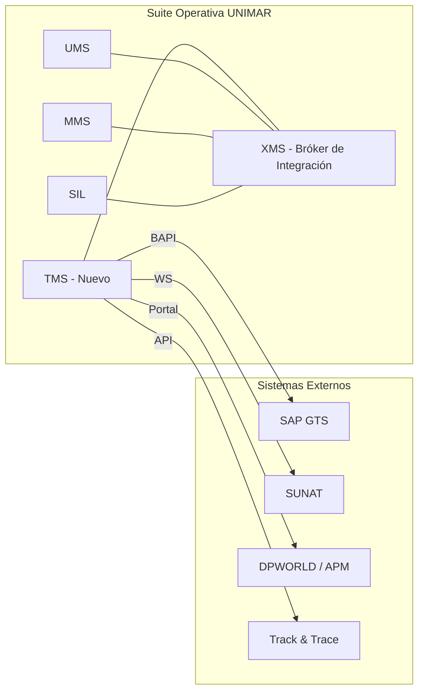
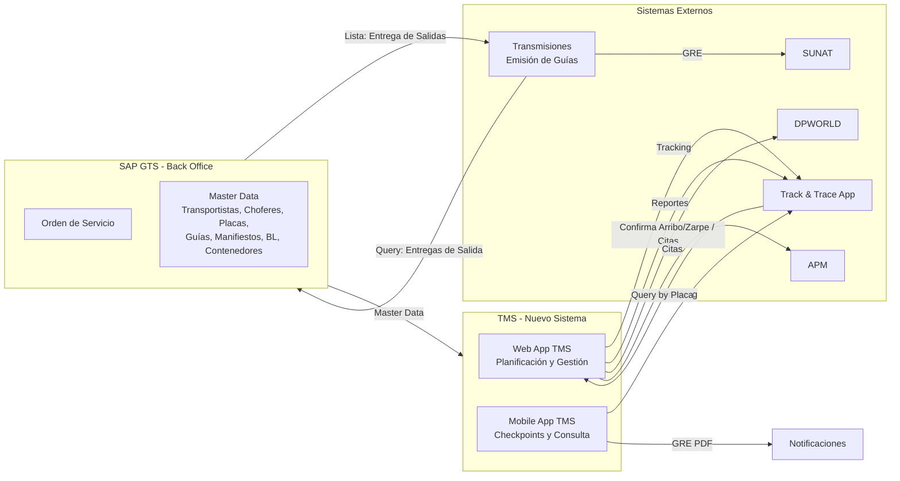

# PRD — Sistema de Gestión de Transportes (TMS)

  
  
  
  

> **Fase:** 1 — Concepción y Descubrimiento
> **Padre:** [Plantillas de Artefactos](../../reference/governance/sdlc/04-plantillas-artefactos/README.md)

---

## 1. Metadatos

- **Identificador:** `PRD-TMS-001`
- **Producto:** Sistema de Gestión de Transportes (TMS)
- **Versión:** 0.1.0-draft
- **Estado:** Borrador
- **Autor(es):** John (Product Manager)
- **Aprobador de Negocio:** *(pendiente)*
- **Aprobador de Arquitectura:** *(pendiente)*
- **Fecha de Aprobación:** *(pendiente)*

## 2. Resumen Ejecutivo

Unimar requiere un Sistema de Gestión de Transportes (TMS) como nuevo dominio de la **Suite Operativa** (capa Apoyo al Negocio), para gestionar el ciclo completo de descarga de contenedores desde puerto, desde la relación detallada de la nave hasta la emisión de la guía de remisión electrónica (GRE) y el seguimiento del viaje del transportista. Actualmente la planificación se gestiona de forma manual sin trazabilidad digital. El TMS automatizará la creación de solicitudes de transporte, asignación de transportistas/choferes/unidades, y preparará la base para la emisión electrónica de guías y track & trace. El MVP cubre el flujo de planificación de transportes. El horizonte de entrega del MVP es Q3 2026.

## 3. Contexto y Problema

- **Situación actual:** Unimar opera su ecosistema de sistemas (Suite Operativa) con dominios como UMS, MMS y SIL, interoperados mediante un bróker de alta disponibilidad (XMS). El TMS se incorpora como un nuevo dominio en la capa de **Apoyo al Negocio**, para cubrir el transporte de carga que actualmente se gestiona sin un sistema dedicado. Las relaciones detalladas se consultan manualmente desde SAP, las solicitudes de transporte se gestionan de forma verbal o por correo, y no hay trazabilidad del estado de cada viaje.
- **Problema:** Ausencia de un sistema centralizado genera retrabajo, pérdida de información, falta de trazabilidad y dificultad para escalar la operación. No hay registro formal de asignación de transportistas, choferes ni unidades vehiculares.
- **Oportunidad:** Digitalizar el flujo de planificación reduce tiempos de asignación, elimina errores de comunicación, provee trazabilidad completa y prepara el camino para la emisión electrónica de guías (GRE) y track & trace en tiempo real.
- **Audiencia afectada:** Gestores de Transportes (planificadores), Operadores de Documentación, Transportistas (ejecutores), Gestores Comerciales (consulta).

## 4. Objetivos y Métricas de Éxito

| Objetivo | Métrica | Valor Inicial | Meta | Horizonte |
| :--- | :--- | :--- | :--- | :--- |
| Digitalizar la planificación de transportes | Solicitudes creadas en sistema vs manuales | 0% | 100% | Q3 2026 |
| Reducir tiempo de asignación de viaje | Tiempo desde solicitud hasta viaje confirmado | Sin medición | < 2 horas | Q4 2026 |
| Trazabilidad de viajes | Viajes con registro digital completo | 0% | 100% | Q3 2026 |
| Preparar base para GRE | Solicitudes listas para emisión de GRE | 0% | 80% | Q1 2027 |

## 5. Alcance

### 5.1 Dentro del Alcance

- Gestión de relaciones detalladas de contenedores desde SAP
- Creación de solicitudes de transporte
- Asignación de viajes con transportista, chofer y unidad vehicular
- Coordinación de citas portuarias (DPWORLD/APM)
- Consulta de viajes planificados con filtros
- Dashboard de planificación
- Integración batch con SAP para maestro de datos

### 5.2 Fuera del Alcance (MVP)

- Emisión de guías de remisión electrónicas (GRE) a SUNAT
- Track & Trace en tiempo real
- Aplicación móvil para transportistas
- Portal de consulta para clientes
- Reportería avanzada

### 5.3 Mapa Conceptual

## 6. Actores y Casos de Uso de Alto Nivel

| Actor | Necesidad | Caso de uso de alto nivel | Prioridad |
| :---- | :-------- | :------------------------ | :-------- |
| **Gestor de Transportes** | Planificar y asignar viajes de descarga | Gestionar relaciones detalladas, crear solicitudes, asignar viajes | Must |
| **Transportista** | Ejecutar viaje asignado | Consultar solicitud asignada, confirmar datos | Must |
| **Operador de Documentación** | Gestionar relaciones detalladas | Registrar y mantener relaciones detalladas por nave/BL | Could |
| **Gestor Comercial** | Consultar estado de operaciones | Visualizar dashboard y tracking | Should |

## 7. Funcionalidades Detalladas del MVP

| ID | Funcionalidad | Descripción |
| :-- | :------------ | :---------- |
| F-01 | Gestión de Relaciones Detalladas | Visualización y filtro de relaciones detalladas desde SAP por nave, BL, puerto, fecha |
| F-02 | Creación de Solicitud de Transporte | El Gestor crea una solicitud seleccionando contenedores de una relación detallada |
| F-03 | Asignación de Viaje | El Gestor asigna la solicitud a un transportista, definiendo origen, destino y fecha |
| F-04 | Selección de Transportista | Búsqueda y selección de transportista desde maestro de datos |
| F-05 | Selección de Chofer | Búsqueda y selección de chofer asociado al transportista. **Opcional en planificación**, se confirma al momento de la ejecución del viaje |
| F-06 | Selección de Unidad Vehicular | Búsqueda y selección de placa/unidad asociada al transportista. **Opcional en planificación**, se confirma al momento de la ejecución del viaje |
| F-07 | Confirmación de Viaje | Confirmación formal que notifica al transportista. En esta etapa se completan chofer y unidad vehicular si no fueron asignados en la planificación |
| F-08 | Consulta de Viajes Planificados | Listado de viajes con estado, filtros por fecha, transportista, estado |
| F-09 | Edición de Viaje | Edición de datos del viaje antes de su ejecución |
| F-10 | Dashboard de Planificación | Resumen visual de viajes por estado con acceso rápido a creación |
| F-11 | Coordinación de Citas Portuarias | Gestión de citas con terminales portuarias (DPWORLD/APM): confirmación de arribo/zarpe y agendamiento de citas de retiro de contenedores |

## 8. Reglas de Negocio Explícitas

| ID | Regla |
| :-- | :---- |
| RN-01 | Un manifiesto puede tener más de una relación detallada |
| RN-02 | La Fase 1 contempla relación detallada de descarga de contenedores desde puerto |
| RN-03 | Una relación detallada puede pertenecer a diferentes orígenes: depósito, almacenes, etc. |
| RN-04 | Una Orden de Servicio (SAP) puede tener asociados múltiples Pedidos de Transporte en diferentes momentos |
| RN-05 | El Pedido de Transporte se referencia desde la OS SAP |
| RN-06 | La asignación de viaje sigue la jerarquía: Transportista → Chofer → Unidad Vehicular. En planificación solo el transportista es obligatorio; chofer y unidad pueden asignarse al confirmar el viaje |
| RN-07 | Para carga suelta se requieren fotos, packing list y dimensiones (fase posterior) |
| RN-08 | La coordinación de citas portuarias se realiza a través del portal de DPWORLD/APM |

## 8. Restricciones y Supuestos

- **Restricciones regulatorias:** Las guías de remisión electrónicas deben cumplir con la normativa SUNAT (fuera de MVP, considerar en fase 2)
- **Restricciones técnicas:** Integración con SAP vía BAPI existente; datos maestros provistos por SAP GTS; stack definido en ADR-0001 (NestJS, PostgreSQL, React)
- **Supuestos:** Los maestros de transportistas, choferes y unidades están disponibles en SAP; el MVP no requiere integración en tiempo real con SAP (carga batch); los prototipos de negocio reflejan fielmente el flujo actual

## 9. Riesgos de Negocio

| Riesgo | Probabilidad | Impacto | Mitigación |
| :----- | :----------- | :------ | :--------- |
| Calidad de datos maestros en SAP | Media | Alto | Validar data quality antes del desarrollo; plan de limpieza |
| Cambios en normativa SUNAT de GRE | Baja | Medio | Diseñar GRE con parámetros configurables; monitorear cambios regulatorios |
| Adopción por parte de transportistas | Media | Medio | Involucrar transportistas en validación temprana; UI simple e intuitiva |
| Dependencia de integración SAP no disponible | Alta | Alto | Definir interfaz batch como MVP; planificar BAPI en fase 2 |

## 10. Criterios de Aceptación del PRD

El PRD se considera aprobado cuando:

- [ ] El resumen ejecutivo está validado por el Aprobador de Negocio.
- [ ] Las métricas de éxito tienen valor inicial y meta medibles.
- [ ] El alcance está firmado por Producto y Arquitectura.
- [ ] Las reglas de negocio explícitas no tienen contradicciones.
- [ ] Los riesgos tienen mitigación documentada.
- [ ] Los diagramas conceptuales reflejan correctamente el flujo MVP.

## 11. Trazabilidad

- Las **Historias Funcionales** posteriores referencian este PRD como `PRD-TMS-001`.
- El **Reporte Resumen de Pruebas** citará los criterios de aceptación funcionales definidos aquí.
- Las **Notas de Lanzamiento** resumirán el valor entregado contra los objetivos declarados.
- Los **ADRs** referenciados en este PRD se enlazan desde la sección de Restricciones y Supuestos.
- Los **contratos de integración** con otros dominios de la Suite Operativa (vía XMS) se definirán en fase de arquitectura.

## 12. Glosario

| Término | Definición |
| :------ | :--------- |
| **Relación Detallada** | Lista de contenedores por nave + BL, base de la planificación de transporte |
| **Solicitud de Transporte** | Petición formal de servicio de transporte para uno o más contenedores |
| **Viaje** | Asignación de un transportista, chofer y unidad a una solicitud de transporte |
| **Orden de Servicio (OS)** | Documento SAP que origina el pedido de transporte |
| **Guía de Remisión Electrónica (GRE)** | Documento electrónico para el traslado de carga, transmitido a SUNAT |
| **Checkpoint** | Punto de control en la ejecución del viaje (inicio ruta, fin ruta) |
| **Manifiesto** | Documento de carga de la nave |
| **BL / Booking** | Bill of Lading — conocimiento de embarque |

## 13. Historial de Cambios

| Versión | Fecha | Autor | Cambios |
| :------ | :---- | :---- | :------ |
| 0.1.0-draft | 2026-06-23 | John (PM) | Versión inicial |

---

## Anexos — Diagramas del Sistema

### A.1 Vista Conceptual General

**Actores del sistema y sus interacciones:**
- **Gestor de Transportes** — consulta Track & Trace, coordina citas con DPWORLD/APM, gestiona planificación vía Web App TMS
- **Operador de Transmisiones** — emite guías de remisión electrónicas hasta obtener OCR desde SUNAT
- **Transportista** — consulta solicitudes de servicio, confirma contenedor, genera guía, registra checkpoints (inicio/fin ruta) vía Mobile App TMS
- **Gestor Comercial** — consulta tracking y reportes

### A.2 Vista Conceptual de Proceso

### A.3 C4 Context View

### A.4 Prototipos de Pantallas (MVP)

| Pantalla | Descripción | Funcionalidades Asociadas |
| :------- | :---------- | :------------------------ |
| **Dashboard de Planificación** | Resumen visual de viajes por estado (Planificados, En Ejecución, Completados) con acceso rápido a creación | F-10 |
| **Listado de Relaciones Detalladas** | Tabla con filtros por nave, puerto, fecha. Botón para crear solicitud de transporte | F-01 |
| **Creación de Solicitud de Transporte** | Wizard: seleccionar contenedores → definir origen/destino → fecha tentativa → confirmar | F-02 |
| **Asignación de Viaje** | Selectores encadenados: Transportista → Chofer → Unidad Vehicular | F-03, F-04, F-05, F-06, F-07 |
| **Detalle de Viaje** | Cabecera, datos generales, transportista/chofer/unidad, contenedores, historial | F-08, F-09 |

---

  
  

  <strong>© Unimar S.A.</strong> · RUC 20100412447 · Operador Logístico Aduanero desde 1978 
  Estándar: <a href="https://github.com/mhernandez-unimar/unimar_arch">Unimar Arch</a> · Plantilla: <a href="https://github.com/mhernandez-unimar/unimar_arch/blob/main/reference/governance/sdlc/04-plantillas-artefactos/plantilla-prd.es.md">PRD Template</a>

