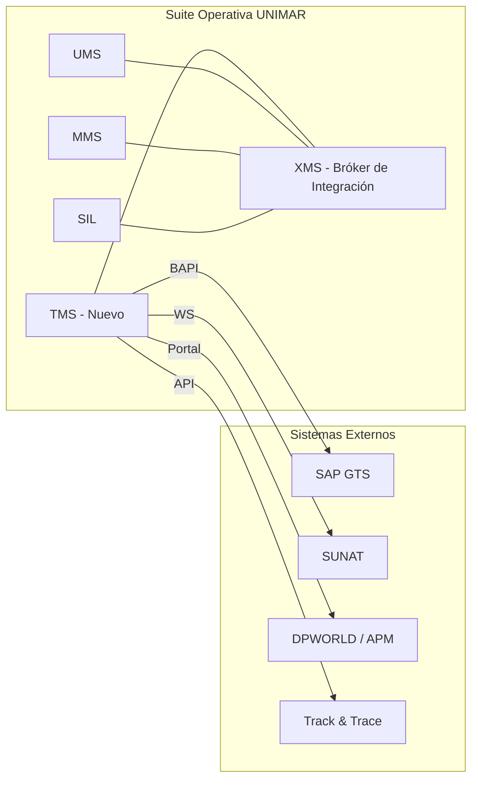
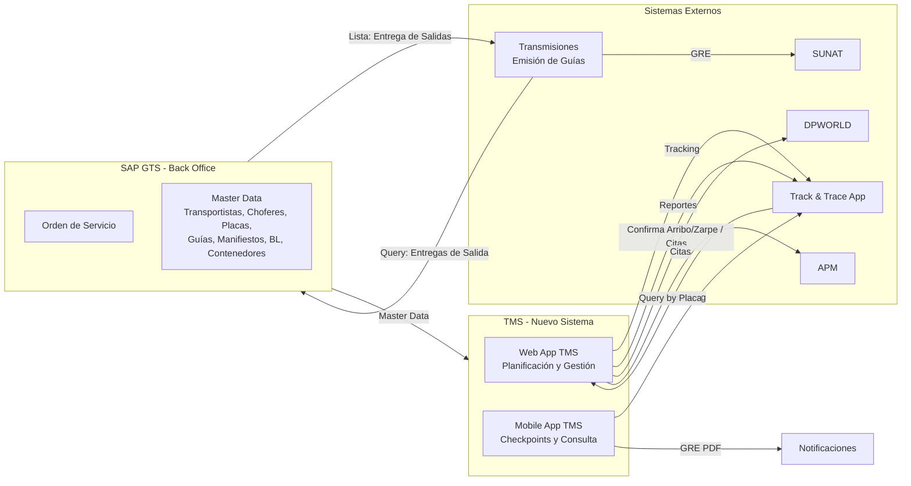

# PRD — Sistema de Gestión de Transportes (TMS)

  
  
  
  

> **Fase:** 1 — Concepción y Descubrimiento
> **Padre:** [Plantillas de Artefactos](../../reference/governance/sdlc/04-plantillas-artefactos/README.md)

---

## 1. Metadatos

- **Identificador:** `PRD-TMS-001`
- **Producto:** Sistema de Gestión de Transportes (TMS)
- **Versión:** 0.1.0-draft
- **Estado:** Borrador
- **Autor(es):** John (Product Manager)
- **Aprobador de Negocio:** *(pendiente)*
- **Aprobador de Arquitectura:** *(pendiente)*
- **Fecha de Aprobación:** *(pendiente)*

## 2. Resumen Ejecutivo

### 2.1 Declaración del Problema

La operación de transporte de Unimar procesa aproximadamente **{X} contenedores/mes** distribuidos en **{Y} viajes/mes** sin un sistema dedicado de gestión. El proceso actual depende de hojas de cálculo, llamadas telefónicas y WhatsApp, generando **{X} horas/hombre de retrabajo mensual**, una tasa de errores del **{X}%** en datos de asignación (placa, chofer, fecha) y **cero trazabilidad** en tiempo real del estado de los contenedores.

### 2.2 Solución Propuesta

El **Sistema de Gestión de Transportes (TMS)** es el nuevo dominio de la **Suite Operativa** de Unimar (capa Apoyo al Negocio) que digitaliza el ciclo completo de transporte de contenedores desde puerto: desde la recepción de relaciones detalladas desde SAP GTS hasta la confirmación de viaje, coordinando de forma iterativa transportistas, choferes y unidades vehiculares.

### 2.3 Alcance del MVP

El MVP (Q3 2026) cubre las siguientes funcionalidades:

| Categoría | Funcionalidades |
| :-------- | :-------------- |
| **Gestión de datos** | Relaciones detalladas desde SAP, búsqueda de contenedores |
| **Planificación** | Creación de solicitudes, clonación, asignación de viajes |
| **Coordinación** | Selección de transportista, chofer y unidad (asignación iterativa con el transportista) |
| **Citas portuarias** | Coordinación con DPWORLD/APM |
| **Visibilidad** | Dashboard de planificación, calendario de citas, alertas de vencimiento |
| **Operación** | Aceptación/rechazo de viaje, cancelación, reasignación, registro fotográfico |
| **Auditoría** | Historial de cambios, exportación de datos |

### 2.4 Beneficios Esperados

| Beneficio | Valor Esperado |
| :-------- | :------------- |
| Reducción del tiempo de asignación | De {X} horas a < 2 horas |
| Trazabilidad de viajes | 100% de viajes con registro digital |
| Eliminación de errores de comunicación | {X}% reducción en datos inconsistentes |
| Base para emisión de GRE | 80% de solicitudes listas para Fase 2 |
| Visibilidad operativa | Dashboard en tiempo real para Gestores |

### 2.5 Fases de Entrega

| Fase | Entregable | Horizonte |
| :--- | :--------- | :-------- |
| **Fase 1 — MVP** | Planificación y asignación de transportes | Q3 2026 |
| **Fase 2 — GRE** | Emisión de guías de remisión electrónicas a SUNAT | Q1 2027 |
| **Fase 3 — Track & Trace** | Seguimiento en tiempo real y notificaciones | Q2 2027 |
| **Fase 4 — App Móvil** | Aplicación móvil para transportistas | Q3 2027 |

### 2.6 Inversión Estimada

| Concepto | Estimado |
| :------- | :------- |
| Desarrollo MVP (Fase 1) | USD {X} |
| Integración SAP | USD {X} |
| Infraestructura y DevOps | USD {X} |
| **Total MVP** | **USD {X}** |

> *Nota: La inversión para Fases 2-4 se estimará al finalizar la Fase 1 con datos reales de complejidad.*

## 3. Contexto y Problema

### 3.1 Contexto Actual

- **Operación de transporte:** Unimar gestiona el transporte de contenedores desde puerto hasta destino final. La operación actual procesa aproximadamente **{X} contenedores/mes** distribuidos en **{Y} viajes/mes** con **{Z} transportistas activos**.
- **Ecosistema de sistemas:** Unimar opera su Suite Operativa con dominios como UMS, MMS y SIL, interoperados mediante el bróker XMS. El TMS se incorpora como nuevo dominio en la capa de Apoyo al Negocio.
- **Proceso actual (paso a paso):**
  1. El Gestor consulta relaciones detalladas en SAP manualmente
  2. Copia datos de contenedores a una hoja de cálculo
  3. Selecciona transportista según disponibilidad conocida (sin sistema)
  4. Comunica la asignación por llamada telefónica o WhatsApp
  5. El transportista confirma chofer y placa por la misma vía
  6. El Gestor actualiza manualmente la hoja de cálculo
  7. No existe registro centralizado ni trazabilidad del estado
- **Tiempo promedio de asignación:** {X} horas desde solicitud hasta viaje confirmado
- **Tasa de errores:** {X}% de viajes presentan datos inconsistentes (placa incorrecta, chofer no disponible, fecha desactualizada)
- **Volumen de transportistas:** {X} transportistas con {Y} unidades vehiculares registradas

### 3.2 Problema Identificado

| Problema | Impacto | Consecuencia Operativa |
| :------- | :------ | :--------------------- |
| **Sin trazabilidad** | No se conoce la ubicación ni estado de los contenedores en tiempo real | Clientes consultan y no hay respuesta; pérdida de confianza |
| **Comunicación fragmentada** | Información dispersa en llamadas, correos, WhatsApp y hojas de cálculo | Datos perdidos, versiones contradictorias, retrabajo |
| **Errores de asignación** | Placa equivocada, chofer no disponible, fecha incorrecta | Retrasos en retiro de contenedores, storage portuario adicional |
| **Sin métricas de desempeño** | No se puede medir cumplimiento de transportistas | Imposible negociar contratos con datos objetivos |
| **Riesgo de cumplimiento** | Sin registro formal de asignaciones y confirmaciones | Exposición legal en caso de incidentes o auditorías |
| **Cuello de botella operativo** | La planificación depende de uno o dos Gestores clave | Si se ausentan, la operación se detiene |
| **Escalabilidad limitada** | El proceso manual no escala con volumen creciente | Cada incremento de demanda requiere más personal manual |

### 3.3 Impacto Estimado

| Métrica | Valor Estimado | Nota |
| :------ | :------------- | :--- |
| Horas/hombre perdidas en gestión manual | {X} horas/mes | Copia de datos, llamadas, actualización de hojas |
| Costo estimado de retrabajo | USD {X}/mes | Corrección de errores, coordinación adicional |
| Tiempo promedio de respuesta a cliente | {X} horas | Para consultas de estado de contenedor |
| Riesgo de storage portuario por retraso | USD {X}/contenedor/día | Costo de permanencia en terminal |

### 3.4 Visión Estratégica

El TMS es pieza clave de la digitalización de la Suite Operativa de Unimar. Además de resolver los problemas operativos inmediatos, habilita:
- **Emisión de GRE (Fase 2):** Sin trazabilidad de viajes, no es posible emitir guías electrónicas
- **Track & Trace (Fase 2):** Sin datos de viaje en tiempo real, no hay seguimiento
- **Analítica operativa:** Sin datos estructurados, no hay reportes ni métricas
- **Experiencia del cliente:** Sin trazabilidad, el cliente no puede consultar el estado de su carga

## 4. Objetivos y Métricas de Éxito

| Objetivo | Métrica | Valor Inicial | Meta | Horizonte |
| :--- | :--- | :--- | :--- | :--- |
| Digitalizar la planificación de transportes | Solicitudes creadas en sistema vs manuales | 0% | 100% | Q3 2026 |
| Reducir tiempo de asignación de viaje | Tiempo desde solicitud hasta viaje confirmado | Sin medición | < 2 horas | Q4 2026 |
| Trazabilidad de viajes | Viajes con registro digital completo | 0% | 100% | Q3 2026 |
| Preparar base para GRE | Solicitudes listas para emisión de GRE | 0% | 80% | Q1 2027 |

## 5. Alcance

### 5.1 Dentro del Alcance

- Gestión de relaciones detalladas de contenedores desde SAP
- Creación de solicitudes de transporte
- Asignación de viajes con transportista, chofer y unidad vehicular
- Coordinación de citas portuarias (DPWORLD/APM)
- Consulta de viajes planificados con filtros
- Dashboard de planificación
- Integración batch con SAP para maestro de datos

### 5.2 Fuera del Alcance (MVP)

- Emisión de guías de remisión electrónicas (GRE) a SUNAT
- Track & Trace en tiempo real
- Aplicación móvil para transportistas
- Portal de consulta para clientes
- Reportería avanzada

### 5.3 Mapa Conceptual

## 6. Actores y Casos de Uso de Alto Nivel

| Actor | Necesidad | Caso de uso de alto nivel | Prioridad |
| :---- | :-------- | :------------------------ | :-------- |
| **Gestor de Transportes** | Planificar y asignar viajes de descarga | Gestionar relaciones detalladas, crear solicitudes, asignar viajes | Must |
| **Transportista** | Ejecutar viaje asignado | Consultar solicitud asignada, confirmar datos | Must |
| **Operador de Documentación** | Gestionar relaciones detalladas | Registrar y mantener relaciones detalladas por nave/BL | Could |
| **Gestor Comercial** | Consultar estado de operaciones | Visualizar dashboard y tracking | Should |

## 7. Funcionalidades Detalladas del MVP

| ID | Funcionalidad | Descripción |
| :-- | :------------ | :---------- |
| F-01 | Gestión de Relaciones Detalladas | Visualización y filtro de relaciones detalladas desde SAP por nave, BL, puerto, fecha |
| F-02 | Creación de Solicitud de Transporte | El Gestor crea una solicitud seleccionando contenedores de una relación detallada |
| F-03 | Asignación de Viaje | El Gestor asigna la solicitud a un transportista, definiendo origen, destino y fecha |
| F-04 | Selección de Transportista | Búsqueda y selección de transportista desde maestro de datos |
| F-05 | Selección de Chofer | Asignación de chofer al viaje. Puede ser asignado por UNIMAR desde el maestro o propuesto/confirmado por el transportista. Opcional en planificación, se coordina hasta antes de iniciar el viaje |
| F-06 | Selección de Unidad Vehicular | Asignación de placa/unidad al viaje. Puede ser asignada por UNIMAR desde el maestro o propuesta/confirmada por el transportista. Opcional en planificación, se coordina hasta antes de iniciar el viaje |
| F-07 | Confirmación de Viaje | Confirmación formal que notifica al transportista. El transportista puede notificar chofer y placa final en esta etapa, o haberlo hecho durante la planificación. La comunicación es continua y puede ocurrir hasta antes de iniciar el viaje |
| F-08 | Consulta de Viajes Planificados | Listado de viajes con estado, filtros por fecha, transportista, estado |
| F-09 | Edición de Viaje | Edición de datos del viaje antes de su ejecución |
| F-10 | Dashboard de Planificación | Resumen visual de viajes por estado con acceso rápido a creación |
| F-11 | Coordinación de Citas Portuarias | Gestión de citas con terminales portuarias (DPWORLD/APM): confirmación de arribo/zarpe y agendamiento de citas de retiro de contenedores |
| F-12 | Cancelación de Solicitud/Viaje | Cancelación de solicitud o viaje antes de su ejecución, con registro del motivo |
| F-13 | Reasignación de Viaje | Reasignación del viaje a otro transportista cuando el original rechaza o no puede cumplir |
| F-14 | Historial de Cambios | Registro de auditoría de todos los cambios en solicitudes y viajes: actor, timestamp, campo, valor anterior y nuevo |
| F-15 | Notificaciones al Transportista | Envío de notificaciones (correo, SMS, push) por asignación, cambios y recordatorios de viaje |
| F-16 | Aceptación/Rechazo de Viaje | El transportista acepta o rechaza formalmente un viaje asignado antes de ejecutarlo |
| F-17 | Búsqueda Rápida de Contenedores | Búsqueda directa por número de contenedor sin navegar por relaciones detalladas |
| F-18 | Clonar Solicitud de Transporte | Duplicar una solicitud existente con sus contenedores para agilizar creación de solicitudes similares |
| F-19 | Vista Calendario de Citas Portuarias | Vista visual de citas agendadas por día/semana para evitar solapamientos |
| F-20 | Alertas de Vencimiento | Notificaciones automáticas por contenedores sin asignar o citas próximas a vencer |
| F-21 | Exportar Datos (Excel/PDF) | Exportación de solicitudes, viajes y reportes para compartir con transportistas y clientes |
| F-22 | Gestión de Excepciones | Proceso formal para registrar y resolver incidencias: demoras, daños, rechazos, contenedores varados |
| F-23 | Registro Fotográfico | Evidencia fotográfica al inicio y fin de viaje para reclamaciones y auditoría |

## 8. Reglas de Negocio Explícitas

| ID | Regla |
| :-- | :---- |
| RN-01 | Un manifiesto puede tener más de una relación detallada |
| RN-02 | La Fase 1 contempla relación detallada de descarga de contenedores desde puerto |
| RN-03 | Una relación detallada puede pertenecer a diferentes orígenes: depósito, almacenes, etc. |
| RN-04 | Una Orden de Servicio (SAP) puede tener asociados múltiples Pedidos de Transporte en diferentes momentos |
| RN-05 | El Pedido de Transporte se referencia desde la OS SAP |
| RN-06 | La asignación de chofer y unidad vehicular es un proceso de coordinación iterativo entre UNIMAR y el transportista. UNIMAR puede asignar desde el maestro, el transportista puede proponer o confirmar, y la asignación se cierra cuando ambas partesvalidan. Esta coordinación puede ocurrir en planificación, confirmación o hasta antes de iniciar el viaje |
| RN-07 | Para carga suelta se requieren fotos, packing list y dimensiones (fase posterior) |
| RN-08 | La coordinación de citas portuarias se realiza a través del portal de DPWORLD/APM |
| RN-09 | Un contenedor solo puede estar asignado a un viaje activo a la vez |
| RN-10 | La solicitud de transporte solo puede incluir contenedores de la misma relación detallada |
| RN-11 | El chofer y la unidad deben estar asociados al transportista seleccionado en el maestro de datos |
| RN-12 | Origen y destino de un viaje no pueden ser iguales |
| RN-13 | Un viaje no puede confirmarse sin al menos el transportista asignado |
| RN-14 | Un viaje en ejecución (con checkpoint registrado) no puede editarse |
| RN-15 | Un viaje solo puede cancelarse antes de iniciar la ejecución |
| RN-16 | La fecha del viaje no puede ser anterior a la fecha actual al momento de creación |
| RN-17 | La fecha de cita portuaria debe ser coherente con la fecha estimada de arribo de la nave |
| RN-18 | Solo contenedores con estado pendiente o planificado en la relación detallada pueden asignarse a viajes |
| RN-19 | La sincronización batch de maestros con SAP debe ejecutarse mínimo una vez al día |
| RN-20 | Si la sincronización SAP falla, el sistema opera con el último conjunto de datos válido |
| RN-21 | El transportista debe ser notificado al momento de asignársele un viaje |
| RN-22 | El Gestor debe ser notificado cuando el transportista proporciona chofer y unidad vehicular |
| RN-23 | Una solicitud de transporte puede generar múltiples viajes cuando la cantidad de contenedores excede la capacidad de una unidad |
| RN-24 | Un viaje puede contener múltiples contenedores siempre que pertenezcan a la misma solicitud |
| RN-25 | Una solicitud de transporte debe contener al menos un contenedor |
| RN-26 | El transportista debe aceptar o rechazar formalmente un viaje asignado |
| RN-27 | Los datos del chofer deben validarse contra el maestro (licencia, vigencia) |
| RN-28 | La unidad vehicular debe tener estado operativo en el maestro para poder asignarse |
| RN-29 | No se puede asignar un viaje si el transportista tiene otro viaje en conflicto de horario/fecha para la misma unidad |
| RN-30 | El historial de cambios debe registrar: actor, timestamp, campo modificado, valor anterior y nuevo |
| RN-31 | Si el transportista rechaza el viaje, el Gestor debe ser notificado para reasignar |
| RN-32 | La solicitud de transporte debe referenciar al menos una Orden de Servicio de SAP |
| RN-33 | Un contenedor con viaje en ejecución no puede ser asignado a otro viaje |
| RN-34 | Debe existir un tiempo mínimo de anticipación para crear un viaje (ej. 24 horas antes del retiro) |
| RN-35 | Un transportista con más del 20% de viajes rechazados en los últimos 30 días debe ser marcado como riesgoso |
| RN-36 | Los contenedores de un mismo BL deben viajar juntos salvo excepción justificada |
| RN-37 | La capacidad máxima de contenedores por viaje depende del tipo de unidad vehicular (20' o 40') |
| RN-38 | El sistema debe alertar sobre contenedores huérfanos (sin viaje asignado después de X días) |
| RN-39 | Las notificaciones deben tener canal de fallback (email → SMS → push) |
| RN-40 | El dashboard debe mostrar métricas en tiempo real: viajes hoy, pendientes, completados, alertas |

## 8. Restricciones y Supuestos

- **Restricciones regulatorias:** Las guías de remisión electrónicas deben cumplir con la normativa SUNAT (fuera de MVP, considerar en fase 2)
- **Restricciones técnicas:** Integración con SAP vía BAPI existente; datos maestros provistos por SAP GTS; stack definido en ADR-0001 (NestJS, PostgreSQL, React)
- **Supuestos:** Los maestros de transportistas, choferes y unidades están disponibles en SAP; el MVP no requiere integración en tiempo real con SAP (carga batch); los prototipos de negocio reflejan fielmente el flujo actual

## 9. Riesgos de Negocio

| Riesgo | Probabilidad | Impacto | Mitigación |
| :----- | :----------- | :------ | :--------- |
| Calidad de datos maestros en SAP | Media | Alto | Validar data quality antes del desarrollo; plan de limpieza |
| Cambios en normativa SUNAT de GRE | Baja | Medio | Diseñar GRE con parámetros configurables; monitorear cambios regulatorios |
| Adopción por parte de transportistas | Media | Medio | Involucrar transportistas en validación temprana; UI simple e intuitiva |
| Dependencia de integración SAP no disponible | Alta | Alto | Definir interfaz batch como MVP; planificar BAPI en fase 2 |

## 10. Criterios de Aceptación del PRD

El PRD se considera aprobado cuando:

- [ ] El resumen ejecutivo está validado por el Aprobador de Negocio.
- [ ] Las métricas de éxito tienen valor inicial y meta medibles.
- [ ] El alcance está firmado por Producto y Arquitectura.
- [ ] Las reglas de negocio explícitas no tienen contradicciones.
- [ ] Los riesgos tienen mitigación documentada.
- [ ] Los diagramas conceptuales reflejan correctamente el flujo MVP.

## 11. Trazabilidad

- Las **Historias Funcionales** posteriores referencian este PRD como `PRD-TMS-001`.
- El **Reporte Resumen de Pruebas** citará los criterios de aceptación funcionales definidos aquí.
- Las **Notas de Lanzamiento** resumirán el valor entregado contra los objetivos declarados.
- Los **ADRs** referenciados en este PRD se enlazan desde la sección de Restricciones y Supuestos.
- Los **contratos de integración** con otros dominios de la Suite Operativa (vía XMS) se definirán en fase de arquitectura.

## 12. Glosario

| Término | Definición |
| :------ | :--------- |
| **Relación Detallada** | Lista de contenedores por nave + BL, base de la planificación de transporte |
| **Solicitud de Transporte** | Petición formal de servicio de transporte para uno o más contenedores |
| **Viaje** | Asignación de un transportista, chofer y unidad a una solicitud de transporte |
| **Orden de Servicio (OS)** | Documento SAP que origina el pedido de transporte |
| **Guía de Remisión Electrónica (GRE)** | Documento electrónico para el traslado de carga, transmitido a SUNAT |
| **Checkpoint** | Punto de control en la ejecución del viaje (inicio ruta, fin ruta) |
| **Manifiesto** | Documento de carga de la nave |
| **BL / Booking** | Bill of Lading — conocimiento de embarque |

## 13. Historial de Cambios

| Versión | Fecha | Autor | Cambios |
| :------ | :---- | :---- | :------ |
| 0.1.0-draft | 2026-06-23 | John (PM) | Versión inicial |

---

## Anexos — Diagramas del Sistema

### A.1 Vista Conceptual General

**Actores del sistema y sus interacciones:**
- **Gestor de Transportes** — consulta Track & Trace, coordina citas con DPWORLD/APM, gestiona planificación vía Web App TMS
- **Operador de Transmisiones** — emite guías de remisión electrónicas hasta obtener OCR desde SUNAT
- **Transportista** — consulta solicitudes de servicio, confirma contenedor, genera guía, registra checkpoints (inicio/fin ruta) vía Mobile App TMS
- **Gestor Comercial** — consulta tracking y reportes

### A.2 Vista Conceptual de Proceso

### A.3 C4 Context View

### A.4 Prototipos de Pantallas (MVP)

| Pantalla | Descripción | Funcionalidades Asociadas |
| :------- | :---------- | :------------------------ |
| **Dashboard de Planificación** | Resumen visual de viajes por estado (Planificados, En Ejecución, Completados) con acceso rápido a creación | F-10 |
| **Listado de Relaciones Detalladas** | Tabla con filtros por nave, puerto, fecha. Botón para crear solicitud de transporte | F-01 |
| **Creación de Solicitud de Transporte** | Wizard: seleccionar contenedores → definir origen/destino → fecha tentativa → confirmar | F-02 |
| **Asignación de Viaje** | Selectores encadenados: Transportista → Chofer → Unidad Vehicular | F-03, F-04, F-05, F-06, F-07 |
| **Detalle de Viaje** | Cabecera, datos generales, transportista/chofer/unidad, contenedores, historial | F-08, F-09 |

---

  
  

  <strong>© Unimar S.A.</strong> · RUC 20100412447 · Operador Logístico Aduanero desde 1978 
  Estándar: <a href="https://github.com/mhernandez-unimar/unimar_arch">Unimar Arch</a> · Plantilla: <a href="https://github.com/mhernandez-unimar/unimar_arch/blob/main/reference/governance/sdlc/04-plantillas-artefactos/plantilla-prd.es.md">PRD Template</a>

