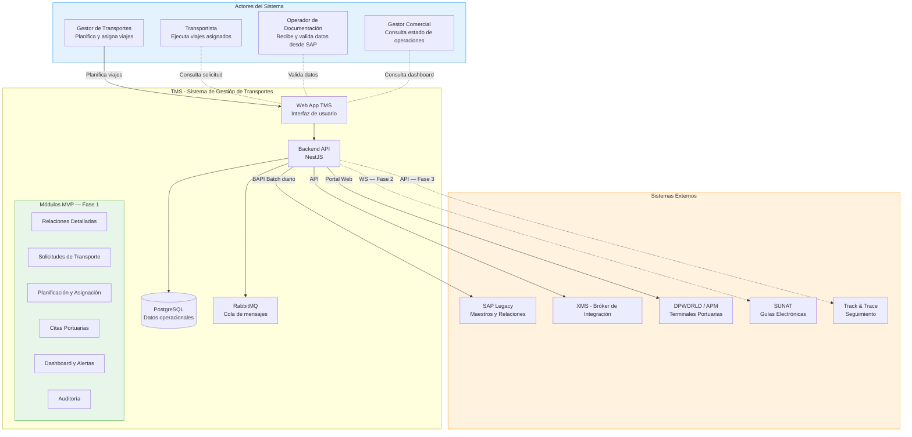
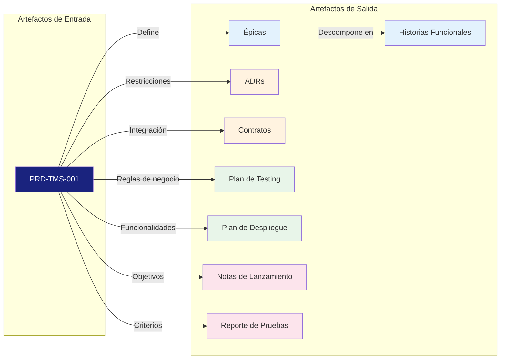
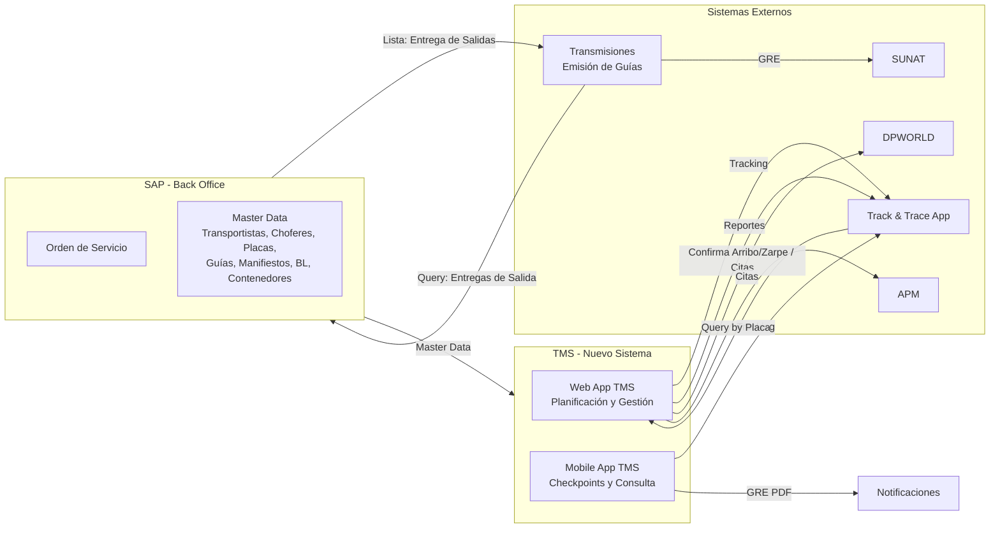
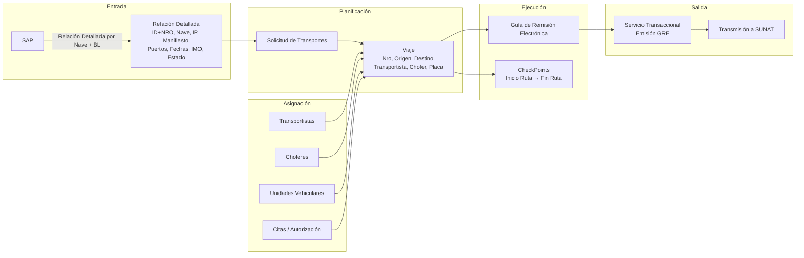
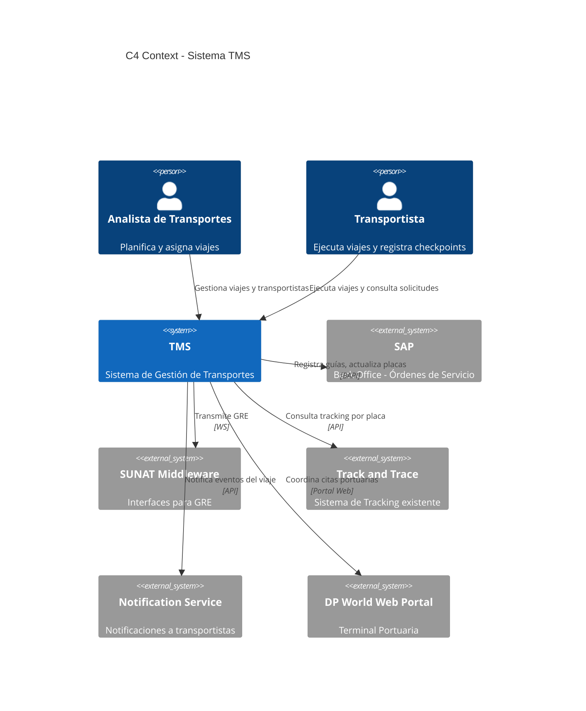

# PRD — Sistema de Gestión de Transportes (TMS)

  
  
  
  

> **Fase:** 1 — Concepción y Descubrimiento
> **Padre:** [Plantillas de Artefactos](../../reference/governance/sdlc/04-plantillas-artefactos/README.md)

---

## 1. Metadatos

- **Identificador:** `PRD-TMS-001`
- **Producto:** Sistema de Gestión de Transportes (TMS)
- **Versión:** 0.2.0-draft
- **Estado:** Borrador
- **Autor(es):** John (Product Manager)
- **Aprobador de Negocio:** *(pendiente)*
- **Aprobador de Arquitectura:** *(pendiente)*
- **Fecha de Aprobación:** *(pendiente)*

## 2. Resumen Ejecutivo

### 2.1 Declaración del Problema

La operación de transporte de Unimar procesa aproximadamente **{X} contenedores/mes** distribuidos en **{Y} viajes/mes** sin un sistema dedicado de gestión. El proceso actual depende de hojas de cálculo, llamadas telefónicas, correos y WhatsApp, generando **{X} horas/hombre de retrabajo mensual**, una tasa de errores del **{X}%** en datos de asignación (placa, chofer, fecha) y **cero trazabilidad** en tiempo real del estado de los contenedores.

### 2.2 Solución Propuesta

El **Sistema de Gestión de Transportes (TMS)** es el nuevo dominio de la **Suite Operativa** de Unimar (capa Apoyo al Negocio) que digitaliza el ciclo completo de transporte de contenedores, carga suelta y carga rodante desde/hasta puerto, traslado de mercancía local y devolución de contenedores vacíos: desde las solicitudes de transporte (relaciones detalladas desde SAP) hasta la confirmación de viaje, coordinando de forma iterativa transportistas, choferes y unidades vehiculares.

### 2.3 Alcance del MVP

El MVP (Q3 2026) cubre las siguientes funcionalidades:

| Categoría | Funcionalidades |
| :-------- | :-------------- |
| **Gestión de datos** | Registro de solicitudes de transporte (input de usuario y obtención desde SAP — relaciones detalladas), búsqueda de contenedores |
| **Planificación** | Creación de solicitudes, gestión de citas en el puerto o depósito temporal, asignación de viajes |
| **Coordinación** | Selección de transportista, chofer y unidad (asignación iterativa con el transportista) |
| **Citas** | Coordinación con DPWORLD/APM o los depósitos |
| **Visibilidad** | Dashboard de planificación, calendario de citas, alertas de vencimiento |
| **Operación** | Aceptación/rechazo de viaje, cancelación, reasignación, registro fotográfico |
| **Auditoría** | Historial de cambios, exportación de datos |

### 2.4 Beneficios Esperados

| Beneficio | Valor Esperado |
| :-------- | :------------- |
| Reducción del tiempo de asignación | De {X} horas a < 2 horas |
| Trazabilidad de viajes | 100% de viajes con registro digital |
| Eliminación de errores de comunicación | {X}% reducción en datos inconsistentes |
| Base para emisión de GRE | 80% de solicitudes listas para Fase 2 |
| Visibilidad operativa | Dashboard en tiempo real para Gestores |

### 2.5 Fases de Entrega

| Fase | Entregable | Horizonte |
| :--- | :--------- | :-------- |
| **Fase 1 — MVP** | Planificación y asignación de transportes | Q3 2026 |
| **Fase 2 — Operación** | Reasignación, aceptación/rechazo, notificaciones, excepciones y registro fotográfico | Q4 2026 |
| **Fase 2 — Emisión (GRE)** | Emisión de guías de remisión electrónicas a SUNAT + integración SAP en tiempo real (BAPI) | Q1 2027 |
| **Fase 3 — Track & Trace** | Seguimiento en tiempo real y notificaciones | Q2 2027 |
| **Fase 4 — App Móvil** | Aplicación móvil para transportistas | Q3 2027 |

## 3. Contexto y Problema

### 3.1 Contexto Actual

- **Operación de transporte:** Unimar gestiona el transporte de contenedores desde/hasta el puerto, transporte local (inland) hasta destino final. La operación actual procesa aproximadamente **{X} contenedores/mes** distribuidos en **{Y} viajes/mes** con **{Z} transportistas activos**.
- **Ecosistema de sistemas:** Unimar opera su Suite Operativa con dominios como UMS, MMS y SIL, interoperados mediante el bróker XMS. El TMS se incorpora como nuevo dominio en la capa de Apoyo al Negocio.
- **Proceso actual de traslado/descarga de contenedores (paso a paso):**
  1. El personal de transportes recibe las solicitudes de transporte vía correo
  2. Copia datos de las solicitudes de transporte a una hoja de cálculo
  3. Coordina con los proveedores de transporte para la atención de dichas solicitudes vía llamada telefónica y WhatsApp, seleccionando transportista según disponibilidad conocida (sin sistema)
  4. Comunica la asignación por llamada telefónica o WhatsApp
  5. El transportista confirma chofer y placa por la misma vía
  6. El personal de transportes actualiza manualmente la hoja de cálculo, donde asocia la información del chofer y la empresa de transportes con la solicitud de transporte
  7. No existe registro centralizado ni trazabilidad del estado; toda la coordinación se realiza vía llamada o WhatsApp
- **Tiempo promedio de asignación:** {X} horas desde solicitud hasta viaje confirmado
- **Tasa de errores:** {X}% de viajes presentan datos inconsistentes (placa incorrecta, chofer no disponible, fecha desactualizada)
- **Volumen de transportistas:** {X} transportistas con {Y} unidades vehiculares registradas

### 3.2 Problema Identificado

| Problema | Impacto | Consecuencia Operativa |
| :------- | :------ | :--------------------- |
| **Sin trazabilidad** | No se conoce la ubicación ni estado de los contenedores en tiempo real | Clientes consultan y no hay respuesta; pérdida de confianza |
| **Comunicación fragmentada** | Información dispersa en llamadas, correos, WhatsApp y hojas de cálculo | Datos perdidos, versiones contradictorias, retrabajo |
| **Errores de asignación** | Placa equivocada, chofer no disponible, fecha incorrecta | Retrasos en retiro de contenedores, storage portuario adicional |
| **Sin métricas de desempeño** | No se puede medir cumplimiento de transportistas | Imposible negociar contratos con datos objetivos |
| **Riesgo de cumplimiento** | Sin registro formal de asignaciones y confirmaciones | Exposición legal en caso de incidentes o auditorías |
| **Cuello de botella operativo** | La planificación depende de uno o dos Gestores clave | Si se ausentan, la operación se detiene |
| **Escalabilidad limitada** | El proceso manual no escala con volumen creciente | Cada incremento de demanda requiere más personal manual |

### 3.3 Impacto Estimado

| Métrica | Valor Estimado | Nota |
| :------ | :------------- | :--- |
| Horas/hombre perdidas en gestión manual | {X} horas/mes | Copia de datos, llamadas, actualización de hojas |
| Costo estimado de retrabajo | USD {X}/mes | Corrección de errores, coordinación adicional |
| Tiempo promedio de respuesta a cliente | {X} horas | Para consultas de estado de contenedor |
| Riesgo de storage portuario por retraso | USD {X}/contenedor/día | Costo de permanencia en terminal |

### 3.4 Visión Estratégica

El TMS es pieza clave de la digitalización de la Suite Operativa de Unimar. Además de resolver los problemas operativos inmediatos, habilita:
- **Emisión de GRE (Fase 2):** Sin trazabilidad de viajes, no es posible emitir guías electrónicas
- **Track & Trace (Fase 2):** Sin datos de viaje en tiempo real, no hay seguimiento
- **Analítica operativa:** Sin datos estructurados, no hay reportes ni métricas
- **Experiencia del cliente:** Sin trazabilidad, el cliente no puede consultar el estado de su carga

## 4. Objetivos y Métricas de Éxito

| Objetivo | Métrica | Valor Inicial | Meta | Horizonte |
| :--- | :--- | :--- | :--- | :--- |
| Digitalizar la planificación de transportes | Solicitudes creadas en sistema vs manuales | 0% | 100% | Q3 2026 |
| Reducir tiempo de asignación de viaje | Tiempo desde solicitud hasta viaje confirmado | Sin medición | < 2 horas | Q4 2026 |
| Trazabilidad de viajes | Viajes con registro digital completo | 0% | 100% | Q3 2026 |
| Preparar base para GRE | Solicitudes listas para emisión de GRE | 0% | 80% | Q1 2027 |

## 5. Alcance

### 5.1 Dentro del Alcance — MVP Planificación (Fase 1)

| Categoría | Funcionalidades Incluidas |
| :-------- | :------------------------ |
| **Gestión de datos** | F-01 Integración con SAP para obtener las solicitudes de transporte (relaciones detalladas), F-17 Búsqueda rápida de solicitudes por naves, documentos de transporte y contenedores |
| **Solicitudes** | F-02 Creación de solicitud, F-18 Clonar solicitud |
| **Planificación y asignación** | F-03 Asignación de viaje, F-04 Selección de transportista, F-05 Selección de chofer, F-06 Selección de unidad vehicular, F-07 Confirmación de viaje |
| **Coordinación iterativa** | Asignación bidireccional UNIMAR-transportista para chofer y unidad (RN-06) |
| **Citas portuarias** | F-11 Coordinación de citas con DPWORLD/APM u otros terminales, F-19 Vista calendario de citas |
| **Visibilidad** | F-08 Consulta de viajes, F-09 Edición de viaje, F-10 Dashboard de planificación, F-20 Alertas de vencimiento |
| **Gestión** | F-12 Cancelación de solicitud/viaje antes de ejecución |
| **Auditoría** | F-14 Historial de cambios, F-21 Exportar datos |
| **Integración** | Integración batch con SAP para maestro de datos (transportistas, choferes, unidades) |
| **Reglas de negocio** | RN-01 a RN-40 — 40 reglas de consistencia, estados, fechas, validación e integración |

### 5.2 Fuera del Alcance MVP — Fases Posteriores

| Fase | Funcionalidad | Horizonte |
| :--- | :------------ | :-------- |
| **Fase 2 — Operación** | F-13 Reasignación de viaje | Q4 2026 |
| **Fase 2 — Operación** | F-15 Notificaciones mejoradas (asignación, cambios, recordatorios) | Q4 2026 |
| **Fase 2 — Operación** | F-16 Aceptación/rechazo de viaje por transportista | Q4 2026 |
| **Fase 2 — Operación** | F-22 Gestión de excepciones (demoras, daños, rechazos) | Q4 2026 |
| **Fase 2 — Operación** | F-23 Registro fotográfico al inicio/fin de viaje | Q4 2026 |
| **Fase 2 — Emisión** | Emisión de guías de remisión electrónicas (GRE) a SUNAT | Q1 2027 |
| **Fase 2 — Emisión** | Integración en tiempo real con SAP (BAPI) | Q1 2027 |
| **Fase 3** | Track & Trace en tiempo real | Q2 2027 |
| **Fase 4** | Aplicación móvil para transportistas | Q3 2027 |
| **Post-MVP** | Portal de consulta para clientes | Por definir |
| **Post-MVP** | Reportería avanzada | Por definir |
| **Post-MVP** | Carga suelta (fotos, packing list, dimensiones — RN-07) | Por definir |

### 5.3 Mapa Conceptual

**Leyenda de conexiones:**
| Conexión | Protocolo | Fase | Dirección |
| :------- | :-------- | :--- | :-------- |
| TMS → SAP | BAPI Batch | MVP | TMS consulta maestros y relaciones |
| TMS → XMS | API REST | MVP | TMS se integra con Suite Operativa |
| TMS → DPWORLD/APM | Portal Web | MVP | Coordinación de citas portuarias |
| TMS → SUNAT | Web Service | Fase 2 | Emisión de GRE |
| TMS → Track & Trace | API REST | Fase 3 | Consulta de tracking |

## 6. Actores y Casos de Uso de Alto Nivel

### 6.1 Descripción de Actores

| Actor | Rol en el Sistema | Responsabilidades Principales |
| :---- | :---------------- | :---------------------------- |
| **Gestor de Transportes** | Planifica, asigna y monitorea viajes | Crear solicitudes, asignar transportistas, coordinar citas, gestionar excepciones, dashboard |
| **Transportista** | Ejecuta viajes asignados | Consultar solicitudes, confirmar chofer y unidad, aceptar/rechazar viaje (Fase 2) |
| **Operador de Documentación** | Recibe y valida datos desde SAP | Verificar relaciones detalladas, mantener datos de nave/BL |
| **Gestor Comercial** | Consulta estado de operaciones | Visualizar dashboard, consultar tracking, generar reportes |
| **Operador de Transmisiones** | Emite guías de remisión | Transmitir GRE a SUNAT (Fase 2) |

### 6.2 Casos de Uso por Actor

| Actor | Casos de Uso — MVP (Fase 1) | Casos de Uso — Fase 2+ |
| :---- | :-------------------------- | :---------------------- |
| **Gestor de Transportes** | F-01 Consultar relaciones detalladas o solicitudes de transporte, F-02 Crear solicitud, F-03 Asignar viaje según el tipo de carga (contenedores, carga rodante, carga suelta), F-04 Seleccionar transportista, F-05 Seleccionar chofer, F-06 Seleccionar unidad, F-07 Confirmar viaje, F-08 Consultar viajes, F-09 Editar viaje, F-10 Dashboard, F-11 Coordinar citas portuarias, F-12 Cancelar solicitud/viaje, F-14 Historial de cambios, F-17 Buscar contenedores, F-18 Clonar solicitud, F-19 Calendario de citas, F-20 Alertas de vencimiento, F-21 Exportar datos | F-13 Reasignar viaje, F-15 Notificaciones mejoradas, F-22 Gestión de excepciones |
| **Transportista** | Consultar solicitud asignada, ver datos de viaje | F-16 Aceptación/rechazo de viaje, F-23 Registro fotográfico |
| **Operador de Documentación** | Consultar relaciones detalladas, validar datos | Edición de relaciones |
| **Gestor Comercial** | Dashboard de planificación, consulta de viajes | Reportería avanzada, portal de clientes |
| **Operador de Transmisiones** | — | Emisión de GRE a SUNAT |

### 6.3 Matriz de Interacción

| Actor | Web App TMS | SAP | DPWORLD/APM | Track & Trace |
| :---- | :---------- | :-- | :---------- | :------------ |
| **Gestor de Transportes** | Crea, edita, consulta | Consulta relaciones | Genera citas | Consulta tracking |
| **Transportista** | Consulta solicitud | — | — | — |
| **Operador de Documentación** | Valida datos | Recibe datos | — | — |
| **Gestor Comercial** | Consulta dashboard | — | — | Consulta tracking |
| **Operador de Transmisiones** | — | Consulta entregas | — | — |

## 7. Funcionalidades Detalladas del MVP

| ID | Funcionalidad | Descripción |
| :-- | :------------ | :---------- |
| F-01 | Gestión de Relaciones Detalladas | Visualización y filtro de relaciones detalladas desde SAP por nave, BL/BK, puerto, fecha |
| F-02 | Creación de Solicitud de Transporte | El Gestor crea una solicitud seleccionando contenedores de una relación detallada (DT de importación o exportación), o crea una solicitud de transporte de acuerdo a los requerimientos de las líneas de negocio como CD, DAS o vacíos |
| F-03 | Asignación de Viaje | El Gestor asigna la solicitud a un transportista de acuerdo a las características de la carga a movilizar, definiendo origen, destino y fecha |
| F-04 | Selección de Transportista | Búsqueda y selección de transportista desde maestro de datos |
| F-05 | Selección de Chofer | Asignación de chofer al viaje. Puede ser asignado por UNIMAR desde el maestro o propuesto/confirmado por el transportista. Opcional en planificación, se coordina hasta antes de iniciar el viaje |
| F-06 | Selección de Unidad Vehicular | Asignación de placa/unidad al viaje. Puede ser asignada por UNIMAR desde el maestro o propuesta/confirmada por el transportista. Opcional en planificación, se coordina hasta antes de iniciar el viaje |
| F-07 | Confirmación de Viaje | Confirmación formal que notifica al transportista. El transportista puede notificar chofer y placa final en esta etapa, o haberlo hecho durante la planificación. La comunicación es continua y puede ocurrir hasta antes de iniciar el viaje |
| F-08 | Consulta de Viajes Planificados | Listado de viajes con estado, filtros por fecha, transportista, estado |
| F-09 | Edición de Viaje | Edición de datos del viaje antes de su ejecución |
| F-10 | Dashboard de Planificación | Resumen visual de viajes por estado con acceso rápido a creación |
| F-11 | Coordinación de Citas Portuarias | Gestión de citas con terminales portuarias (DPWORLD/APM) o almacenes: confirmación de arribo/zarpe, agendamiento de citas de retiro de contenedores y gestión de citas en almacenes de depósito de contenedores para devolución de vacíos |
| F-12 | Cancelación de Solicitud/Viaje | Cancelación de solicitud o viaje antes de su ejecución, con registro del motivo |
| F-13 | Reasignación de Viaje | Reasignación del viaje a otro transportista cuando el original rechaza o no puede cumplir |
| F-14 | Historial de Cambios | Registro de auditoría de todos los cambios en solicitudes y viajes: actor, timestamp, campo, valor anterior y nuevo |
| F-15 | Notificaciones al Transportista | Envío de notificaciones (correo, SMS, push) por asignación, cambios y recordatorios de viaje |
| F-16 | Aceptación/Rechazo de Viaje | El transportista acepta o rechaza formalmente un viaje asignado antes de ejecutarlo |
| F-17 | Búsqueda Rápida de Contenedores | Búsqueda directa por número de contenedor sin navegar por relaciones detalladas |
| F-18 | Clonar Solicitud de Transporte | Duplicar una solicitud existente con sus contenedores para agilizar creación de solicitudes similares |
| F-19 | Vista Calendario de Citas Portuarias | Vista visual de citas agendadas por día/semana para evitar solapamientos |
| F-20 | Alertas de Vencimiento | Notificaciones automáticas por contenedores sin asignar o citas próximas a vencer |
| F-21 | Exportar Datos (Excel/PDF) | Exportación de solicitudes, viajes y reportes para compartir con transportistas y clientes |
| F-22 | Gestión de Excepciones | Proceso formal para registrar y resolver incidencias: demoras, daños, rechazos, contenedores varados |
| F-23 | Registro Fotográfico | Evidencia fotográfica al inicio y fin de viaje para reclamaciones y auditoría |

## 8. Reglas de Negocio Explícitas

> **Prioridad (MoSCoW):** **M** = Must (imprescindible MVP) · **S** = Should (importante, no bloquea MVP) · **C** = Could (deseable / fase posterior).

| ID | Regla | Prioridad |
| :-- | :---- | :-------: |
| RN-01 | Un manifiesto puede tener más de una relación detallada asociada a un BL, y este puede tener más de una relación detallada | M |
| RN-02 | La Fase 1 contempla relación detallada (solicitud de transporte) de descarga y embarque de contenedores, carga suelta y rodante desde/hasta el puerto | M |
| RN-03 | Una relación detallada (solicitud de transporte) puede pertenecer a diferentes orígenes: depósito, almacenes, etc. | M |
| RN-04 | Una Orden de Servicio (SAP) puede tener asociados múltiples Pedidos de Transporte en diferentes momentos | M |
| RN-05 | El Pedido de Transporte se referencia desde la OS SAP | M |
| RN-06 | La asignación de chofer y unidad vehicular es un proceso de coordinación iterativo entre UNIMAR y el transportista. UNIMAR puede asignar desde el maestro, el transportista puede proponer o confirmar, y la asignación se cierra cuando ambas partes validan. Esta coordinación puede ocurrir en planificación, confirmación o hasta antes de iniciar el viaje | M |
| RN-07 | Para carga suelta se requieren fotos, packing list y dimensiones (fase posterior) | C |
| RN-08 | La coordinación de citas portuarias se realiza a través del portal de DPWORLD/APM | M |
| RN-09 | Un contenedor solo puede estar asignado a un viaje activo a la vez | M |
| RN-10 | La solicitud de transporte solo puede incluir contenedores, carga suelta o rodante de la misma relación detallada | M |
| RN-11 | El chofer y la unidad deben estar asociados a la empresa de transportes seleccionada en el maestro de datos | M |
| RN-12 | Origen y destino de un viaje no pueden ser iguales | M |
| RN-13 | Un viaje no puede confirmarse sin al menos el transportista asignado | M |
| RN-14 | Un viaje en ejecución (con checkpoint registrado) no puede editarse, salvo casos excepcionales en que por una falla mecánica se deba cambiar la unidad de transporte; en tal caso solo personal autorizado puede modificarlo, guardando un log de modificaciones | M |
| RN-15 | Un viaje solo puede cancelarse antes de iniciar la ejecución; hay excepciones que debe manejar solo el personal autorizado | M |
| RN-16 | La fecha del viaje no puede ser anterior a la fecha actual al momento de creación | M |
| RN-17 | La fecha de cita portuaria debe ser coherente con la fecha estimada de arribo de la nave. Las citas portuarias no están ligadas a una nave o viaje específico; se asignan a la nave cuando entregan el contenedor en el puerto (DPW) | S |
| RN-18 | Solo contenedores con estado pendiente o planificado en la relación detallada pueden asignarse a viajes, validando el tipo de carga y las características de la unidad de transporte (ej. traslados de carga IMO requieren un tipo especial de unidad vehicular) | M |
| RN-19 | La sincronización batch de maestros con SAP debe ejecutarse mínimo una vez al día. (A evaluar: tener maestros propios en el sistema de gestión de transportes) | M |
| RN-20 | Si la sincronización SAP falla, el sistema opera con el último conjunto de datos válido | S |
| RN-21 | El transportista debe ser notificado al momento de asignársele un viaje | M |
| RN-22 | El Gestor debe ser notificado cuando el transportista proporciona chofer y unidad vehicular | S |
| RN-23 | Una solicitud de transporte puede generar múltiples viajes cuando la cantidad de contenedores, carga suelta o rodante excede la capacidad de una unidad | M |
| RN-24 | Un viaje puede contener múltiples contenedores, siempre que pertenezcan a la misma solicitud | M |
| RN-25 | Una solicitud de transporte debe contener al menos un contenedor | M |
| RN-26 | El transportista debe aceptar o rechazar formalmente un viaje asignado | S |
| RN-27 | Los datos del chofer deben validarse contra el maestro (licencia, vigencia) | S |
| RN-28 | La unidad vehicular debe tener estado operativo en el maestro para poder asignarse | M |
| RN-29 | No se puede asignar un viaje si el transportista tiene otro viaje en conflicto de horario/fecha para la misma unidad | S |
| RN-30 | El historial de cambios debe registrar: actor, timestamp, campo modificado, valor anterior y nuevo | M |
| RN-31 | Si el transportista rechaza el viaje, el Gestor debe ser notificado para reasignar | S |
| RN-32 | La solicitud de transporte debe referenciar al menos una Orden de Servicio de SAP | S |
| RN-33 | Un contenedor con viaje en ejecución no puede ser asignado a otro viaje | M |
| RN-34 | Debe existir un tiempo mínimo de anticipación para crear un viaje (ej. 24 horas antes del retiro) | S |
| RN-35 | Un transportista con más del 20% de viajes rechazados en los últimos 30 días debe ser marcado como riesgoso | C |
| RN-36 | Los contenedores de un mismo BL deben viajar juntos salvo excepción justificada | S |
| RN-37 | La capacidad máxima de contenedores por viaje depende del tipo de unidad vehicular (20' o 40') y de la condición del contenedor (solo si es vacío se puede trasladar más de un contenedor en un viaje; los llenos son un contenedor por viaje) | M |
| RN-38 | El sistema debe alertar sobre contenedores huérfanos (sin viaje asignado después de X días) | S |
| RN-39 | Las notificaciones deben tener canal de fallback (email → SMS → push) | C |
| RN-40 | El dashboard debe mostrar métricas en tiempo real: viajes hoy, pendientes, completados, alertas | S |

## 9. Restricciones y Supuestos

### 9.1 Restricciones

| ID | Restricción | Categoría |
| :-- | :---------- | :-------- |
| R-01 | Las guías de remisión electrónicas deben cumplir con la normativa SUNAT (fuera de MVP, considerar en fase 2) | Regulatoria |
| R-02 | Integración con SAP vía BAPI existente; datos maestros provistos por SAP | Técnica |
| R-03 | Stack tecnológico definido en ADR-0001 (NestJS, PostgreSQL, React) | Técnica |
| R-04 | El MVP está limitado a planificación de transportes; la operación (reasignación, aceptación, excepciones, registro fotográfico) es Fase 2 | Alcance |
| R-05 | El TMS depende de XMS como bróker de integración para interoperar con otros dominios de la Suite Operativa | Técnica |
| R-06 | El portal de DPWORLD/APM es un sistema externo sin control sobre disponibilidad ni cambios de interfaz | Operativa |
| R-07 | Los datos maestros (transportistas, choferes, unidades) dependen de SAP; si SAP no provee datos, el TMS no puede funcionar | Dependencia |

### 9.2 Supuestos

| ID | Supuesto | Riesgo si no se cumple |
| :-- | :------- | :--------------------- |
| S-01 | Los maestros de transportistas, choferes y unidades están disponibles en SAP y son precisos | No se pueden crear viajes válidos |
| S-02 | El MVP no requiere integración en tiempo real con SAP (carga batch diaria es suficiente) | Retraso en datos actualizados |
| S-03 | Los prototipos de negocio reflejan fielmente el flujo actual | El sistema no se ajusta a la operación real |
| S-04 | Los transportistas tienen capacidad vehicular suficiente para cubrir la demanda | La planificación no se puede ejecutar |
| S-05 | Los Gestores de Transportes serán capacitados y adoptarán el sistema | El sistema no genera valor; se mantiene el proceso manual |
| S-06 | Las relaciones detalladas llegan completas desde SAP (nave, BL, contenedores, puertos, fechas) | Datos faltantes requieren carga manual |
| S-07 | Los transportistas responden las asignaciones en un tiempo razonable (< 24 horas) | Retrasos en la planificación |
| S-08 | La infraestructura de TI (servidores, red, seguridad) estará disponible para el MVP | Retraso en el cronograma |

## 10. Riesgos de Negocio

| ID | Riesgo | Probabilidad | Impacto | Mitigación |
| :-- | :----- | :----------- | :------ | :--------- |
| RS-01 | Calidad de datos maestros en SAP incompleta o desactualizada | Media | Alto | Validar data quality antes del desarrollo; plan de limpieza; alertas de datos faltantes |
| RS-02 | Cambios en normativa SUNAT de GRE durante el proyecto | Baja | Medio | Diseñar GRE con parámetros configurables; monitorear cambios regulatorios |
| RS-03 | Adopción deficiente por parte de transportistas | Media | Medio | Involucrar transportistas en validación temprana; UI simple e intuitiva |
| RS-04 | Dependencia de integración SAP batch no disponible a tiempo | Alta | Alto | Definir interfaz batch como MVP; planificar BAPI en fase 2; datos de respaldo |
| RS-05 | Disponibilidad del portal DPWORLD/APM afecta coordinación de citas | Media | Alto | Diseñar interfaz de respaldo; documentar proceso manual de coordinación |
| RS-06 | Resistencia al cambio por parte de Gestores de Transportes | Media | Alto | Involucrarlos desde diseño; mostrar beneficios tangibles; capacitación intensiva |
| RS-07 | Recursos de desarrollo insuficientes para el cronograma del MVP | Media | Alto | Definir MVP acotado; priorizar funcionalidades core; seguimiento semanal |
| RS-08 | Datos incompletos o erróneos desde SAP en relaciones detalladas | Media | Medio | Validación de calidad al importar; alertas de datos faltantes; proceso de corrección |
| RS-09 | Coordinación lenta con transportistas (tiempo de respuesta > 24h) | Alta | Medio | Establecer SLAs de respuesta; alertas de falta de respuesta; escalamiento |
| RS-10 | Cambios en requerimientos durante el desarrollo | Alta | Medio | Control de cambios formal; aprobación de adds; registro en DECISIONS.md |
| RS-11 | Infraestructura de TI no disponible a tiempo para el MVP | Baja | Alto | Definir requisitos tempranos; seguimiento con TI; alternativas cloud |
| RS-12 | Fuga o acceso no autorizado a datos sensibles de transportistas | Baja | Alto | Acceso por roles; auditoría de accesos; cifrado de datos sensibles |

## 11. Criterios de Aceptación del PRD

El PRD se considera aprobado cuando se cumplan todos los siguientes criterios:

### 11.1 Contenido del PRD

| ID | Criterio | Responsable | Estado |
| :-- | :------- | :---------- | :----- |
| CA-01 | Resumen ejecutivo validado por el Aprobador de Negocio | John (PM) | ☐ |
| CA-02 | Métricas de éxito con valor inicial y meta medibles | John (PM) | ☐ |
| CA-03 | Alcance (5.1 y 5.2) firmado por Producto y Arquitectura | John (PM) + Arquitecto | ☐ |
| CA-04 | Reglas de negocio (RN-01 a RN-40) sin contradicciones y priorizadas | John (PM) | ☐ |
| CA-05 | Restricciones y supuestos revisados y aprobados | John (PM) + Arquitecto | ☐ |
| CA-06 | Actores y casos de uso validados con stakeholders clave | John (PM) | ☐ |
| CA-07 | Diagramas conceptuales (5.3, A.1 a A.3) revisados y consistentes | Arquitecto | ☐ |
| CA-08 | Funcionalidades (F-01 a F-23) con criterios de aceptación individuales | John (PM) | ☐ |
| CA-09 | Reglas de negocio priorizadas (Must/Should/Could) | John (PM) | ☐ |
| CA-10 | Glosario completo y consistente con el dominio | John (PM) | ☐ |

### 11.2 Producto

| ID | Criterio | Responsable | Estado |
| :-- | :------- | :---------- | :----- |
| CA-11 | Prototipos/wireframes (A.4) aprobados por UX | UX Designer | ☐ |
| CA-12 | ADR-0001 (stack tecnológico) aprobado | Arquitecto | ☐ |
| CA-13 | Contratos de integración con SAP definidos | Arquitecto | ☐ |
| CA-14 | Contratos de integración con DPWORLD/APM definidos | Arquitecto | ☐ |
| CA-15 | Plan de datos maestros (mapeo, calidad, limpieza) aprobado | John (PM) + Arquitecto | ☐ |

### 11.3 Proyecto

| ID | Criterio | Responsable | Estado |
| :-- | :------- | :---------- | :----- |
| CA-16 | Cronograma del MVP con hitos y fecha de entrega definidos | PM del proyecto | ☐ |
| CA-17 | Recursos de desarrollo asignados y disponibles | PM del proyecto | ☐ |
| CA-18 | Plan de testing (unitario, integración, aceptación) definido | QA Lead | ☐ |
| CA-19 | Plan de despliegue y capacitación definido | PM del proyecto | ☐ |

## 12. Trazabilidad

### 12.1 Referencias del PRD

| Artefacto | Referencia | Sección del PRD |
| :-------- | :--------- | :-------------- |
| Épicas | Cada epic referencia secciones del PRD | Historial de Cambios |
| Historias Funcionales | Cada historia referencia epic + funcionalidad | Historial de Cambios |
| ADR-0001 | Stack tecnológico definido | R-03 (Restricciones) |
| Contrato SAP | Integración batch vía BAPI | R-02 (Restricciones) |
| Contrato DPWORLD/APM | Coordinación de citas vía portal | R-06 (Restricciones) |
| Contrato XMS | Integración con Suite Operativa | R-05 (Restricciones) |
| Plan de Testing | Reglas de negocio a probar | RN-01 a RN-40 |
| Plan de Despliegue | Funcionalidades MVP a desplegar | 5.1 (Alcance) |
| Notas de Lanzamiento | Valor entregado contra objetivos | 4 (Objetivos y Métricas) |
| Reporte Resumen de Pruebas | Criterios de aceptación del PRD | 11 (Criterios de Aceptación) |

### 12.2 Matriz de Trazabilidad

### 12.3 Convención de Referencia

| Artefacto Destino | Convención de Referencia |
| :---------------- | :---------------------- |
| Épicas | `EP-TMS-{número}` |
| Historias Funcionales | `HF-TMS-{épica}-{número}` |
| ADR | `ADR-{número}` |
| Contratos | `CT-{dominio}-{número}` |
| Plan de Testing | `PT-TMS-{fase}` |
| Plan de Despliegue | `PD-TMS-{fase}` |
| Notas de Lanzamiento | `NL-TMS-{versión}` |
| Reporte de Pruebas | `RP-TMS-{fase}` |

## 13. Glosario

| Término | Definición |
| :------ | :--------- |
| **Relación Detallada** | Lista de contenedores, carga suelta o rodante por nave + BL/BK, base de la planificación de transporte |
| **Solicitud de Transporte** | Petición formal de servicio de transporte para uno o más contenedores |
| **Viaje** | Asignación de un transportista, chofer y unidad a una solicitud de transporte |
| **Orden de Servicio (OS)** | Documento SAP que origina el pedido de transporte |
| **Guía de Remisión Electrónica (GRE)** | Documento electrónico para el traslado de carga, transmitido a SUNAT |
| **Checkpoint** | Punto de control en la ejecución del viaje (inicio ruta, fin ruta) |
| **Manifiesto** | Documento de carga de la nave |
| **BL / BK (Booking)** | Bill of Lading — conocimiento de embarque (BL en importación, BK/Booking en exportación) |

## 14. Historial de Cambios

| Versión | Fecha | Autor | Cambios |
| :------ | :---- | :---- | :------ |
| 0.1.0-draft | 2026-06-23 | John (PM) | Versión inicial |
| 0.2.0-draft | 2026-06-30 | John (PM) | Correcciones estructurales y de contenido: §8 duplicado renumerado (Restricciones→§9, cascada hasta §14); reconciliada contradicción de Fase 2 (§2.5 vs §5.2, ahora Operación Q4 2026 + Emisión Q1 2027); añadida priorización MoSCoW a RN-01..RN-40 (CA-09); unificado término BL/BK (glosario + F-01); enriquecidos §2.2, §2.3, §3.1, §5.1, §6.2, §6.3, §7 y RN según revisión de negocio (tracked-changes de M. Hernández). **Pendiente de negocio:** datos {X}/{Y}/{Z}, §3.3 Impacto, métricas §4 y firma de los 19 CA. |

---

## Anexos — Diagramas del Sistema

### A.1 Vista Conceptual General

**Actores del sistema y sus interacciones:**
- **Gestor de Transportes** — consulta Track & Trace, coordina citas con DPWORLD/APM, gestiona planificación vía Web App TMS
- **Operador de Transmisiones** — emite guías de remisión electrónicas hasta obtener OCR desde SUNAT
- **Transportista** — consulta solicitudes de servicio, confirma contenedor, genera guía, registra checkpoints (inicio/fin ruta) vía Mobile App TMS
- **Gestor Comercial** — consulta tracking y reportes

### A.2 Vista Conceptual de Proceso

### A.3 C4 Context View

### A.4 Prototipos de Pantallas (MVP)

Los prototipos de las pantallas del MVP se encuentran disponibles en Figma. Se debe revisar y validar cada pantalla con el Product Owner antes del inicio del desarrollo.

| Pantalla | Funcionalidad | Referencia |
| :------- | :------------ | :--------- |
| Dashboard de Planificación | F-10 | Figma — TMS / Planificación |
| Listado de Relaciones Detalladas | F-01 | Figma — TMS / Relaciones |
| Creación de Solicitud de Transporte | F-02 | Figma — TMS / Solicitudes |
| Asignación de Viaje | F-03, F-04, F-05, F-06, F-07 | Figma — TMS / Asignación |
| Detalle de Viaje | F-08, F-09 | Figma — TMS / Viajes |
| Coordinación de Citas Portuarias | F-11 | Figma — TMS / Citas |

> *Nota: Los prototipos en Figma son la fuente de verdad para el diseño de UI/UX. Este documento solo referencia las pantallas y sus funcionalidades asociadas.*

---

  
  

  <strong>© Unimar S.A.</strong> · RUC 20100412447 · Operador Logístico Aduanero desde 1978 
  Estándar: <a href="https://github.com/mhernandez-unimar/unimar_arch">Unimar Arch</a> · Plantilla: <a href="https://github.com/mhernandez-unimar/unimar_arch/blob/main/reference/governance/sdlc/04-plantillas-artefactos/plantilla-prd.es.md">PRD Template</a>

