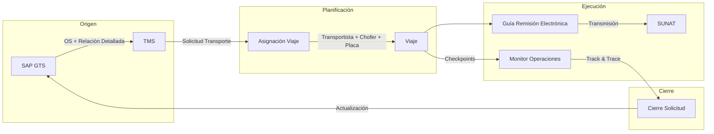
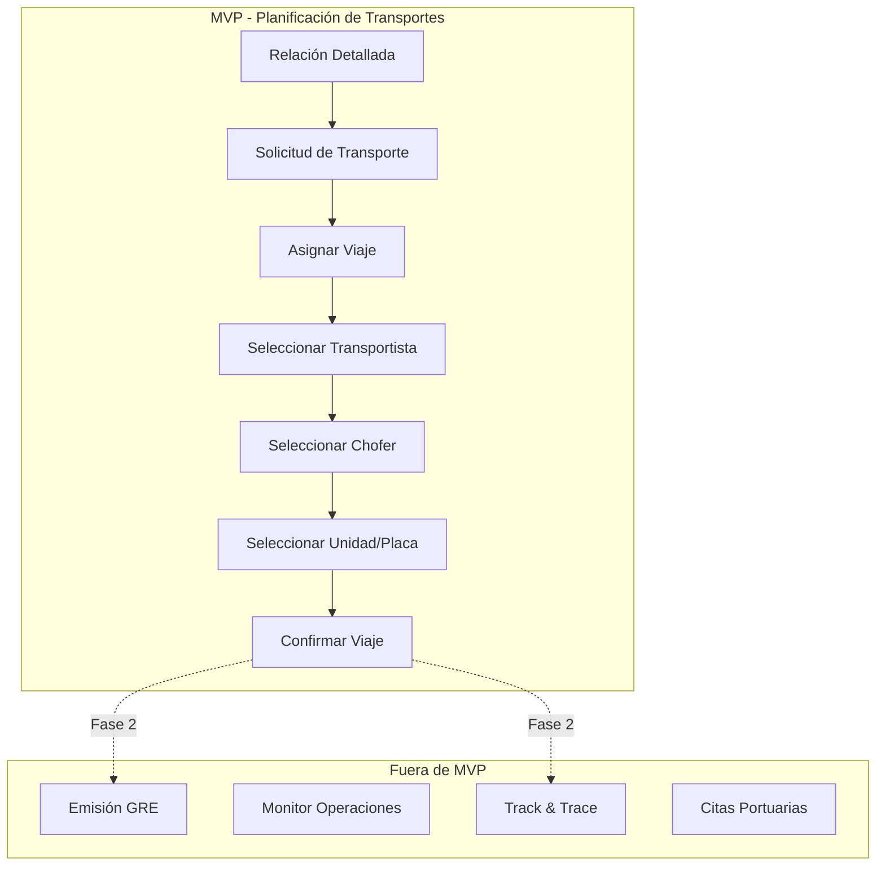

# PRD — Sistema de Gestión de Transportes (TMS)

> **Versión:** 0.1.0-draft
> **Autor:** John (Product Manager)
> **Fecha:** 2026-06-23
> **Estado:** Borrador para revisión

---

## Tabla de Contenidos

1. [Contexto General](#1-contexto-general)
   - 1.1 Dominio del Sistema
   - 1.2 Actores Principales
   - 1.3 Sistemas Externos
   - 1.4 Flujos de Alto Nivel
2. [Alcance Funcional](#2-alcance-funcional)
   - 2.1 Sistema Completo (Visión Total)
   - 2.2 MVP: Flujo de Planificación de Transportes
3. [MVP — Definición Detallada](#3-mvp--definición-detallada)
   - 3.1 Funcionalidades
   - 3.2 Casos de Uso e Historias de Usuario
   - 3.3 Pantallas y Flujos de Interacción
   - 3.4 Reglas de Negocio Visibles
   - 3.5 Criterios de Aceptación
   - 3.6 Dependencias Clave
4. [Requisitos No Funcionales](#4-requisitos-no-funcionales)
5. [Glosario](#5-glosario)

---

## 1. Contexto General

### 1.1 Dominio del Sistema

El **Sistema de Gestión de Transportes (TMS)** de Unimar tiene como objetivo gestionar el ciclo completo del transporte de carga desde el puerto hasta el depósito temporal o cliente final. El alcance inicial cubre la **descarga de contenedores** (importación), abarcando desde la relación detallada de la nave hasta la emisión de la guía de remisión electrónica (GRE) y el seguimiento del viaje del transportista.

El TMS opera en el contexto logístico-portuario peruano, interactuando con:

- **Puertos (DPWORLD, APM):** para confirmación de arribo/zarpe de naves y coordinación de citas
- **SUNAT:** para la emisión y transmisión de guías de remisión electrónicas
- **SAP (GTS):** como sistema de back-office corporativo, fuente de órdenes de servicio y maestro de datos

### 1.2 Actores Principales

| Actor | Rol | Descripción |
| :---- | :-- | :---------- |
| **Gestor de Transportes** | Planificador | Crea y asigna viajes, gestiona transportistas, monitorea operación, track & trace |
| **Operador de Transmisiones** | Documentación | Emite guías de remisión electrónicas (GRE), transmite a SUNAT |
| **Transportista** | Ejecutor | Consulta solicitudes de servicio, confirma contenedor, genera guía, ejecuta ruta (checkpoints) |
| **Gestor Comercial** | Comercial | Consulta estados, track & trace, reportes |
| **Operador de Documentación** | Soporte | Gestiona relaciones detalladas, documentación de manifiestos |

### 1.3 Sistemas Externos

| Sistema | Propósito | Interacción |
| :------ | :--------- | :---------- |
| **SAP (GTS)** | Back-office, órdenes de servicio, maestro de datos | BAPI: registro guía remisión, actualización placa; consulta de entregas de salida |
| **SUNAT** | Receptor de GRE | Transmisión de guías de remisión electrónicas vía middleware |
| **DPWORLD** | Terminal portuaria | Confirmación de arribo/zarpe de naves, coordinación de citas |
| **APM** | Terminal portuaria | Coordinación de citas y consultas |
| **Track & Trace** | Sistema de tracking | Consulta de tracking por placa; reporte de solicitudes de transporte |
| **Sistema de Transmisiones** | Middleware SUNAT | Envío de GRE, notificación de aprobación |

### 1.4 Flujos de Alto Nivel

**Flujo conceptual del sistema completo:**

1. **SAP** genera una Orden de Servicio (OS) que llega al TMS con la relación detallada de contenedores
2. **Planificación:** el Gestor de Transportes crea solicitudes de transporte, asigna transportistas, choferes y unidades vehiculares
3. **Ejecución:** el Transportista ejecuta el viaje con checkpoints (inicio ruta, fin ruta), se emite la GRE y se transmite a SUNAT
4. **Cierre:** se actualiza SAP con la información del viaje completado

---

## 2. Alcance Funcional

### 2.1 Sistema Completo (Visión Total)

| Área Funcional | Descripción | MVP |
| :--- | :--- | :---: |
| **Planificación de Transportes** | Gestión de solicitudes, asignación de viajes, transportistas, choferes, unidades | ✅ |
| **Emisión de GRE** | Generación y transmisión de guías de remisión electrónicas a SUNAT | ❌ |
| **Track & Trace** | Monitoreo en tiempo real de viajes con checkpoints | ❌ |
| **Gestión de Citas Portuarias** | Coordinación de citas con DPWORLD/APM | ❌ |
| **Monitor de Operaciones** | Dashboard de planificación, viajes activos, histórico | ❌ |
| **App Móvil TMS** | Aplicación móvil para transportistas (checkpoints, consultas) | ❌ |
| **Portal de Consulta (T&T)** | Portal web para clientes y gestores (track & trace) | ❌ |
| **Integración SAP** | BAPI de registro de guías, actualización de placas, consulta de entregas | ❌ |
| **Reportería** | Reportes operativos y de gestión | ❌ |

### 2.2 MVP: Flujo de Planificación de Transportes

El **Producto Mínimo Viable** se enfoca exclusivamente en el flujo de **planificación de transportes** para la descarga de contenedores desde puerto. Este flujo abarca desde que el Gestor de Transportes recibe la relación detallada hasta que asigna un viaje a un transportista con chofer y unidad definidos.

---

## 3. MVP — Definición Detallada

### 3.1 Funcionalidades

| ID | Funcionalidad | Descripción |
| :-- | :------------ | :---------- |
| F-01 | Gestión de Relaciones Detalladas | Visualización y filtro de relaciones detalladas provenientes de SAP por nave, BL, puerto, fecha |
| F-02 | Creación de Solicitud de Transporte | El Gestor crea una solicitud seleccionando contenedores de una relación detallada |
| F-03 | Asignación de Viaje | El Gestor asigna la solicitud a un transportista, definiendo origen, destino y fecha |
| F-04 | Selección de Transportista | Búsqueda y selección de transportista desde maestro de datos |
| F-05 | Selección de Chofer | Búsqueda y selección de chofer asociado al transportista |
| F-06 | Selección de Unidad Vehicular | Búsqueda y selección de placa/unidad asociada al transportista |
| F-07 | Confirmación de Viaje | Confirmación formal que dispara la notificación al transportista |
| F-08 | Consulta de Viajes Planificados | Listado de viajes con estado, filtros por fecha, transportista, estado |
| F-09 | Edición de Viaje | Edición de datos del viaje antes de su ejecución |
| F-10 | Dashboard de Planificación | Resumen visual de viajes planificados, pendientes, en ejecución |

### 3.2 Casos de Uso e Historias de Usuario

#### CU-01: Registrar Relación Detallada

> **Como** Gestor de Transportes  
> **Quiero** visualizar las relaciones detalladas de contenedores importadas de SAP  
> **Para** conocer la carga disponible para planificar transporte

**Criterios de Aceptación:**
- La relación detallada muestra: ID+Nro, Nave, IP, Manifiesto, Puerto ETB, Puerto SUNAT, Fecha Almacenaje, Fecha Relación Detallada, Tipo IMO
- Se puede filtrar por nave, puerto, fecha, estado de servicio
- La relación muestra el avance de contenedores (estado de cada contenedor)

#### CU-02: Crear Solicitud de Transporte

> **Como** Gestor de Transportes  
> **Quiero** seleccionar contenedores de una relación detallada y crear una solicitud de transporte  
> **Para** iniciar el proceso de planificación

**Criterios de Aceptación:**
- Se pueden seleccionar uno o múltiples contenedores de la misma relación detallada
- La solicitud registra: origen (puerto/depósito), destino, fecha tentativa
- El sistema valida que los contenedores no tengan otra solicitud activa

#### CU-03: Asignar Viaje

> **Como** Gestor de Transportes  
> **Quiero** asignar la solicitud de transporte a un transportista, chofer y unidad vehicular  
> **Para** concretar la ejecución del transporte

**Criterios de Aceptación:**
- El viaje incluye: Nro Viaje, Origen, Destino, Relación Detallada, Transportista, Chofer, Unidad Vehicular (Placa)
- La asignación requiere seleccionar transportista → chofer → placa en ese orden
- El transportista puede verse en una lista con datos de contacto
- El chofer está asociado al transportista
- La unidad vehicular está asociada al transportista

#### CU-04: Consultar Viajes Planificados

> **Como** Gestor de Transportes  
> **Quiero** ver el listado de viajes con su estado actual  
> **Para** dar seguimiento a la planificación

**Criterios de Aceptación:**
- Listado con columnas: Nro Viaje, Transportista, Chofer, Placa, Origen, Destino, Estado, Fecha
- Filtros por: estado, fecha, transportista
- Estados: Planificado, Asignado, En Ejecución, Completado, Anulado

### 3.3 Pantallas y Flujos de Interacción

Basado en los prototipos de negocio, las pantallas del MVP son:

#### P-01: Dashboard de Planificación

- Resumen visual: tarjetas con conteo de viajes por estado (Planificados, En Ejecución, Completados)
- Tabla resumen de solicitudes pendientes de asignación
- Acceso rápido a "Nuevo Viaje"

#### P-02: Listado de Relaciones Detalladas

- Tabla con relaciones detalladas importadas
- Columnas: Nave, BL, Puerto, Fecha Almacenaje, Fecha RD, Contenedores, Estado
- Filtros por fecha, nave, puerto
- Botón "Crear Solicitud de Transporte" por relación

#### P-03: Creación de Solicitud de Transporte

- Wizard/pasos:
  1. Seleccionar contenedores de la relación detallada (tabla con checkboxes)
  2. Definir origen y destino (campos: puerto/depósito, dirección)
  3. Fecha tentativa de recogida
  4. Resumen y confirmar

#### P-04: Asignación de Viaje

- Formulario con selectores encadenados:
  - **Transportista:** buscador + lista desplegable (carga desde maestro)
  - **Chofer:** se filtra por transportista seleccionado
  - **Unidad Vehicular:** se filtra por transportista seleccionado
- Campos de viaje: Origen, Destino, Fecha/Hora, Referencia RD
- Botón "Confirmar Viaje"

#### P-05: Detalle de Viaje

- Cabecera con datos del viaje
- Secciones: Datos Generales, Transportista/Chofer/Unidad, Contenedores Asignados, Historial de Estados
- Botones: Editar, Anular, Ver en Mapa (futuro)

### 3.4 Reglas de Negocio Visibles

| ID | Regla |
| :-- | :---- |
| RN-01 | Un manifiesto puede tener más de una relación detallada |
| RN-02 | La Fase 1 (alcance actual) contempla relación detallada de **descarga de contenedores** desde puerto. En el futuro podrá incluir carga consolidada y carga suelta |
| RN-03 | Una relación detallada puede pertenecer a diferentes orígenes: depósito, almacenes, etc. |
| RN-04 | Una Orden de Servicio (SAP) puede tener asociados múltiples Pedidos de Transporte en diferentes momentos |
| RN-05 | El Pedido de Transporte se referencia desde la OS SAP |
| RN-06 | La asignación de viaje sigue la jerarquía: Transportista → Chofer → Unidad Vehicular |
| RN-07 | Para carga suelta se requieren fotos, packing list y dimensiones (a considerar en fase posterior) |

### 3.5 Criterios de Aceptación Generales del MVP

1. El Gestor de Transportes puede ver relaciones detalladas y crear solicitudes de transporte
2. El flujo de asignación de viaje sigue la jerarquía transportista → chofer → placa
3. La interfaz es responsiva (web), optimizada para escritorio
4. Los datos maestros (transportistas, choferes, placas) se cargan inicialmente desde SAP
5. El sistema registra auditoría de cambios en cada viaje
6. La planificación no requiere integración en tiempo real con SAP en MVP (carga batch)

### 3.6 Dependencias Clave

| Dependencia | Tipo | Estado |
| :---------- | :--- | :----- |
| Maestro de Transportistas desde SAP | Datos | Por definir interfaz |
| Maestro de Choferes desde SAP | Datos | Por definir interfaz |
| Maestro de Unidades Vehiculares desde SAP | Datos | Por definir interfaz |
| Relación Detallada desde SAP (por nave/BL) | Datos | Por definir interfaz |
| Autenticación de usuarios (Gestores) | Técnica | Por definir |
| Ambiente de desarrollo (NestJS + PostgreSQL) | Técnica | Definido en ADR-0001 |

---

## 4. Requisitos No Funcionales

Alineados al estándar de arquitectura Unimar:

| Categoría | Requisito |
| :-------- | :-------- |
| **Rendimiento** | Las consultas de listado de relaciones detalladas y viajes deben responder en menos de 3 segundos |
| **Disponibilidad** | El sistema debe estar disponible en horario operativo (lun–sáb, 6:00–22:00) |
| **Seguridad** | Autenticación basada en roles (Gestor, Operador, Consulta); todas las operaciones auditadas |
| **Integración** | APIs REST para integración futura con SAP; diseño preparado para BAPI |
| **UX** | Interfaz en español; diseño responsivo desktop-first |
| **Arquitectura** | Backend NestJS, PostgreSQL, frontend React (según ADR-0001); seguir GitFlow extendido (ADR-0003) |
| **Calidad** | Cobertura de pruebas ≥ 70%; validación de documentación via `.harness/scripts/validate-docs.mjs` |

---

## 5. Glosario

| Término | Definición |
| :------ | :--------- |
| **Relación Detallada** | Lista de contenedores por nave + BL, base de la planificación de transporte |
| **Solicitud de Transporte** | Petición formal de servicio de transporte para uno o más contenedores |
| **Viaje** | Asignación de un transportista, chofer y unidad a una solicitud de transporte |
| **Orden de Servicio (OS)** | Documento SAP que origina el pedido de transporte |
| **Guía de Remisión Electrónica (GRE)** | Documento electrónico emitido para el traslado de carga, transmitido a SUNAT |
| **Checkpoint** | Punto de control en la ejecución del viaje (inicio ruta, fin ruta) |
| **Manifiesto** | Documento de carga de la nave |
| **BL / Booking** | Bill of Lading — conocimiento de embarque |

---

> **Próximos pasos:** Revisión con stakeholders, validación de alcance MVP, y pase a fase de arquitectura (`bmad-create-architecture`).
