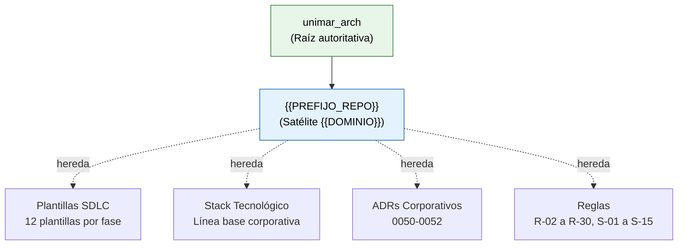

# Propuesta: Estandarizar README de Satélites en unimar_arch

> **Propósito:** Analizar y proponer cómo incorporar el diseño estándar de README como paso automatizado en la creación de repositorios satélite.
> **Estado:** Propuesta para revisión del Architecture Board
> **Fecha:** 2026-06-23

---

## 1. Diagnóstico

### 1.1 Situación Actual

Actualmente `unimar_arch` define reglas satélite (S-01 a S-15) que exigen:

| Regla | Exigencia |
| :---- | :-------- |
| **S-01** | Estructura de directorios replicada |
| **S-06** | `CONTRIBUTING.md` basado en plantilla |
| **S-10** | `MASTER_INDEX.md` obligatorio |
| **S-14** | `AGENTS.md` heredado y adaptado |

Sin embargo, **no existe una regla ni un artefacto que standarice el README.md del satélite**. Cada satélite implementa su README de forma manual y sin un diseño consistente.

### 1.2 Problema Identificado

El README es la puerta de entrada al repositorio. Sin un estándar:

- Cada satélite tiene un diseño y estructura distinta
- Se pierde la identidad corporativa
- No hay enlaces consistentes a artefactos clave (PRD, ADRs, MASTER_INDEX)
- Los agentes IA no encuentran la información de onboarding de forma predecible
- Se duplica esfuerzo: cada nuevo satélite debe diseñar su README desde cero

### 1.3 Validación (unimar_tms como caso piloto)

Durante la implementación del estándar en `unimar_tms` se detectaron los siguientes puntos de atención:

| Aspecto | Hallazgo |
| :------ | :------- |
| **Imagen conceptual** | `unimar_arch` referencia `reference/assets/unimar-arch-model.png`. El satélite necesita su propia imagen conceptual (no heredar la del padre) |
| **Enlaces relativos** | Los enlaces del README deben funcionar desde la raíz del satélite. Las referencias a `unimar_arch` deben ser absolutas (GitHub) |
| **Badges** | Deben reflejar el estado del satélite (Planificación, Activo, etc.), no copiar los del padre |
| **Contenido dinámico** | Las secciones de producto, arquitectura y SDLC se actualizan conforme el satélite avanza. El README debe diseñarse para crecer |

---

## 2. Propuesta de Implementación

### 2.1 Nuevo Artefacto: Plantilla de README Satélite

**Ruta propuesta en `unimar_arch`:**

```
reference/governance/sdlc/04-plantillas-artefactos/
├── plantilla-adr.es.md
├── plantilla-prd.es.md
├── plantilla-historia-funcional.es.md
├── ...
└── plantilla-readme-satelite.es.md        ← NUEVO
```

**Estructura de la plantilla:**

```markdown
<div align="center">

# {{NOMBRE_SISTEMA}} — {{PREFIJO_REPO}}

> **Repositorio satélite de {{DESCRIPCIÓN}} de Unimar S.A.**

[]()
[]()
[]()
[]()
[]()

<br/>

**{{PREFIJO_REPO}} es el repositorio satélite de Unimar para {{NOMBRE_SISTEMA}}.**<br/>
Hereda taxonomía, reglas, plantillas SDLC, skills BMAD y stack tecnológico del repositorio<br/>
autoritativo [`unimar_arch`](https://github.com/mhernandez-unimar/unimar_arch) y los especializa para el dominio {{DOMINIO}}.

> *Separar conceptualmente antes de separar físicamente.*

</div>

<br/>

<div align="center">
  
  <br/>
  <sub><strong>Figura 1:</strong> Modelo conceptual de {{NOMBRE_SISTEMA}} — herencia desde unimar_arch, dominio y alcance.</sub>
</div>

<br/>
<br/>

---

## 1. Orientación

<details>
<summary><strong>Puntos de entrada primarios</strong></summary>

> **Meta:** {{META_ORIENTACIÓN}}
> **Objetivos:** {{OBJETIVOS_ORIENTACIÓN}}

| Enlace (URL) | Descripción | Meta / Objetivo | Tipificación |
|---|---|---|---|
| [Índice de Navegación](./reference/navigation/MASTER_INDEX.md) | Navegación completa del repositorio | Localizar cualquier artefacto | Índice de navegación |
| [AGENTS.md](./AGENTS.md) | Reglas y convenciones para agentes de IA | Gobernar la interacción con asistentes BMAD | Reglas para agentes |
| [DECISIONS.md](./DECISIONS.md) | Triaje Adopt/Extend/Override/N/A de patrones unimar_arch | Registrar decisiones arquitectónicas locales | Registro de decisiones |
| [Glosario](./reference/governance/glosario-{{PREFIJO_REPO}}.es.md) | Terminología controlada del dominio | Unificar lenguaje | Referencia |

</details>

<details>
<summary><strong>Primeros pasos por rol</strong></summary>

> **Propósito:** Onboarding autoguiado — cada perfil encuentra su primera lectura según su responsabilidad.

| Rol | ¿Qué busca? | Comenzar por | Luego revisar |
|---|---|---|---|
| **Product Manager** | PRD, alcance, roadmap | [PRD](./_bmad-output/planning-artifacts/prd-{{PREFIJO_REPO}}.es.md) | [DECISIONS.md](./DECISIONS.md) |
| **Arquitecto** | ADRs, stack, estándares | [Stack Tecnológico](./reference/architecture/stack/stack-tecnologico-autorizado-{{PREFIJO_REPO}}.es.md) | [ADRs locales](./reference/architecture/adrs/) |
| **Desarrollador** | Stack, estándares, SDLC | [CONTRIBUTING.md](./CONTRIBUTING.md) | [Stack Tecnológico](./reference/architecture/stack/stack-tecnologico-autorizado-{{PREFIJO_REPO}}.es.md) |
| **Agente IA (BMAD)** | Reglas, skills, flujo asistido | [AGENTS.md](./AGENTS.md) | Skills en `.claude/skills/` |
| **Cualquier rol** | Navegación general | — | [MASTER_INDEX.md](./reference/navigation/MASTER_INDEX.md) |

</details>

<details>
<summary><strong>Repositorio Autoritativo y Herencia</strong></summary>

> **Meta:** Establecer la relación de herencia desde unimar_arch y las reglas de especialización del satélite.



| Enlace | ¿Qué contiene? | Meta |
| :----- | :------------- | :--- |
| [unimar_arch](https://github.com/mhernandez-unimar/unimar_arch) | Repositorio corporativo de arquitectura de software | Fuente autoritativa |
| [Reglas Globales](.harness/rules/global-rules.md) | R-02 a R-30 | Gobernar calidad y procesos |
| [Reglas Satélite](.harness/rules/satellite-repo-rules.md) | S-01 a S-15 | Estandarizar operación satélite |

</details>

## 2. Producto

<details>
<summary><strong>{{SECCIÓN_PRODUCTO_TÍTULO}}</strong></summary>

> **Meta:** {{META_PRODUCTO}}
> **Objetivos:** {{OBJETIVOS_PRODUCTO}}

**Estado:** {{ESTADO_PRODUCTO}}

| Enlace (URL) | Meta / Objetivo |
|---|---|
| [PRD](./_bmad-output/planning-artifacts/prd-{{PREFIJO_REPO}}.es.md) | Visión completa del producto |

</details>

## 3. Arquitectura

<details>
<summary><strong>Decisiones y Estándares Arquitectónicos</strong></summary>

> **Meta:** Registrar las decisiones arquitectónicas y estándares técnicos.
> **Objetivos:** Proveer trazabilidad de decisiones, stack autorizado y ADRs locales.

| Enlace (URL) | Meta / Objetivo | Tipificación |
|---|---|---|
| ADRs locales en `reference/architecture/adrs/` | Decisiones arquitectónicas del satélite | Decisión arquitectónica |
| [Stack Tecnológico Autorizado](./reference/architecture/stack/stack-tecnologico-autorizado-{{PREFIJO_REPO}}.es.md) | Lista aprobada de tecnologías | Estándar técnico |

</details>

## 4. Ciclo de Desarrollo

<details>
<summary><strong>SDLC y Calidad</strong></summary>

> **Meta:** Estandarizar el ciclo de desarrollo.
> **Objetivos:** Garantizar trazabilidad, calidad de commits y documentación validada.

| Enlace (URL) | Meta / Objetivo | Tipificación |
|---|---|---|
| [Estrategia de Ramificación](./reference/governance/sdlc/estrategia-ramificacion-{{PREFIJO_REPO}}.es.md) | GitFlow extendido | Guía de branching |
| [CONTRIBUTING.md](./CONTRIBUTING.md) | Guía de contribución | Guía de colaboración |
| [Validador de Documentación](.harness/scripts/validate-docs.mjs) | Validación de enlaces, anclas y Mermaid | Herramienta de calidad |

</details>

---

<div align="center">
  <sub><strong>© Unimar S.A.</strong> · RUC 20100412447 · Operador Logístico Aduanero desde 1978 · Última revisión: {{FECHA}}</sub>
</div>
```

### 2.2 Nueva Regla Satélite: S-16

Agregar en `.harness/rules/satellite-repo-rules.md`:

| ID | Título | Descripción |
| :-- | :------ | :---------- |
| **S-16** | README Estándar | Todo repositorio satélite DEBE usar la plantilla `reference/governance/sdlc/04-plantillas-artefactos/plantilla-readme-satelite.es.md` para su README.md, completando los marcadores `{{...}}` con los valores específicos del dominio. El README debe incluir: (a) encabezado centrado con badges, (b) sección de orientación con tabla de puntos de entrada, (c) tabla de primeros pasos por rol, (d) sección de herencia con diagrama Mermaid, (e) sección de producto con enlace al PRD, (f) sección de arquitectura con enlaces a ADRs y stack, (g) sección de SDLC con GitFlow y calidad, (h) footer corporativo. |

### 2.3 Extensión del Script de Validación

Agregar en `.harness/scripts/validate-satellite-base.mjs` la verificación:

```
- README.md existe
- README.md contiene encabezado centrado con badges
- README.md contiene sección "Repositorio Autoritativo y Herencia"
- README.md contiene diagrama Mermaid de herencia
- README.md contiene enlaces a MASTER_INDEX, AGENTS.md, DECISIONS.md
- README.md contiene footer corporativo
```

### 2.4 Guía Rápida: Crear Satélite (Checklist Extendido)

1. Clonar `unimar_arch` como base → crear repo satélite
2. `mkdir -p reference/assets reference/navigation reference/architecture/adrs reference/architecture/stack reference/governance/sdlc reference/knowledge/dominio`
3. `cp .harness/rules/global-rules.md .harness/rules/satellite-repo-rules.md` al satélite
4. Copiar `AGENTS.md`, `MASTER_INDEX.md`, `.editorconfig`, `.markdownlint.json`, validadores
5. **NUEVO:** Usar plantilla README → `cp plantilla-readme-satelite.es.md` y reemplazar marcadores `{{...}}`

---

## 3. Resumen de Cambios Requeridos en unimar_arch

| # | Acción | Archivo | Prioridad |
| :- | :----- | :------ | :-------- |
| 1 | Crear plantilla README | `reference/governance/sdlc/04-plantillas-artefactos/plantilla-readme-satelite.es.md` | Alta |
| 2 | Agregar regla S-16 | `.harness/rules/satellite-repo-rules.md` | Alta |
| 3 | Extender validación | `.harness/scripts/validate-satellite-base.mjs` | Media |
| 4 | Actualizar taxonomía | `reference/governance/standards/taxonomia-repositorio.md` | Media |
| 5 | Documentar en hub de contribución | `reference/contribucion/README.md` | Baja |

---

> **Próximo paso:** Presentar al Architecture Board para aprobación, crear ADR y PR en unimar_arch.
