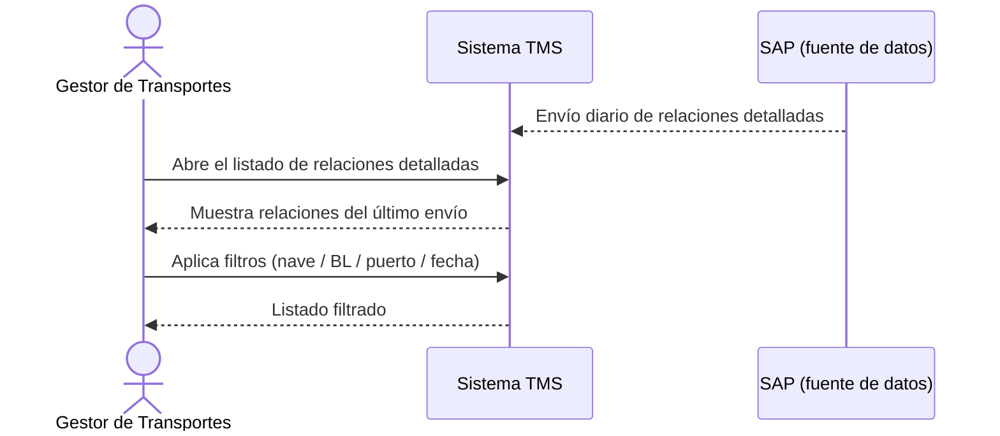

# Historia de Usuario: US-TMS-01 — Consultar Relaciones Detalladas

> **Unimar S.A. · Producto: TMS · Estado: Borrador · Versión: 0.1.0**
> **Fase SDLC:** 1 — Concepción y Descubrimiento · **Responsable:** John (PM)
> **PRD Origen:** PRD-TMS-001 § 7 (F-01)

---

## 1. Descripción Funcional

**Como** Gestor de Transportes
**Quiero** consultar y filtrar las relaciones detalladas que llegan desde SAP por nave, BL, puerto y fecha
**Para** identificar qué contenedores están disponibles y partir de ahí para planificar su transporte

---

## 2. Actores y Stakeholders

### 2.1 Actor Principal

| Campo | Descripción |
|---|---|
| **Nombre** | Gestor de Transportes |
| **Tipo** | Usuario Interno |
| **Descripción** | Planifica y asigna el transporte de contenedores desde puerto |
| **Canal** | Web |

### 2.2 Actores Secundarios

| Actor | Rol en esta historia | Necesidad |
|---|---|---|
| Operador de Documentación | Valida que las relaciones detalladas reflejen el dato de SAP | Que el listado muestre el último envío sincronizado |

### 2.3 Diagrama de Interacción



### 2.4 Interacciones del Actor Principal

| # | Interacción | Pantalla/Vista | Resultado esperado |
|---|---|---|---|
| 1 | Abrir el listado | Listado de Relaciones Detalladas | Se muestran las relaciones del último envío |
| 2 | Filtrar por nave/BL/puerto/fecha | Listado de Relaciones Detalladas | El listado se reduce a las coincidencias |
| 3 | Abrir una relación | Detalle de Relación | Se ven sus contenedores y datos de nave/BL |

---

## 3. Criterios de Aceptación (BDD/Gherkin)

```gherkin
Escenario: Listar relaciones detalladas sincronizadas
  Dado que existe un envío de relaciones detalladas sincronizado desde SAP
  Cuando el Gestor abre el listado de relaciones detalladas
  Entonces el sistema muestra las relaciones con nave, BL, puerto y fecha de arribo

Escenario: Filtrar relaciones por nave
  Dado que el Gestor está en el listado de relaciones detalladas
  Cuando filtra por un número de nave
  Entonces el sistema muestra solo las relaciones de esa nave

Escenario: Operar con el último dato válido si la sincronización falló
  Dado que la última sincronización con SAP falló
  Cuando el Gestor abre el listado
  Entonces el sistema muestra el último conjunto de datos válido
  Y advierte que los datos podrían no estar actualizados
```

---

## 4. Requisitos Técnicos (Aislados)

> *Reservado para Arquitectos / Devs. Se completa en Fase 2 (Diseño) / Sprint Planning.*

#### 4.1 Dominio y Contexto
| Campo | Valor |
|---|---|
| Bounded Context | `[Pendiente — Mapa de Contextos Acotados, Fase 2]` |
| Entidades | `relacion_detallada`, `contenedor` |

#### 4.2 Dependencias
| Tipo | Valor |
|---|---|
| Sistemas externos | SAP (envío batch diario) |

#### 4.3 Reglas de Negocio a Respetar
- RN-01 — Un manifiesto puede tener más de una relación detallada.
- RN-02 — La Fase 1 contempla relación detallada de descarga desde puerto.
- RN-03 — Una relación detallada puede pertenecer a diferentes orígenes.
- RN-19 — La sincronización batch con SAP se ejecuta mínimo una vez al día.
- RN-20 — Si la sincronización falla, se opera con el último conjunto de datos válido.

---

## 5. Definición de Hecho (DoD)

- [ ] Código implementado y revisado.
- [ ] Pruebas unitarias superan el umbral definido (≥ 80%).
- [ ] Criterios de aceptación verificados.
- [ ] Reglas RN-01, RN-02, RN-03, RN-20 cubiertas por pruebas.
- [ ] Documentación actualizada si aplica.
