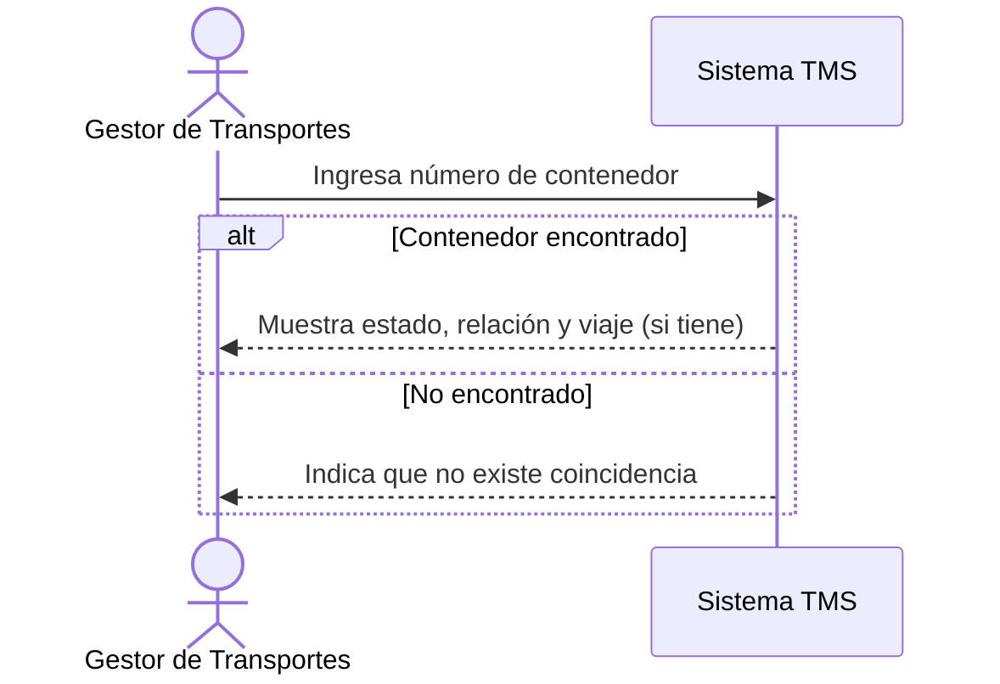

# Historia de Usuario: US-TMS-02 — Buscar Contenedor por Número

> **Unimar S.A. · Producto: TMS · Estado: Borrador · Versión: 0.1.0**
> **Fase SDLC:** 1 — Concepción y Descubrimiento · **Responsable:** John (PM)
> **PRD Origen:** PRD-TMS-001 § 7 (F-17)

---

## 1. Descripción Funcional

**Como** Gestor de Transportes
**Quiero** buscar un contenedor directamente por su número sin navegar por las relaciones detalladas
**Para** ubicar de inmediato su estado y la relación a la que pertenece cuando un cliente o transportista consulta

---

## 2. Actores y Stakeholders

### 2.1 Actor Principal

| Campo | Descripción |
|---|---|
| **Nombre** | Gestor de Transportes |
| **Tipo** | Usuario Interno |
| **Descripción** | Consulta y planifica el transporte de contenedores |
| **Canal** | Web |

### 2.2 Actores Secundarios

| Actor | Rol en esta historia | Necesidad |
|---|---|---|
| Gestor Comercial | Consulta el estado de un contenedor para responder al cliente | Encontrar el contenedor sin conocer su relación |

### 2.3 Diagrama de Interacción



### 2.4 Interacciones del Actor Principal

| # | Interacción | Pantalla/Vista | Resultado esperado |
|---|---|---|---|
| 1 | Ingresar número de contenedor | Búsqueda Rápida | Se ejecuta la búsqueda |
| 2 | Ver resultado | Búsqueda Rápida | Se muestra estado, relación y viaje (si tiene) |

---

## 3. Criterios de Aceptación (BDD/Gherkin)

```gherkin
Escenario: Encontrar un contenedor existente
  Dado que existe un contenedor sincronizado en el sistema
  Cuando el Gestor busca por su número de contenedor
  Entonces el sistema muestra su estado, su relación detallada y su viaje si lo tiene

Escenario: Búsqueda sin coincidencias
  Dado que el número ingresado no corresponde a ningún contenedor
  Cuando el Gestor ejecuta la búsqueda
  Entonces el sistema indica que no hay coincidencias
```

---

## 4. Requisitos Técnicos (Aislados)

> *Reservado para Arquitectos / Devs. Se completa en Fase 2 (Diseño) / Sprint Planning.*

#### 4.1 Dominio y Contexto
| Campo | Valor |
|---|---|
| Bounded Context | `[Pendiente — Fase 2]` |
| Entidades | `contenedor`, `relacion_detallada`, `viaje` |

#### 4.2 Reglas de Negocio a Respetar
- RN-09 — Un contenedor solo puede estar asignado a un viaje activo a la vez (se refleja en el estado mostrado).

---

## 5. Definición de Hecho (DoD)

- [ ] Código implementado y revisado.
- [ ] Pruebas unitarias ≥ 80%.
- [ ] Criterios de aceptación verificados.
- [ ] Documentación actualizada si aplica.
