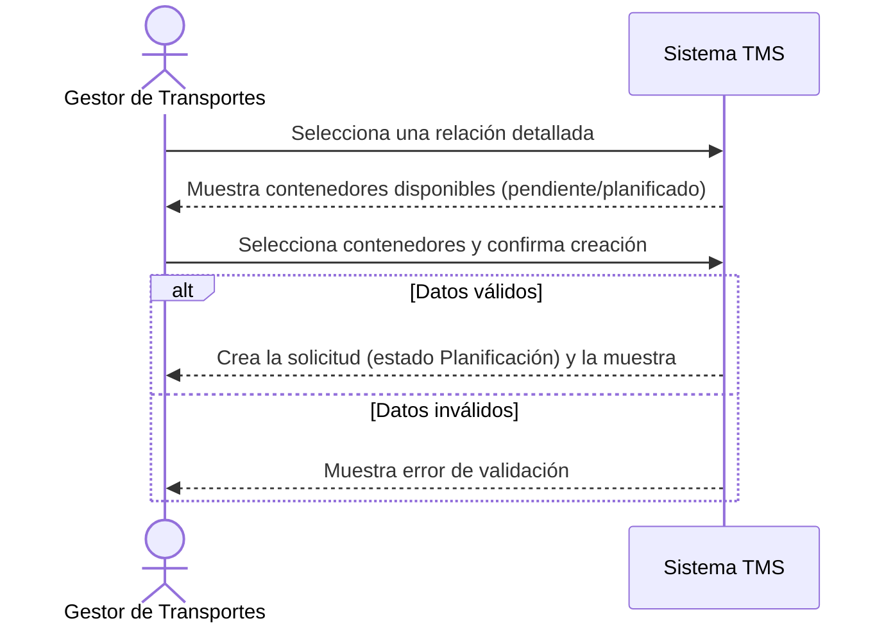

# Historia de Usuario: US-TMS-03 — Crear Solicitud de Transporte

> **Unimar S.A. · Producto: TMS · Estado: Borrador · Versión: 0.1.0**
> **Fase SDLC:** 1 — Concepción y Descubrimiento · **Responsable:** John (PM)
> **PRD Origen:** PRD-TMS-001 § 7 (F-02)

---

## 1. Descripción Funcional

**Como** Gestor de Transportes
**Quiero** crear una solicitud de transporte seleccionando contenedores de una relación detallada
**Para** iniciar formalmente la planificación del retiro de esos contenedores desde puerto y dejar trazabilidad del pedido

---

## 2. Actores y Stakeholders

### 2.1 Actor Principal

| Campo | Descripción |
|---|---|
| **Nombre** | Gestor de Transportes |
| **Tipo** | Usuario Interno |
| **Descripción** | Planifica y asigna el transporte de contenedores desde puerto |
| **Canal** | Web |

### 2.2 Actores Secundarios

| Actor | Rol en esta historia | Necesidad |
|---|---|---|
| Operador de Documentación | Mantiene actualizadas las relaciones detalladas | Que los contenedores disponibles reflejen el dato real de SAP |
| Gestor Comercial | Consulta el avance de las solicitudes | Que cada solicitud quede registrada y consultable |

### 2.3 Diagrama de Interacción



### 2.4 Interacciones del Actor Principal

| # | Interacción | Pantalla/Vista | Resultado esperado |
|---|---|---|---|
| 1 | Abrir una relación detallada | Listado de Relaciones Detalladas | Se listan sus contenedores con estado |
| 2 | Seleccionar uno o más contenedores | Creación de Solicitud | Los contenedores quedan marcados para la solicitud |
| 3 | Confirmar la creación | Creación de Solicitud | Se crea la solicitud en estado "Planificación" con número único |

---

## 3. Criterios de Aceptación (BDD/Gherkin)

```gherkin
Escenario: Crear solicitud con contenedores válidos
  Dado que el Gestor abre una relación detallada con contenedores en estado "pendiente"
  Cuando selecciona uno o más contenedores y confirma la creación
  Entonces el sistema crea una solicitud de transporte en estado "Planificación"
  Y le asigna un número de solicitud único
  Y referencia la relación detallada y la Orden de Servicio de origen

Escenario: Rechazar solicitud sin contenedores
  Dado que el Gestor inicia la creación de una solicitud
  Cuando intenta confirmar sin haber seleccionado ningún contenedor
  Entonces el sistema no crea la solicitud
  Y muestra un mensaje indicando que se requiere al menos un contenedor

Escenario: Rechazar contenedores de distinta relación detallada
  Dado que el Gestor selecciona contenedores
  Cuando intenta incluir contenedores que pertenecen a relaciones detalladas distintas
  Entonces el sistema no permite la mezcla
  Y solo admite contenedores de la misma relación detallada
```

---

## 4. Requisitos Técnicos (Aislados)

> *Reservado para Arquitectos / Devs. Se completa en Fase 2 (Diseño) / Sprint Planning.*

#### 4.1 Dominio y Contexto
| Campo | Valor |
|---|---|
| Bounded Context | `[Pendiente — Mapa de Contextos Acotados, Fase 2]` |
| Módulo / Aggregate | `solicitud-transporte` (tentativo) |
| Entidades | `solicitud_transporte`, `contenedor`, `relacion_detallada` |

#### 4.2 Reglas de Negocio a Respetar
- RN-10 — La solicitud solo puede incluir contenedores de la misma relación detallada.
- RN-25 — Una solicitud debe contener al menos un contenedor.
- RN-32 — La solicitud debe referenciar al menos una Orden de Servicio de SAP.
- RN-18 — Solo contenedores en estado pendiente o planificado pueden incluirse.

---

## 5. Definición de Hecho (DoD)

- [ ] Código implementado y revisado.
- [ ] Pruebas unitarias superan el umbral definido (≥ 80%).
- [ ] Criterios de aceptación verificados.
- [ ] Reglas RN-10, RN-25, RN-32, RN-18 cubiertas por pruebas.
- [ ] Documentación actualizada si aplica.
