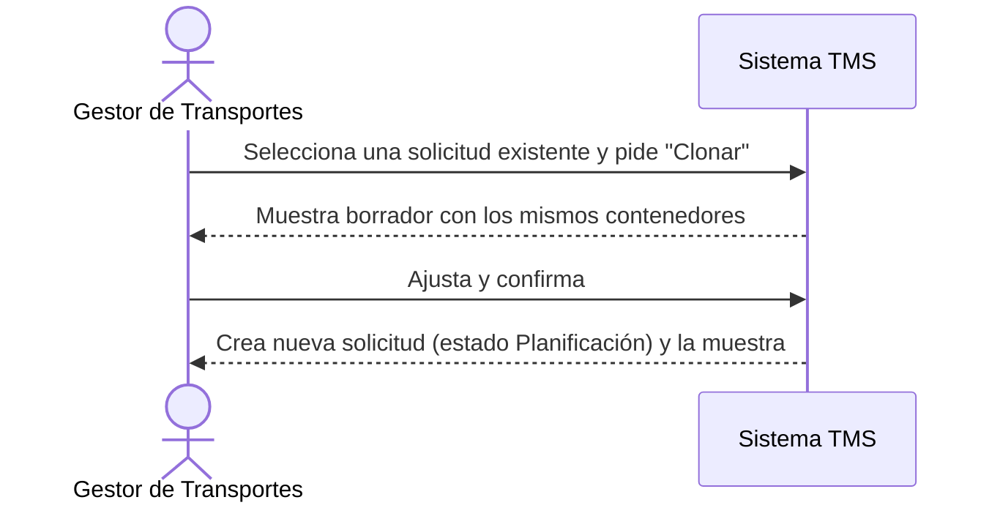

# Historia de Usuario: US-TMS-04 — Clonar Solicitud de Transporte

> **Unimar S.A. · Producto: TMS · Estado: Borrador · Versión: 0.1.0**
> **Fase SDLC:** 1 — Concepción y Descubrimiento · **Responsable:** John (PM)
> **PRD Origen:** PRD-TMS-001 § 7 (F-18)

---

## 1. Descripción Funcional

**Como** Gestor de Transportes
**Quiero** clonar una solicitud de transporte existente con sus contenedores
**Para** agilizar la creación de solicitudes similares sin volver a capturar todo desde cero

---

## 2. Actores y Stakeholders

### 2.1 Actor Principal

| Campo | Descripción |
|---|---|
| **Nombre** | Gestor de Transportes |
| **Tipo** | Usuario Interno |
| **Descripción** | Crea y gestiona solicitudes de transporte |
| **Canal** | Web |

### 2.2 Actores Secundarios

| Actor | Rol en esta historia | Necesidad |
|---|---|---|
| — | — | — |

### 2.3 Diagrama de Interacción



### 2.4 Interacciones del Actor Principal

| # | Interacción | Pantalla/Vista | Resultado esperado |
|---|---|---|---|
| 1 | Elegir "Clonar" sobre una solicitud | Listado de Solicitudes | Se genera un borrador con los mismos contenedores |
| 2 | Ajustar y confirmar | Creación de Solicitud | Nueva solicitud creada con número propio |

---

## 3. Criterios de Aceptación (BDD/Gherkin)

```gherkin
Escenario: Clonar una solicitud existente
  Dado que existe una solicitud de transporte con contenedores
  Cuando el Gestor la clona y confirma
  Entonces el sistema crea una nueva solicitud en estado "Planificación"
  Y copia los contenedores y la referencia de relación detallada de la original
  Y le asigna un número de solicitud nuevo

Escenario: Excluir contenedores ya no disponibles al clonar
  Dado que algún contenedor de la solicitud original ya está en un viaje activo
  Cuando el Gestor clona la solicitud
  Entonces el sistema excluye esos contenedores del clon
  Y avisa cuáles no se pudieron incluir
```

---

## 4. Requisitos Técnicos (Aislados)

> *Reservado para Arquitectos / Devs. Se completa en Fase 2 (Diseño) / Sprint Planning.*

#### 4.1 Dominio y Contexto
| Campo | Valor |
|---|---|
| Bounded Context | `[Pendiente — Fase 2]` |
| Entidades | `solicitud_transporte`, `contenedor` |

#### 4.2 Reglas de Negocio a Respetar
- RN-10 — La solicitud solo puede incluir contenedores de la misma relación detallada.
- RN-25 — Una solicitud debe contener al menos un contenedor.
- RN-18 — Solo contenedores en estado pendiente o planificado pueden incluirse.

---

## 5. Definición de Hecho (DoD)

- [ ] Código implementado y revisado.
- [ ] Pruebas unitarias ≥ 80%.
- [ ] Criterios de aceptación verificados.
- [ ] Reglas RN-10, RN-25, RN-18 cubiertas.
- [ ] Documentación actualizada si aplica.
