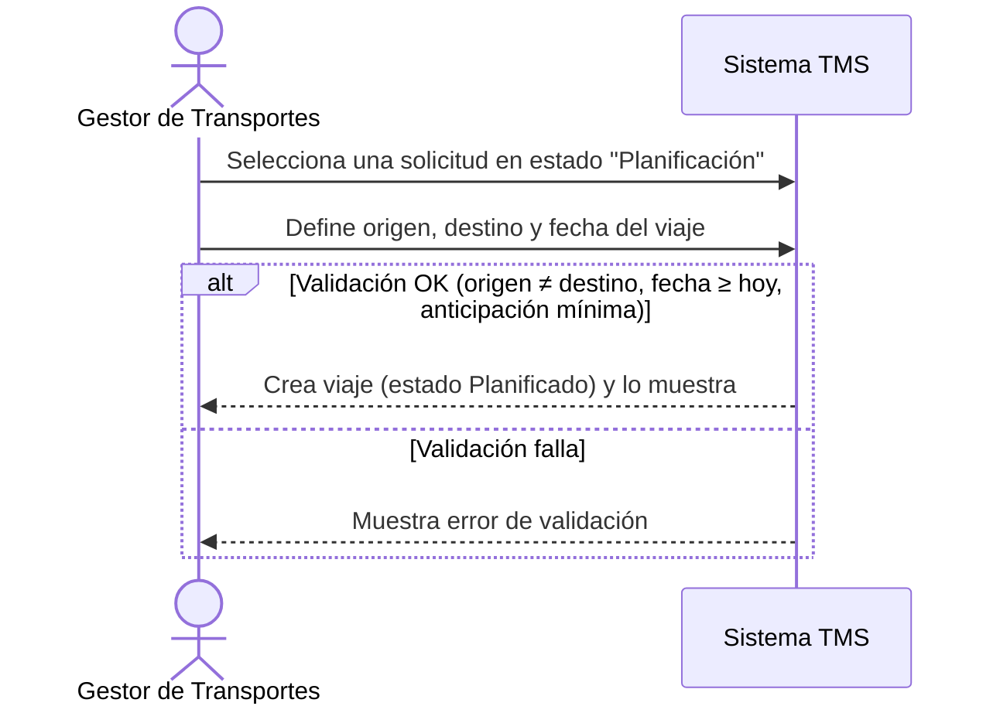

# Historia de Usuario: US-TMS-05 — Asignar Viaje

> **Unimar S.A. · Producto: TMS · Estado: Borrador · Versión: 0.1.0**
> **Fase SDLC:** 1 — Concepción y Descubrimiento · **Responsable:** John (PM)
> **PRD Origen:** PRD-TMS-001 § 7 (F-03)

---

## 1. Descripción Funcional

**Como** Gestor de Transportes
**Quiero** asignar una solicitud a un viaje definiendo origen, destino y fecha
**Para** convertir la solicitud en un viaje planificable y avanzar hacia su ejecución

---

## 2. Actores y Stakeholders

### 2.1 Actor Principal

| Campo | Descripción |
|---|---|
| **Nombre** | Gestor de Transportes |
| **Tipo** | Usuario Interno |
| **Descripción** | Planifica y asigna viajes de transporte |
| **Canal** | Web |

### 2.2 Actores Secundarios

| Actor | Rol en esta historia | Necesidad |
|---|---|---|
| Transportista | Será el responsable de ejecutar el viaje | Recibir un viaje con datos coherentes |

### 2.3 Diagrama de Interacción



### 2.4 Interacciones del Actor Principal

| # | Interacción | Pantalla/Vista | Resultado esperado |
|---|---|---|---|
| 1 | Elegir solicitud a planificar | Asignación de Viaje | Solicitud cargada |
| 2 | Capturar origen, destino, fecha | Asignación de Viaje | Datos validados |
| 3 | Crear el viaje | Asignación de Viaje | Viaje en estado "Planificado" con número |

---

## 3. Criterios de Aceptación (BDD/Gherkin)

```gherkin
Escenario: Crear un viaje con datos válidos
  Dado que el Gestor tiene una solicitud en estado "Planificación"
  Cuando define origen, destino y fecha válidos y crea el viaje
  Entonces el sistema crea un viaje en estado "Planificado" con número único

Escenario: Rechazar origen igual a destino
  Dado que el Gestor está creando un viaje
  Cuando ingresa el mismo valor en origen y destino
  Entonces el sistema no crea el viaje y muestra un error

Escenario: Rechazar fecha pasada
  Dado que el Gestor está creando un viaje
  Cuando ingresa una fecha anterior a la fecha actual
  Entonces el sistema no crea el viaje y muestra un error
```

---

## 4. Requisitos Técnicos (Aislados)

> *Reservado para Arquitectos / Devs. Se completa en Fase 2 (Diseño) / Sprint Planning.*

#### 4.1 Dominio y Contexto
| Campo | Valor |
|---|---|
| Bounded Context | `[Pendiente — Fase 2]` |
| Entidades | `viaje`, `solicitud_transporte`, `viaje_contenedor` |

#### 4.2 Reglas de Negocio a Respetar
- RN-12 — Origen y destino de un viaje no pueden ser iguales.
- RN-16 — La fecha del viaje no puede ser anterior a la fecha actual al crearlo.
- RN-34 — Debe existir un tiempo mínimo de anticipación para crear un viaje.
- RN-23 — Una solicitud puede generar múltiples viajes si excede la capacidad de una unidad.
- RN-24 — Un viaje puede contener múltiples contenedores de la misma solicitud.

---

## 5. Definición de Hecho (DoD)

- [ ] Código implementado y revisado.
- [ ] Pruebas unitarias ≥ 80%.
- [ ] Criterios de aceptación verificados.
- [ ] Reglas RN-12, RN-16, RN-34 cubiertas.
- [ ] Documentación actualizada si aplica.
