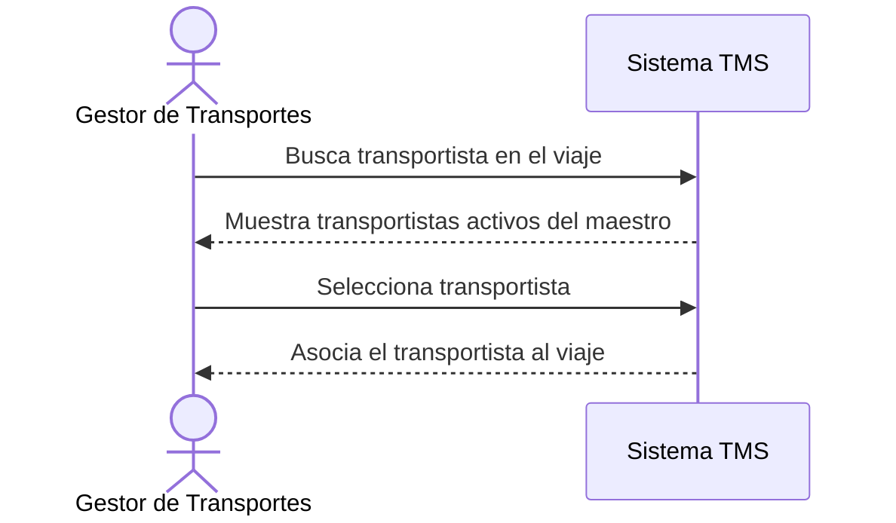

# Historia de Usuario: US-TMS-06 — Seleccionar Transportista

> **Unimar S.A. · Producto: TMS · Estado: Borrador · Versión: 0.1.0**
> **Fase SDLC:** 1 — Concepción y Descubrimiento · **Responsable:** John (PM)
> **PRD Origen:** PRD-TMS-001 § 7 (F-04)

---

## 1. Descripción Funcional

**Como** Gestor de Transportes
**Quiero** buscar y seleccionar un transportista desde el maestro de datos para un viaje
**Para** asignar el responsable del transporte usando datos validados provenientes de SAP

---

## 2. Actores y Stakeholders

### 2.1 Actor Principal

| Campo | Descripción |
|---|---|
| **Nombre** | Gestor de Transportes |
| **Tipo** | Usuario Interno |
| **Descripción** | Asigna transportistas a los viajes |
| **Canal** | Web |

### 2.2 Actores Secundarios

| Actor | Rol en esta historia | Necesidad |
|---|---|---|
| Operador de Documentación | Mantiene el maestro de transportistas sincronizado desde SAP | Que el maestro esté actualizado |

### 2.3 Diagrama de Interacción



### 2.4 Interacciones del Actor Principal

| # | Interacción | Pantalla/Vista | Resultado esperado |
|---|---|---|---|
| 1 | Buscar transportista | Asignación de Viaje | Lista filtrada del maestro |
| 2 | Seleccionar uno | Asignación de Viaje | Transportista asociado al viaje |

---

## 3. Criterios de Aceptación (BDD/Gherkin)

```gherkin
Escenario: Asignar transportista activo
  Dado que el Gestor está en un viaje sin transportista
  Cuando busca y selecciona un transportista activo del maestro
  Entonces el sistema asocia ese transportista al viaje

Escenario: No listar transportistas inactivos
  Dado que un transportista está marcado como inactivo en el maestro
  Cuando el Gestor busca transportistas
  Entonces el sistema no lo incluye entre los seleccionables
```

---

## 4. Requisitos Técnicos (Aislados)

> *Reservado para Arquitectos / Devs. Se completa en Fase 2 (Diseño) / Sprint Planning.*

#### 4.1 Dominio y Contexto
| Campo | Valor |
|---|---|
| Bounded Context | `[Pendiente — Fase 2]` |
| Entidades | `transportista`, `viaje` |

#### 4.2 Reglas de Negocio a Respetar
- RN-11 — El chofer y la unidad deben estar asociados al transportista seleccionado (primer paso de esa cadena).
- RN-35 — Un transportista con más del 20% de viajes rechazados en 30 días se marca como riesgoso (advertencia).

---

## 5. Definición de Hecho (DoD)

- [ ] Código implementado y revisado.
- [ ] Pruebas unitarias ≥ 80%.
- [ ] Criterios de aceptación verificados.
- [ ] Regla RN-11 cubierta.
- [ ] Documentación actualizada si aplica.
