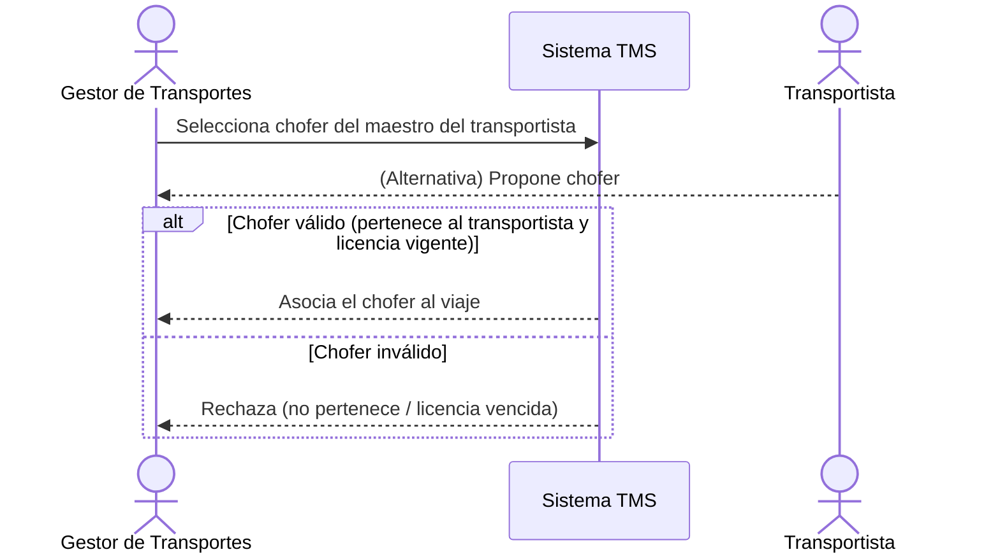

# Historia de Usuario: US-TMS-07 — Asignar Chofer al Viaje

> **Unimar S.A. · Producto: TMS · Estado: Borrador · Versión: 0.1.0**
> **Fase SDLC:** 1 — Concepción y Descubrimiento · **Responsable:** John (PM)
> **PRD Origen:** PRD-TMS-001 § 7 (F-05)

---

## 1. Descripción Funcional

**Como** Gestor de Transportes
**Quiero** asignar un chofer al viaje desde el maestro, o registrar el que proponga el transportista
**Para** completar de forma coordinada los datos de ejecución del viaje hasta antes de iniciarlo

---

## 2. Actores y Stakeholders

### 2.1 Actor Principal

| Campo | Descripción |
|---|---|
| **Nombre** | Gestor de Transportes |
| **Tipo** | Usuario Interno |
| **Descripción** | Coordina la asignación de chofer con el transportista |
| **Canal** | Web |

### 2.2 Actores Secundarios

| Actor | Rol en esta historia | Necesidad |
|---|---|---|
| Transportista | Propone o confirma el chofer asignado | Que su propuesta de chofer quede registrada |

### 2.3 Diagrama de Interacción



### 2.4 Interacciones del Actor Principal

| # | Interacción | Pantalla/Vista | Resultado esperado |
|---|---|---|---|
| 1 | Buscar chofer del transportista | Asignación de Viaje | Lista de choferes del transportista |
| 2 | Seleccionar / registrar chofer | Asignación de Viaje | Chofer asociado al viaje |

---

## 3. Criterios de Aceptación (BDD/Gherkin)

```gherkin
Escenario: Asignar chofer válido del transportista
  Dado que el viaje tiene un transportista asignado
  Cuando el Gestor selecciona un chofer que pertenece a ese transportista con licencia vigente
  Entonces el sistema asocia el chofer al viaje

Escenario: Rechazar chofer de otro transportista
  Dado que el viaje tiene un transportista asignado
  Cuando se intenta asignar un chofer que no pertenece a ese transportista
  Entonces el sistema rechaza la asignación

Escenario: Rechazar chofer con licencia vencida
  Dado que el chofer tiene la licencia vencida en el maestro
  Cuando se intenta asignarlo al viaje
  Entonces el sistema rechaza la asignación e indica el motivo

Escenario: Chofer opcional en planificación
  Dado que el viaje está en planificación
  Cuando aún no se ha definido el chofer
  Entonces el sistema permite mantener el viaje sin chofer hasta antes de iniciarlo
```

---

## 4. Requisitos Técnicos (Aislados)

> *Reservado para Arquitectos / Devs. Se completa en Fase 2 (Diseño) / Sprint Planning.*

#### 4.1 Dominio y Contexto
| Campo | Valor |
|---|---|
| Bounded Context | `[Pendiente — Fase 2]` |
| Entidades | `chofer`, `transportista`, `viaje` |

#### 4.2 Reglas de Negocio a Respetar
- RN-06 — Asignación de chofer = coordinación iterativa UNIMAR-transportista; se cierra cuando ambas partes validan, hasta antes de iniciar el viaje.
- RN-11 — El chofer debe estar asociado al transportista seleccionado en el maestro.
- RN-27 — Los datos del chofer se validan contra el maestro (licencia, vigencia).
- RN-22 — El Gestor debe ser notificado cuando el transportista proporciona chofer.

---

## 5. Definición de Hecho (DoD)

- [ ] Código implementado y revisado.
- [ ] Pruebas unitarias ≥ 80%.
- [ ] Criterios de aceptación verificados.
- [ ] Reglas RN-06, RN-11, RN-27 cubiertas.
- [ ] Documentación actualizada si aplica.
