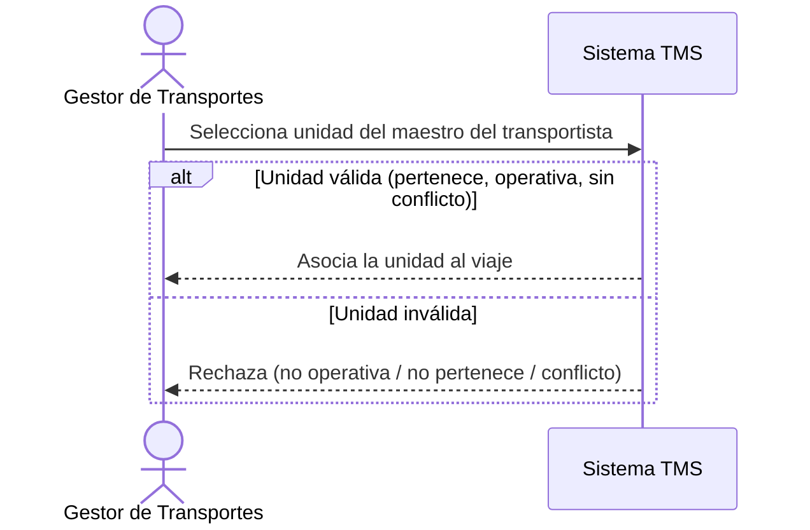

# Historia de Usuario: US-TMS-08 — Asignar Unidad Vehicular al Viaje

> **Unimar S.A. · Producto: TMS · Estado: Borrador · Versión: 0.1.0**
> **Fase SDLC:** 1 — Concepción y Descubrimiento · **Responsable:** John (PM)
> **PRD Origen:** PRD-TMS-001 § 7 (F-06)

---

## 1. Descripción Funcional

**Como** Gestor de Transportes
**Quiero** asignar una unidad vehicular (placa) al viaje desde el maestro, o registrar la que proponga el transportista
**Para** completar los datos operativos del viaje con una unidad válida y operativa

---

## 2. Actores y Stakeholders

### 2.1 Actor Principal

| Campo | Descripción |
|---|---|
| **Nombre** | Gestor de Transportes |
| **Tipo** | Usuario Interno |
| **Descripción** | Coordina la asignación de unidad con el transportista |
| **Canal** | Web |

### 2.2 Actores Secundarios

| Actor | Rol en esta historia | Necesidad |
|---|---|---|
| Transportista | Propone o confirma la unidad asignada | Que su propuesta de unidad quede registrada |

### 2.3 Diagrama de Interacción



### 2.4 Interacciones del Actor Principal

| # | Interacción | Pantalla/Vista | Resultado esperado |
|---|---|---|---|
| 1 | Buscar unidad del transportista | Asignación de Viaje | Lista de unidades del transportista |
| 2 | Seleccionar / registrar unidad | Asignación de Viaje | Unidad asociada al viaje |

---

## 3. Criterios de Aceptación (BDD/Gherkin)

```gherkin
Escenario: Asignar unidad operativa del transportista
  Dado que el viaje tiene un transportista asignado
  Cuando el Gestor selecciona una unidad operativa que pertenece a ese transportista
  Entonces el sistema asocia la unidad al viaje

Escenario: Rechazar unidad no operativa
  Dado que la unidad está en estado "Mantenimiento" o "Baja"
  Cuando se intenta asignarla
  Entonces el sistema rechaza la asignación

Escenario: Rechazar unidad con conflicto de horario
  Dado que la unidad ya está asignada a otro viaje en conflicto de fecha/horario
  Cuando se intenta asignarla
  Entonces el sistema rechaza la asignación e indica el conflicto

Escenario: Unidad opcional en planificación
  Dado que el viaje está en planificación
  Cuando aún no se ha definido la unidad
  Entonces el sistema permite mantener el viaje sin unidad hasta antes de iniciarlo
```

---

## 4. Requisitos Técnicos (Aislados)

> *Reservado para Arquitectos / Devs. Se completa en Fase 2 (Diseño) / Sprint Planning.*

#### 4.1 Dominio y Contexto
| Campo | Valor |
|---|---|
| Bounded Context | `[Pendiente — Fase 2]` |
| Entidades | `unidad_vehicular`, `transportista`, `viaje` |

#### 4.2 Reglas de Negocio a Respetar
- RN-06 — Asignación de unidad = coordinación iterativa UNIMAR-transportista, hasta antes de iniciar el viaje.
- RN-11 — La unidad debe estar asociada al transportista seleccionado en el maestro.
- RN-28 — La unidad debe tener estado operativo en el maestro para poder asignarse.
- RN-29 — No se asigna si el transportista tiene otro viaje en conflicto de horario/fecha para la misma unidad.
- RN-37 — La capacidad máxima de contenedores por viaje depende del tipo de unidad (20'/40').

---

## 5. Definición de Hecho (DoD)

- [ ] Código implementado y revisado.
- [ ] Pruebas unitarias ≥ 80%.
- [ ] Criterios de aceptación verificados.
- [ ] Reglas RN-06, RN-11, RN-28, RN-29, RN-37 cubiertas.
- [ ] Documentación actualizada si aplica.
