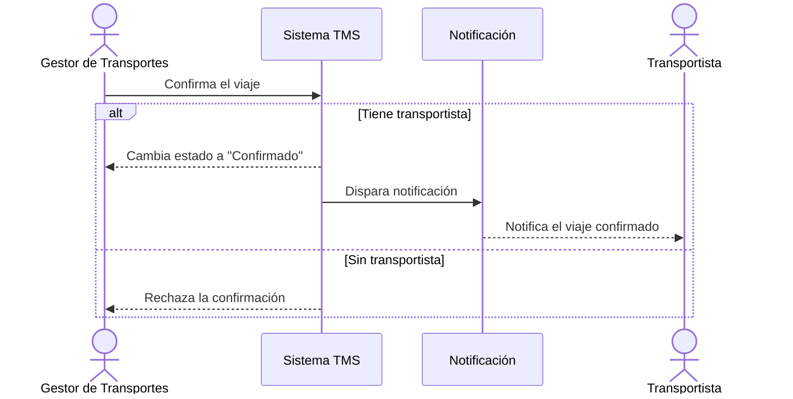

# Historia de Usuario: US-TMS-09 — Confirmar Viaje

> **Unimar S.A. · Producto: TMS · Estado: Borrador · Versión: 0.1.0**
> **Fase SDLC:** 1 — Concepción y Descubrimiento · **Responsable:** John (PM)
> **PRD Origen:** PRD-TMS-001 § 7 (F-07)

---

## 1. Descripción Funcional

**Como** Gestor de Transportes
**Quiero** confirmar formalmente un viaje planificado
**Para** notificar al transportista y dejar el viaje listo para ejecución

---

## 2. Actores y Stakeholders

### 2.1 Actor Principal

| Campo | Descripción |
|---|---|
| **Nombre** | Gestor de Transportes |
| **Tipo** | Usuario Interno |
| **Descripción** | Confirma viajes y dispara la notificación al transportista |
| **Canal** | Web |

### 2.2 Actores Secundarios

| Actor | Rol en esta historia | Necesidad |
|---|---|---|
| Transportista | Recibe la confirmación del viaje | Ser notificado con los datos del viaje |

### 2.3 Diagrama de Interacción



### 2.4 Interacciones del Actor Principal

| # | Interacción | Pantalla/Vista | Resultado esperado |
|---|---|---|---|
| 1 | Pulsar "Confirmar viaje" | Detalle de Viaje | Viaje pasa a estado "Confirmado" |
| 2 | Ver notificación enviada | Detalle de Viaje | Se registra la notificación al transportista |

---

## 3. Criterios de Aceptación (BDD/Gherkin)

```gherkin
Escenario: Confirmar viaje con transportista asignado
  Dado que el viaje está en estado "Planificado" y tiene transportista
  Cuando el Gestor confirma el viaje
  Entonces el sistema cambia el estado a "Confirmado" y registra el momento
  Y notifica al transportista

Escenario: Rechazar confirmación sin transportista
  Dado que el viaje no tiene transportista asignado
  Cuando el Gestor intenta confirmarlo
  Entonces el sistema no permite la confirmación e indica el motivo
```

---

## 4. Requisitos Técnicos (Aislados)

> *Reservado para Arquitectos / Devs. Se completa en Fase 2 (Diseño) / Sprint Planning.*

#### 4.1 Dominio y Contexto
| Campo | Valor |
|---|---|
| Bounded Context | `[Pendiente — Fase 2]` |
| Entidades | `viaje`, `transportista` |

#### 4.2 Dependencias
| Tipo | Valor |
|---|---|
| Servicios | Servicio de notificación (con fallback email → SMS → push) |

#### 4.3 Reglas de Negocio a Respetar
- RN-13 — Un viaje no puede confirmarse sin al menos el transportista asignado.
- RN-21 — El transportista debe ser notificado al asignársele un viaje.
- RN-39 — Las notificaciones deben tener canal de fallback (email → SMS → push).

---

## 5. Definición de Hecho (DoD)

- [ ] Código implementado y revisado.
- [ ] Pruebas unitarias ≥ 80%.
- [ ] Criterios de aceptación verificados.
- [ ] Reglas RN-13, RN-21 cubiertas.
- [ ] Documentación actualizada si aplica.
