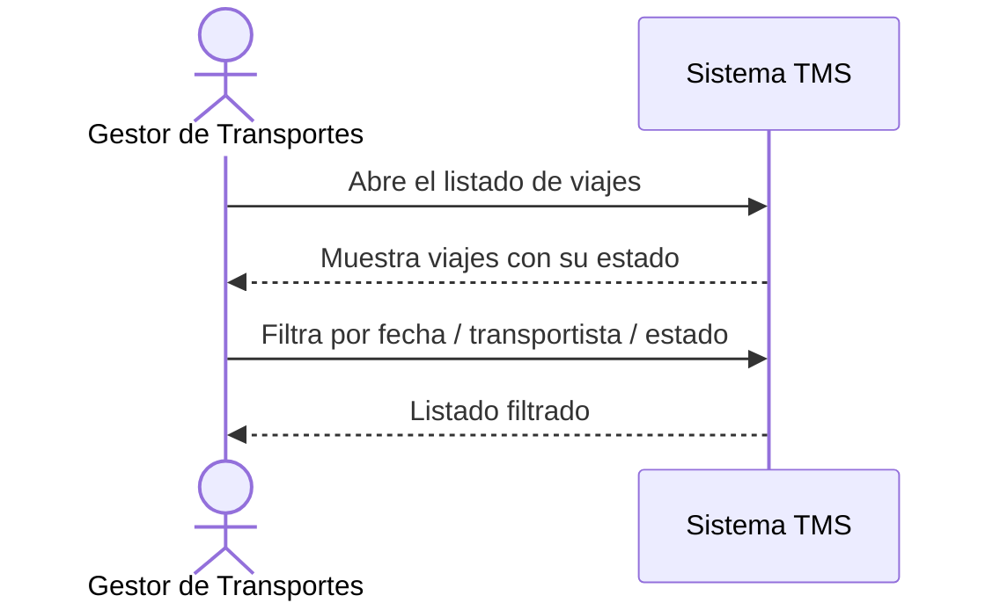

# Historia de Usuario: US-TMS-10 — Consultar Viajes Planificados

> **Unimar S.A. · Producto: TMS · Estado: Borrador · Versión: 0.1.0**
> **Fase SDLC:** 1 — Concepción y Descubrimiento · **Responsable:** John (PM)
> **PRD Origen:** PRD-TMS-001 § 7 (F-08)

---

## 1. Descripción Funcional

**Como** Gestor de Transportes
**Quiero** consultar el listado de viajes con filtros por fecha, transportista y estado
**Para** monitorear la planificación y ubicar rápidamente cualquier viaje

---

## 2. Actores y Stakeholders

### 2.1 Actor Principal

| Campo | Descripción |
|---|---|
| **Nombre** | Gestor de Transportes |
| **Tipo** | Usuario Interno |
| **Descripción** | Monitorea los viajes planificados |
| **Canal** | Web |

### 2.2 Actores Secundarios

| Actor | Rol en esta historia | Necesidad |
|---|---|---|
| Gestor Comercial | Consulta viajes para informar al cliente | Ver el estado de los viajes |

### 2.3 Diagrama de Interacción



### 2.4 Interacciones del Actor Principal

| # | Interacción | Pantalla/Vista | Resultado esperado |
|---|---|---|---|
| 1 | Abrir listado de viajes | Consulta de Viajes | Se muestran los viajes con su estado |
| 2 | Filtrar | Consulta de Viajes | Listado reducido a coincidencias |
| 3 | Abrir un viaje | Detalle de Viaje | Se ven sus datos completos |

---

## 3. Criterios de Aceptación (BDD/Gherkin)

```gherkin
Escenario: Listar viajes con su estado
  Dado que existen viajes planificados
  Cuando el Gestor abre el listado de viajes
  Entonces el sistema muestra cada viaje con su estado, fecha y transportista

Escenario: Filtrar viajes por estado
  Dado que el Gestor está en el listado de viajes
  Cuando filtra por el estado "Confirmado"
  Entonces el sistema muestra solo los viajes confirmados
```

---

## 4. Requisitos Técnicos (Aislados)

> *Reservado para Arquitectos / Devs. Se completa en Fase 2 (Diseño) / Sprint Planning.*

#### 4.1 Dominio y Contexto
| Campo | Valor |
|---|---|
| Bounded Context | `[Pendiente — Fase 2]` |
| Entidades | `viaje`, `transportista` |

#### 4.2 Reglas de Negocio a Respetar
- *(Sin regla explícita adicional; aplica la visibilidad de los estados definidos en el ciclo del viaje.)*

---

## 5. Definición de Hecho (DoD)

- [ ] Código implementado y revisado.
- [ ] Pruebas unitarias ≥ 80%.
- [ ] Criterios de aceptación verificados.
- [ ] Documentación actualizada si aplica.
