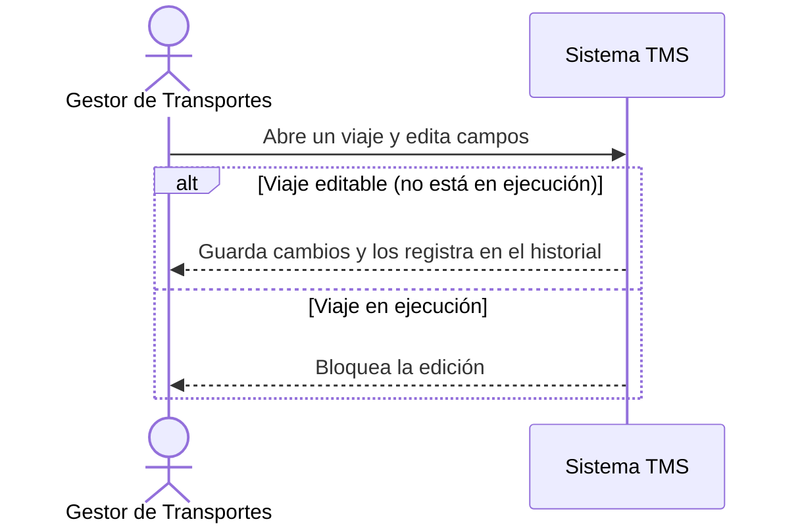

# Historia de Usuario: US-TMS-11 — Editar Viaje

> **Unimar S.A. · Producto: TMS · Estado: Borrador · Versión: 0.1.0**
> **Fase SDLC:** 1 — Concepción y Descubrimiento · **Responsable:** John (PM)
> **PRD Origen:** PRD-TMS-001 § 7 (F-09)

---

## 1. Descripción Funcional

**Como** Gestor de Transportes
**Quiero** editar los datos de un viaje antes de su ejecución
**Para** corregir o actualizar información sin tener que cancelar y recrear el viaje

---

## 2. Actores y Stakeholders

### 2.1 Actor Principal

| Campo | Descripción |
|---|---|
| **Nombre** | Gestor de Transportes |
| **Tipo** | Usuario Interno |
| **Descripción** | Mantiene actualizados los datos del viaje |
| **Canal** | Web |

### 2.2 Actores Secundarios

| Actor | Rol en esta historia | Necesidad |
|---|---|---|
| Transportista | Se ve afectado por cambios en el viaje | Que los cambios se comuniquen |

### 2.3 Diagrama de Interacción



### 2.4 Interacciones del Actor Principal

| # | Interacción | Pantalla/Vista | Resultado esperado |
|---|---|---|---|
| 1 | Editar campos del viaje | Detalle de Viaje | Cambios aplicados si es editable |
| 2 | Guardar | Detalle de Viaje | Cambios persistidos y registrados en historial |

---

## 3. Criterios de Aceptación (BDD/Gherkin)

```gherkin
Escenario: Editar un viaje no iniciado
  Dado que el viaje está en estado "Planificado" o "Confirmado" sin checkpoint
  Cuando el Gestor modifica datos y guarda
  Entonces el sistema persiste los cambios y los registra en el historial

Escenario: Bloquear edición de viaje en ejecución
  Dado que el viaje tiene un checkpoint de ejecución registrado
  Cuando el Gestor intenta editarlo
  Entonces el sistema impide la edición e indica que el viaje está en ejecución
```

---

## 4. Requisitos Técnicos (Aislados)

> *Reservado para Arquitectos / Devs. Se completa en Fase 2 (Diseño) / Sprint Planning.*

#### 4.1 Dominio y Contexto
| Campo | Valor |
|---|---|
| Bounded Context | `[Pendiente — Fase 2]` |
| Entidades | `viaje`, `auditoria_cambio` |

#### 4.2 Reglas de Negocio a Respetar
- RN-14 — Un viaje en ejecución (con checkpoint registrado) no puede editarse.
- RN-30 — El historial debe registrar actor, momento, campo, valor anterior y nuevo.

---

## 5. Definición de Hecho (DoD)

- [ ] Código implementado y revisado.
- [ ] Pruebas unitarias ≥ 80%.
- [ ] Criterios de aceptación verificados.
- [ ] Reglas RN-14, RN-30 cubiertas.
- [ ] Documentación actualizada si aplica.
