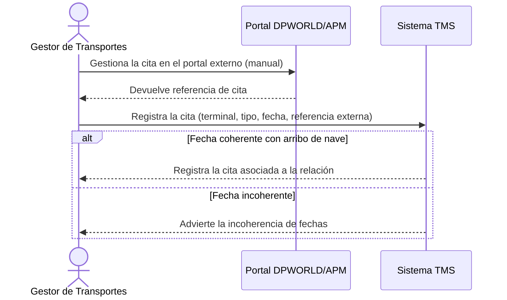

# Historia de Usuario: US-TMS-12 — Coordinar Cita Portuaria

> **Unimar S.A. · Producto: TMS · Estado: Borrador · Versión: 0.1.0**
> **Fase SDLC:** 1 — Concepción y Descubrimiento · **Responsable:** John (PM)
> **PRD Origen:** PRD-TMS-001 § 7 (F-11)

---

## 1. Descripción Funcional

**Como** Gestor de Transportes
**Quiero** registrar y coordinar citas con las terminales portuarias (DPWORLD/APM) para una relación detallada
**Para** agendar el retiro/devolución de contenedores de forma coherente con el arribo de la nave

---

## 2. Actores y Stakeholders

### 2.1 Actor Principal

| Campo | Descripción |
|---|---|
| **Nombre** | Gestor de Transportes |
| **Tipo** | Usuario Interno |
| **Descripción** | Coordina citas portuarias |
| **Canal** | Web |

### 2.2 Actores Secundarios

| Actor | Rol en esta historia | Necesidad |
|---|---|---|
| Terminal Portuaria (DPWORLD/APM) | Sistema externo donde se agenda la cita (portal web manual) | Recibir la solicitud de cita por su portal |

### 2.3 Diagrama de Interacción



### 2.4 Interacciones del Actor Principal

| # | Interacción | Pantalla/Vista | Resultado esperado |
|---|---|---|---|
| 1 | Registrar cita | Coordinación de Citas | Cita registrada con su referencia externa |
| 2 | Actualizar estado de cita | Coordinación de Citas | Estado actualizado (Confirmada/Realizada/Cancelada) |

---

## 3. Criterios de Aceptación (BDD/Gherkin)

```gherkin
Escenario: Registrar cita portuaria
  Dado que existe una relación detallada con fecha de arribo
  Cuando el Gestor registra una cita con terminal, tipo, fecha y referencia externa
  Entonces el sistema persiste la cita asociada a la relación detallada

Escenario: Advertir fecha de cita incoherente con arribo
  Dado que el Gestor ingresa una fecha de cita anterior al arribo estimado de la nave
  Cuando intenta guardar la cita
  Entonces el sistema advierte la incoherencia de fechas
```

---

## 4. Requisitos Técnicos (Aislados)

> *Reservado para Arquitectos / Devs. Se completa en Fase 2 (Diseño) / Sprint Planning.*

#### 4.1 Dominio y Contexto
| Campo | Valor |
|---|---|
| Bounded Context | `[Pendiente — Fase 2]` |
| Entidades | `cita_portuaria`, `relacion_detallada` |

#### 4.2 Dependencias
| Tipo | Valor |
|---|---|
| Sistemas externos | Portal DPWORLD/APM (coordinación manual en MVP) |

#### 4.3 Reglas de Negocio a Respetar
- RN-08 — La coordinación de citas portuarias se realiza a través del portal de DPWORLD/APM.
- RN-17 — La fecha de cita portuaria debe ser coherente con la fecha estimada de arribo de la nave.

---

## 5. Definición de Hecho (DoD)

- [ ] Código implementado y revisado.
- [ ] Pruebas unitarias ≥ 80%.
- [ ] Criterios de aceptación verificados.
- [ ] Reglas RN-08, RN-17 cubiertas.
- [ ] Documentación actualizada si aplica.
