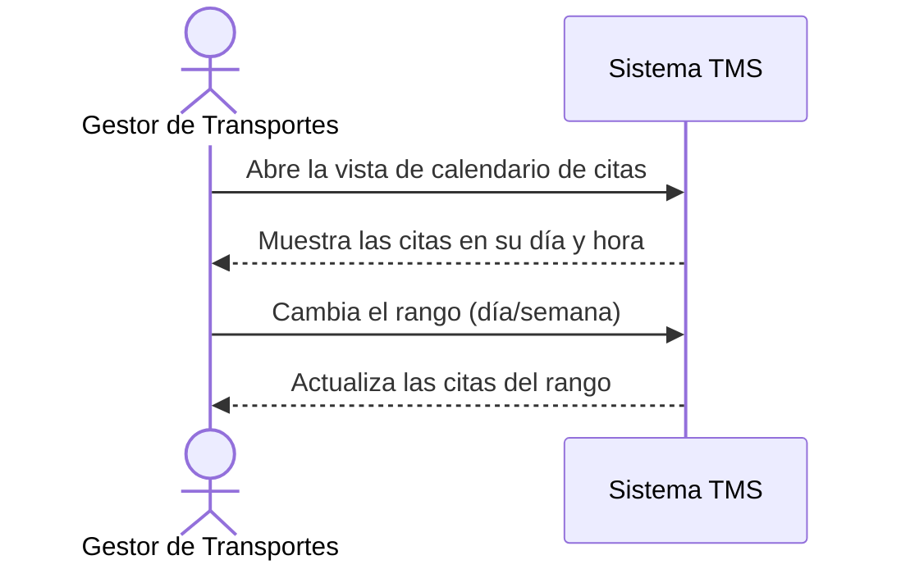

# Historia de Usuario: US-TMS-13 — Vista Calendario de Citas Portuarias

> **Unimar S.A. · Producto: TMS · Estado: Borrador · Versión: 0.1.0**
> **Fase SDLC:** 1 — Concepción y Descubrimiento · **Responsable:** John (PM)
> **PRD Origen:** PRD-TMS-001 § 7 (F-19)

---

## 1. Descripción Funcional

**Como** Gestor de Transportes
**Quiero** ver las citas portuarias agendadas en una vista de calendario por día/semana
**Para** detectar y evitar solapamientos en la coordinación de retiros

---

## 2. Actores y Stakeholders

### 2.1 Actor Principal

| Campo | Descripción |
|---|---|
| **Nombre** | Gestor de Transportes |
| **Tipo** | Usuario Interno |
| **Descripción** | Coordina la agenda de citas portuarias |
| **Canal** | Web |

### 2.2 Actores Secundarios

| Actor | Rol en esta historia | Necesidad |
|---|---|---|
| — | — | — |

### 2.3 Diagrama de Interacción



### 2.4 Interacciones del Actor Principal

| # | Interacción | Pantalla/Vista | Resultado esperado |
|---|---|---|---|
| 1 | Abrir calendario | Calendario de Citas | Citas mostradas en día/semana |
| 2 | Cambiar de semana | Calendario de Citas | Se actualizan las citas del rango |

---

## 3. Criterios de Aceptación (BDD/Gherkin)

```gherkin
Escenario: Visualizar citas en calendario
  Dado que existen citas portuarias agendadas
  Cuando el Gestor abre la vista de calendario
  Entonces el sistema muestra las citas ubicadas en su día y hora

Escenario: Señalar solapamiento de citas
  Dado que dos citas coinciden en fecha y franja horaria
  Cuando el Gestor visualiza el calendario
  Entonces el sistema resalta el solapamiento
```

---

## 4. Requisitos Técnicos (Aislados)

> *Reservado para Arquitectos / Devs. Se completa en Fase 2 (Diseño) / Sprint Planning.*

#### 4.1 Dominio y Contexto
| Campo | Valor |
|---|---|
| Bounded Context | `[Pendiente — Fase 2]` |
| Entidades | `cita_portuaria` |

#### 4.2 Reglas de Negocio a Respetar
- *(Apoya a RN-08/RN-17 dando visibilidad de la agenda; sin regla explícita propia.)*

---

## 5. Definición de Hecho (DoD)

- [ ] Código implementado y revisado.
- [ ] Pruebas unitarias ≥ 80%.
- [ ] Criterios de aceptación verificados.
- [ ] Documentación actualizada si aplica.
