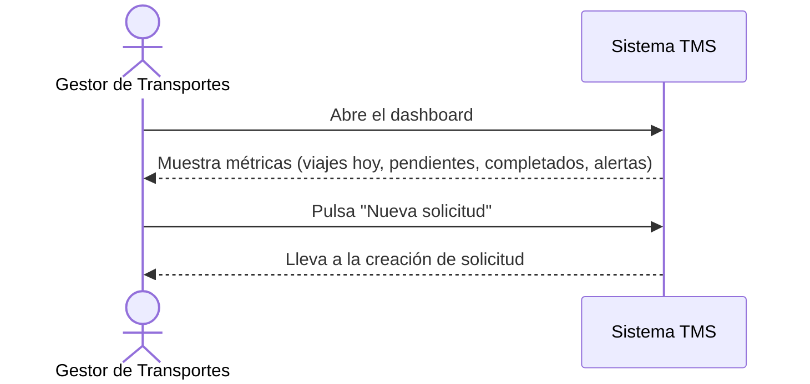

# Historia de Usuario: US-TMS-14 — Dashboard de Planificación

> **Unimar S.A. · Producto: TMS · Estado: Borrador · Versión: 0.1.0**
> **Fase SDLC:** 1 — Concepción y Descubrimiento · **Responsable:** John (PM)
> **PRD Origen:** PRD-TMS-001 § 7 (F-10)

---

## 1. Descripción Funcional

**Como** Gestor de Transportes
**Quiero** un dashboard con el resumen de viajes por estado y métricas en tiempo real
**Para** tener visibilidad operativa inmediata y acceso rápido a la creación de solicitudes

---

## 2. Actores y Stakeholders

### 2.1 Actor Principal

| Campo | Descripción |
|---|---|
| **Nombre** | Gestor de Transportes |
| **Tipo** | Usuario Interno |
| **Descripción** | Monitorea la operación de planificación |
| **Canal** | Web |

### 2.2 Actores Secundarios

| Actor | Rol en esta historia | Necesidad |
|---|---|---|
| Gestor Comercial | Consulta el panorama general de operaciones | Ver métricas agregadas |

### 2.3 Diagrama de Interacción



### 2.4 Interacciones del Actor Principal

| # | Interacción | Pantalla/Vista | Resultado esperado |
|---|---|---|---|
| 1 | Abrir dashboard | Dashboard de Planificación | Métricas en tiempo real visibles |
| 2 | Pulsar "Nueva solicitud" | Dashboard de Planificación | Navega a creación de solicitud |

---

## 3. Criterios de Aceptación (BDD/Gherkin)

```gherkin
Escenario: Mostrar métricas en tiempo real
  Dado que existen viajes en distintos estados
  Cuando el Gestor abre el dashboard
  Entonces el sistema muestra viajes de hoy, pendientes, completados y alertas

Escenario: Acceso rápido a creación
  Dado que el Gestor está en el dashboard
  Cuando pulsa el acceso de creación de solicitud
  Entonces el sistema lo lleva a la pantalla de creación de solicitud
```

---

## 4. Requisitos Técnicos (Aislados)

> *Reservado para Arquitectos / Devs. Se completa en Fase 2 (Diseño) / Sprint Planning.*

#### 4.1 Dominio y Contexto
| Campo | Valor |
|---|---|
| Bounded Context | `[Pendiente — Fase 2]` |
| Entidades | `viaje`, `solicitud_transporte`, `cita_portuaria` |

#### 4.2 Reglas de Negocio a Respetar
- RN-40 — El dashboard debe mostrar métricas en tiempo real: viajes hoy, pendientes, completados, alertas.

---

## 5. Definición de Hecho (DoD)

- [ ] Código implementado y revisado.
- [ ] Pruebas unitarias ≥ 80%.
- [ ] Criterios de aceptación verificados.
- [ ] Regla RN-40 cubierta.
- [ ] Documentación actualizada si aplica.
