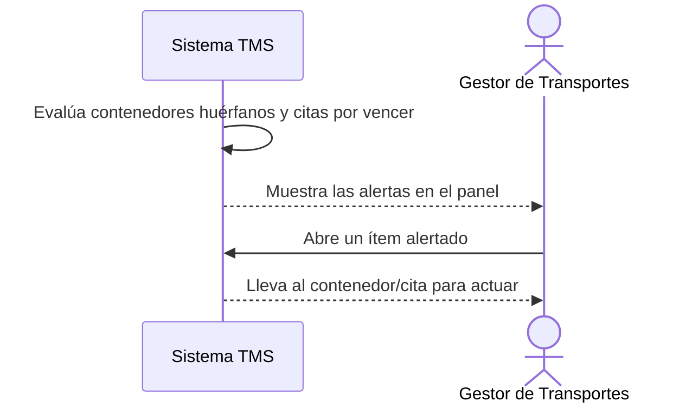

# Historia de Usuario: US-TMS-15 — Alertas de Vencimiento

> **Unimar S.A. · Producto: TMS · Estado: Borrador · Versión: 0.1.0**
> **Fase SDLC:** 1 — Concepción y Descubrimiento · **Responsable:** John (PM)
> **PRD Origen:** PRD-TMS-001 § 7 (F-20)

---

## 1. Descripción Funcional

**Como** Gestor de Transportes
**Quiero** recibir alertas automáticas por contenedores sin asignar y citas próximas a vencer
**Para** actuar a tiempo y evitar sobrecostos de permanencia en terminal

---

## 2. Actores y Stakeholders

### 2.1 Actor Principal

| Campo | Descripción |
|---|---|
| **Nombre** | Gestor de Transportes |
| **Tipo** | Usuario Interno |
| **Descripción** | Atiende las alertas y prioriza la planificación |
| **Canal** | Web |

### 2.2 Actores Secundarios

| Actor | Rol en esta historia | Necesidad |
|---|---|---|
| — | — | — |

### 2.3 Diagrama de Interacción



### 2.4 Interacciones del Actor Principal

| # | Interacción | Pantalla/Vista | Resultado esperado |
|---|---|---|---|
| 1 | Ver panel de alertas | Dashboard / Alertas | Lista de contenedores sin asignar y citas por vencer |
| 2 | Abrir el ítem alertado | Detalle relacionado | Navega al contenedor/cita para actuar |

---

## 3. Criterios de Aceptación (BDD/Gherkin)

```gherkin
Escenario: Alertar contenedor sin asignar
  Dado que un contenedor lleva más de {X} días sin viaje asignado
  Cuando el sistema evalúa las alertas
  Entonces genera una alerta de contenedor huérfano para el Gestor

Escenario: Alertar cita próxima a vencer
  Dado que una cita portuaria está próxima a su fecha
  Cuando el sistema evalúa las alertas
  Entonces genera una alerta de cita por vencer
```

> ⚠️ El umbral de "{X} días" para contenedor huérfano (RN-38) se confirma en reunión 2026-06-25.

---

## 4. Requisitos Técnicos (Aislados)

> *Reservado para Arquitectos / Devs. Se completa en Fase 2 (Diseño) / Sprint Planning.*

#### 4.1 Dominio y Contexto
| Campo | Valor |
|---|---|
| Bounded Context | `[Pendiente — Fase 2]` |
| Entidades | `contenedor`, `cita_portuaria` |

#### 4.2 Reglas de Negocio a Respetar
- RN-38 — El sistema debe alertar sobre contenedores huérfanos (sin viaje asignado después de {X} días). ⚠️ Umbral pendiente.
- RN-20 — Las alertas operan sobre el último conjunto de datos válido si la sincronización falló.

---

## 5. Definición de Hecho (DoD)

- [ ] Código implementado y revisado.
- [ ] Pruebas unitarias ≥ 80%.
- [ ] Criterios de aceptación verificados.
- [ ] Regla RN-38 cubierta (con umbral confirmado).
- [ ] Documentación actualizada si aplica.
