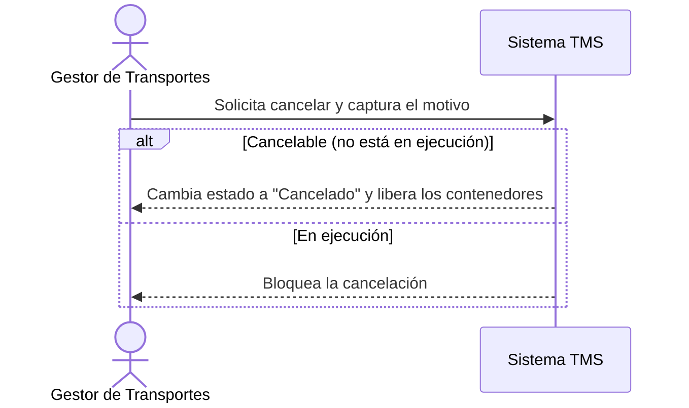

# Historia de Usuario: US-TMS-16 — Cancelar Solicitud o Viaje

> **Unimar S.A. · Producto: TMS · Estado: Borrador · Versión: 0.1.0**
> **Fase SDLC:** 1 — Concepción y Descubrimiento · **Responsable:** John (PM)
> **PRD Origen:** PRD-TMS-001 § 7 (F-12)

---

## 1. Descripción Funcional

**Como** Gestor de Transportes
**Quiero** cancelar una solicitud o un viaje antes de su ejecución registrando el motivo
**Para** liberar los contenedores y mantener la trazabilidad de por qué no se ejecutó

---

## 2. Actores y Stakeholders

### 2.1 Actor Principal

| Campo | Descripción |
|---|---|
| **Nombre** | Gestor de Transportes |
| **Tipo** | Usuario Interno |
| **Descripción** | Cancela solicitudes/viajes y documenta el motivo |
| **Canal** | Web |

### 2.2 Actores Secundarios

| Actor | Rol en esta historia | Necesidad |
|---|---|---|
| Transportista | Se ve afectado si el viaje cancelado le fue asignado | Ser informado de la cancelación |

### 2.3 Diagrama de Interacción



### 2.4 Interacciones del Actor Principal

| # | Interacción | Pantalla/Vista | Resultado esperado |
|---|---|---|---|
| 1 | Cancelar y registrar motivo | Detalle de Solicitud/Viaje | Estado cambia a cancelado |
| 2 | Ver contenedores liberados | Detalle | Los contenedores vuelven a disponibles |

---

## 3. Criterios de Aceptación (BDD/Gherkin)

```gherkin
Escenario: Cancelar un viaje no iniciado
  Dado que el viaje no ha iniciado su ejecución
  Cuando el Gestor lo cancela e ingresa un motivo
  Entonces el sistema cambia el estado a "Cancelado", guarda el motivo y libera los contenedores

Escenario: Bloquear cancelación de viaje en ejecución
  Dado que el viaje ya inició ejecución
  Cuando el Gestor intenta cancelarlo
  Entonces el sistema impide la cancelación e indica el motivo

Escenario: Exigir motivo de cancelación
  Dado que el Gestor inicia una cancelación
  Cuando confirma sin ingresar motivo
  Entonces el sistema no permite cancelar hasta registrar el motivo
```

---

## 4. Requisitos Técnicos (Aislados)

> *Reservado para Arquitectos / Devs. Se completa en Fase 2 (Diseño) / Sprint Planning.*

#### 4.1 Dominio y Contexto
| Campo | Valor |
|---|---|
| Bounded Context | `[Pendiente — Fase 2]` |
| Entidades | `solicitud_transporte`, `viaje`, `viaje_contenedor`, `auditoria_cambio` |

#### 4.2 Reglas de Negocio a Respetar
- RN-15 — Un viaje solo puede cancelarse antes de iniciar la ejecución.
- RN-09 — Al cancelar, los contenedores quedan disponibles para otro viaje.
- RN-30 — La cancelación se registra en el historial (actor, momento, motivo).

---

## 5. Definición de Hecho (DoD)

- [ ] Código implementado y revisado.
- [ ] Pruebas unitarias ≥ 80%.
- [ ] Criterios de aceptación verificados.
- [ ] Reglas RN-15, RN-09, RN-30 cubiertas.
- [ ] Documentación actualizada si aplica.
