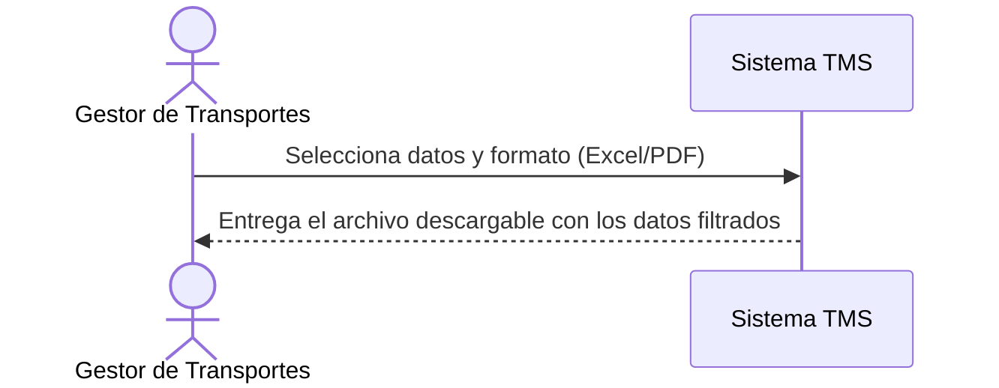

# Historia de Usuario: US-TMS-17 — Exportar Datos (Excel/PDF)

> **Unimar S.A. · Producto: TMS · Estado: Borrador · Versión: 0.1.0**
> **Fase SDLC:** 1 — Concepción y Descubrimiento · **Responsable:** John (PM)
> **PRD Origen:** PRD-TMS-001 § 7 (F-21)

---

## 1. Descripción Funcional

**Como** Gestor de Transportes
**Quiero** exportar solicitudes, viajes y reportes en Excel/PDF
**Para** compartir información con transportistas y clientes fuera del sistema

---

## 2. Actores y Stakeholders

### 2.1 Actor Principal

| Campo | Descripción |
|---|---|
| **Nombre** | Gestor de Transportes |
| **Tipo** | Usuario Interno |
| **Descripción** | Exporta datos para compartir externamente |
| **Canal** | Web |

### 2.2 Actores Secundarios

| Actor | Rol en esta historia | Necesidad |
|---|---|---|
| Gestor Comercial | Usa los exportes para informar a clientes | Obtener reportes presentables |

### 2.3 Diagrama de Interacción



### 2.4 Interacciones del Actor Principal

| # | Interacción | Pantalla/Vista | Resultado esperado |
|---|---|---|---|
| 1 | Elegir exportar | Listado de Solicitudes/Viajes | Diálogo de formato |
| 2 | Descargar archivo | Listado | Archivo Excel/PDF generado |

---

## 3. Criterios de Aceptación (BDD/Gherkin)

```gherkin
Escenario: Exportar viajes a Excel
  Dado que el Gestor tiene un listado de viajes filtrado
  Cuando exporta en formato Excel
  Entonces el sistema genera un archivo con los viajes y sus datos

Escenario: Exportar a PDF
  Dado que el Gestor tiene un listado o reporte
  Cuando exporta en formato PDF
  Entonces el sistema genera un documento presentable con los datos
```

---

## 4. Requisitos Técnicos (Aislados)

> *Reservado para Arquitectos / Devs. Se completa en Fase 2 (Diseño) / Sprint Planning.*

#### 4.1 Dominio y Contexto
| Campo | Valor |
|---|---|
| Bounded Context | `[Pendiente — Fase 2]` |
| Entidades | `solicitud_transporte`, `viaje` |

#### 4.2 Reglas de Negocio a Respetar
- *(Sin regla explícita; respeta el filtrado aplicado y los permisos de acceso por rol.)*

---

## 5. Definición de Hecho (DoD)

- [ ] Código implementado y revisado.
- [ ] Pruebas unitarias ≥ 80%.
- [ ] Criterios de aceptación verificados.
- [ ] Documentación actualizada si aplica.
