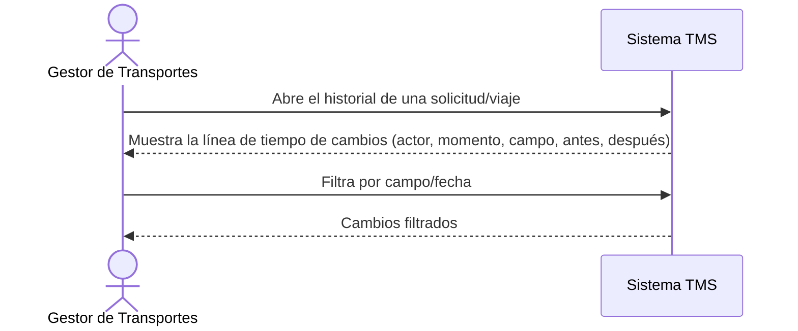

# Historia de Usuario: US-TMS-18 — Historial de Cambios

> **Unimar S.A. · Producto: TMS · Estado: Borrador · Versión: 0.1.0**
> **Fase SDLC:** 1 — Concepción y Descubrimiento · **Responsable:** John (PM)
> **PRD Origen:** PRD-TMS-001 § 7 (F-14)

---

## 1. Descripción Funcional

**Como** Gestor de Transportes
**Quiero** consultar el historial de cambios de solicitudes y viajes
**Para** auditar qué se modificó, quién lo hizo y cuándo, ante reclamos o revisiones

---

## 2. Actores y Stakeholders

### 2.1 Actor Principal

| Campo | Descripción |
|---|---|
| **Nombre** | Gestor de Transportes |
| **Tipo** | Usuario Interno |
| **Descripción** | Consulta la trazabilidad de cambios |
| **Canal** | Web |

### 2.2 Actores Secundarios

| Actor | Rol en esta historia | Necesidad |
|---|---|---|
| Gestor Comercial | Revisa el historial ante un reclamo | Evidencia de los cambios realizados |

### 2.3 Diagrama de Interacción



### 2.4 Interacciones del Actor Principal

| # | Interacción | Pantalla/Vista | Resultado esperado |
|---|---|---|---|
| 1 | Abrir historial | Detalle de Solicitud/Viaje | Lista cronológica de cambios |
| 2 | Filtrar por campo/fecha | Historial | Cambios filtrados |

---

## 3. Criterios de Aceptación (BDD/Gherkin)

```gherkin
Escenario: Consultar historial de un viaje
  Dado que un viaje ha tenido modificaciones
  Cuando el Gestor abre su historial de cambios
  Entonces el sistema muestra cada cambio con actor, momento, campo, valor anterior y nuevo

Escenario: Registro automático ante cualquier cambio
  Dado que se modifica un dato de una solicitud o viaje
  Cuando se guarda el cambio
  Entonces el sistema registra automáticamente una entrada de auditoría
```

---

## 4. Requisitos Técnicos (Aislados)

> *Reservado para Arquitectos / Devs. Se completa en Fase 2 (Diseño) / Sprint Planning.*

#### 4.1 Dominio y Contexto
| Campo | Valor |
|---|---|
| Bounded Context | `[Pendiente — Fase 2]` |
| Entidades | `auditoria_cambio`, `solicitud_transporte`, `viaje` |

#### 4.2 Reglas de Negocio a Respetar
- RN-30 — El historial debe registrar actor, momento, campo modificado, valor anterior y nuevo.
- RN-14 — Los cambios sobre viajes en ejecución no se permiten (se reflejan como bloqueados en la auditoría).

---

## 5. Definición de Hecho (DoD)

- [ ] Código implementado y revisado.
- [ ] Pruebas unitarias ≥ 80%.
- [ ] Criterios de aceptación verificados.
- [ ] Regla RN-30 cubierta.
- [ ] Documentación actualizada si aplica.
