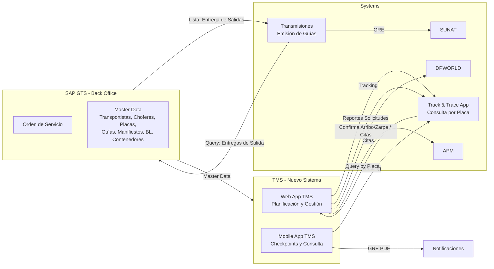
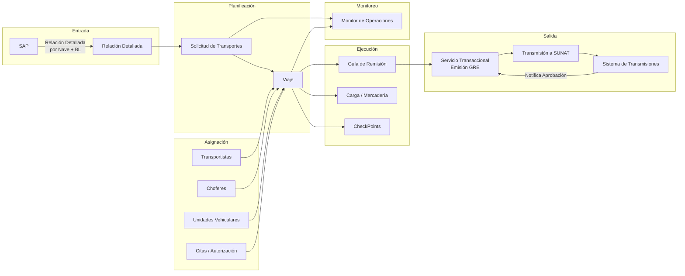
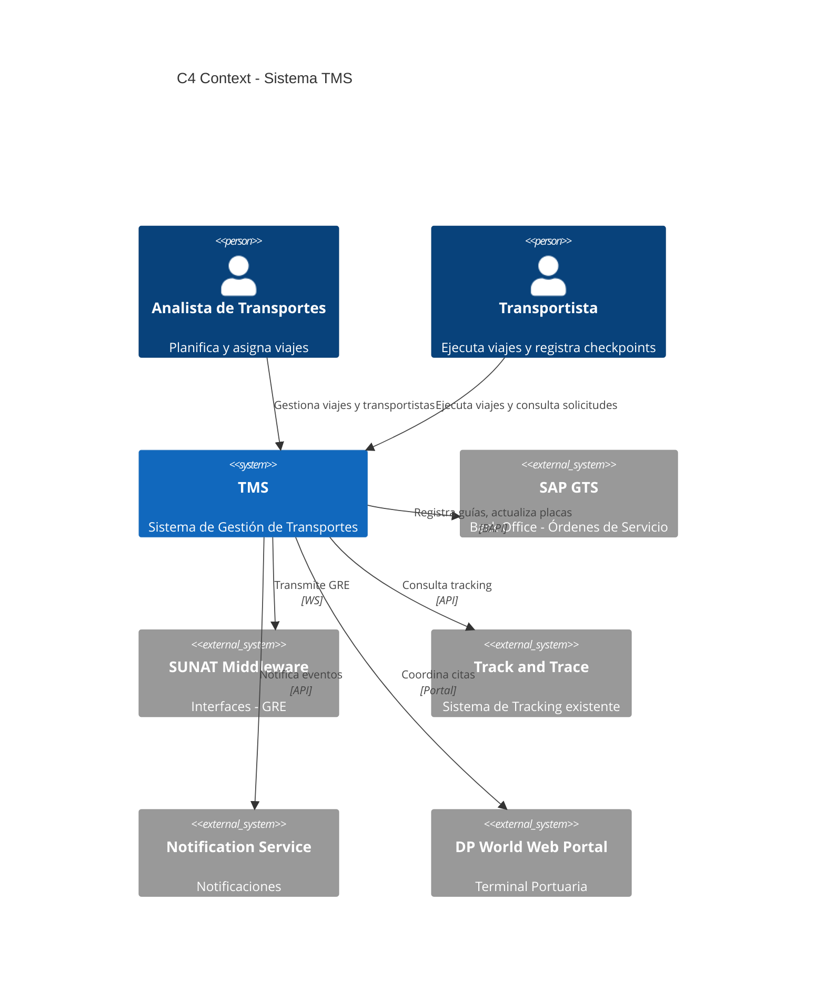
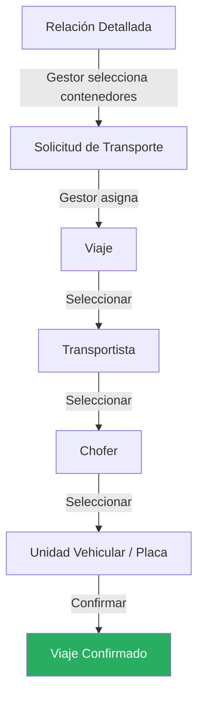

# Diagramas del Sistema TMS

> Traducción del archivo `tms-figma.drawio` (8 páginas) a diagramas Mermaid renderizables en GitHub.

---

## Página 1 — Vista Conceptual General

**Actores:**
- Gestor de Transportes — consulta T&T, coordina citas DPWORLD/APM
- Operador de Transmisiones — emite GRE hasta obtener OCR
- Transportista — consulta solicitudes, confirma contenedor, genera guía, inicia/fin ruta
- Gestor Comercial — consulta tracking

---

## Página 2 — Vista Conceptual de Proceso

**Reglas de negocio:**
- Un manifiesto puede tener más de una relación detallada
- Fase 1 contempla relación detallada de **descarga de contenedores**
- Una relación detallada puede pertenecer a diferentes orígenes: depósito, almacenes, etc.
- Una OS puede tener múltiples pedidos de transporte en diferentes momentos

**Atributos de Relación Detallada:**
ID+NRO, Nave, IP, Manifiesto, Puerto ETB, Puerto SUNAT, Fecha Almacenaje, Fecha RD, Tipo IMO, Avance de Contenedores, Estado de Servicio

**Atributos de Viaje:**
Número Viaje, Origen/Destino, Relación Detallada, Transportista, Chofer, Unidad Vehicular (Placa)

---

## Página 3 — C4 Context View

---

## Páginas 4–8 — Prototipos de Pantallas

Los prototipos de interfaz cubren las siguientes pantallas del flujo de planificación:

| Pantalla | Descripción |
| :------- | :---------- |
| **Dashboard de Planificación** | Resumen de viajes por estado, accesos rápidos |
| **Listado de Relaciones Detalladas** | Tabla con filtros por nave, puerto, fecha |
| **Creación de Solicitud de Transporte** | Wizard: seleccionar contenedores, definir origen/destino, fecha |
| **Asignación de Viaje** | Selectores encadenados: Transportista → Chofer → Unidad |
| **Detalle de Viaje** | Cabecera, datos generales, transportista, contenedores, historial |

> **Nota:** Los prototipos visuales detallados se encuentran en el archivo `tms-figma.drawio`. Para visualizarlos, abrir el archivo en [app.diagrams.net](https://app.diagrams.net).

---

## Flujo de Planificación (MVP)

---

> **Archivo fuente:** `docs/tms-figma.drawio` — 8 páginas editables en draw.io
> **Última actualización:** 2026-06-23
