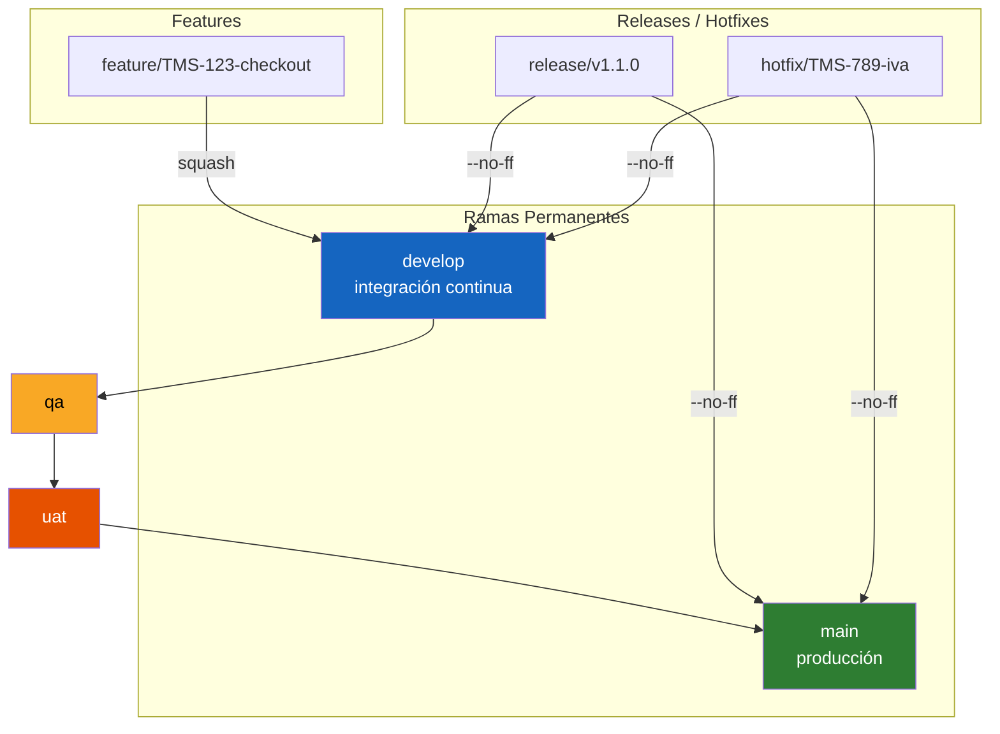

# Estrategia de Ramificación — unimar_tms

> **Herencia:** Adopta [ADR-0050](https://github.com/mhernandez-unimar/unimar_arch/blob/main/reference/architecture/adrs/core/0050-estrategia-ramificacion-gitflow.es.md) (GitFlow extendido) y [ADR-0003](../architecture/adrs/0003-estrategia-ramificacion-gitflow-tms.es.md) (adaptación TMS)

## Modelo de Ramas



## Ramas

| Rama | Propósito | Base | Fusiona a |
| :--- | :-------- | :--- | :-------- |
| `main` | Producción | — | — |
| `develop` | Integración continua | `main` | — |
| `qa` | Validación técnica | `develop` | `uat` |
| `uat` | Validación de usuario | `qa` | `main` |
| `feature/TMS-*` | Desarrollo de funcionalidad | `develop` | `develop` (squash) |
| `release/v*` | Preparación de release | `develop` | `main` y `develop` (--no-ff) |
| `hotfix/TMS-*` | Corrección urgente | `main` | `main` y `develop` (--no-ff) |

## Estándar de Commits

Conventional Commits v1.0.0 validado por commitlint + husky.

```
<tipo>(<alcance opcional>): <descripción>
```

| Tipo | Uso |
| :--- | :-- |
| `feat` | Nueva funcionalidad |
| `fix` | Corrección de bug |
| `chore` | Mantenimiento, tooling |
| `docs` | Documentación |
| `refactor` | Refactor sin cambio funcional |
| `test` | Pruebas |
| `ci` | CI/CD |
| `BREAKING CHANGE` | Major release |

## Pull Requests

- Toda fusión a ramas protegidas vía PR.
- Template en `.github/PULL_REQUEST_TEMPLATE.md`.
- `develop`: squash merge, 1 approval.
- `main`: --no-ff merge, 2 approvals.

## Referencias

- [ADR-0003: GitFlow TMS](../architecture/adrs/0003-estrategia-ramificacion-gitflow-tms.es.md)
- [ADR-0050: GitFlow Extendido (unimar_arch)](https://github.com/mhernandez-unimar/unimar_arch/blob/main/reference/architecture/adrs/core/0050-estrategia-ramificacion-gitflow.es.md)
- [Conventional Commits v1.0.0](https://www.conventionalcommits.org/)
